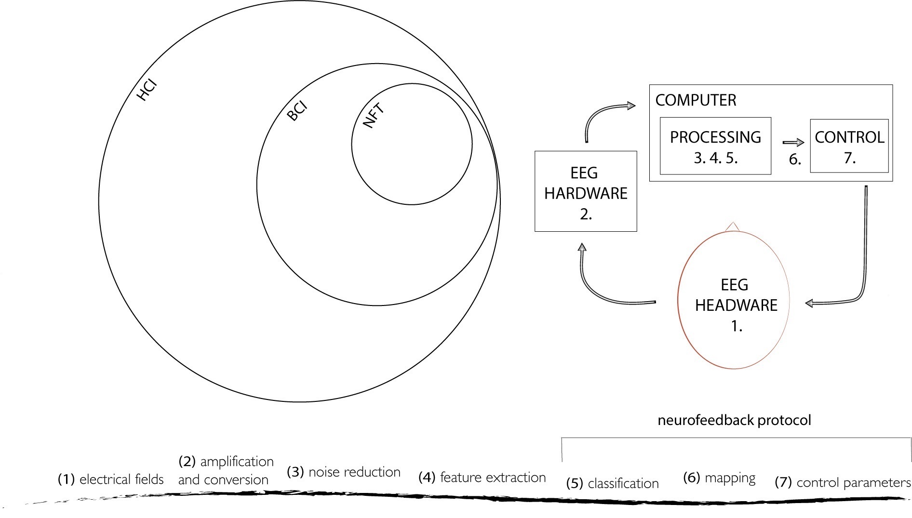

# 1 Introduction

{: .no_toc }

## Table of contents
{: .no_toc .text-delta }

1. TOC
{:toc}

---

## 1.1 Overview of the Thesis
The overall design of my research is grounded in practice and demonstrated through a portfolio of creative works and this written commentary. It is a proof-of-concept research study in which I developed a prototype brain-computer music interfacing (BCMI) system to support meditation practices in neurofeedback training (NFT) and artistic performance settings. To help induce and maintain meditative states, the system provides customisable neurofeedback protocols and customisable auditory entrainment. To develop this system, I explored the intersections of various domains, including brain-computer interfacing (BCI), NFT, neurogaming (NG), sound and music, music therapy and meditation (Fig. 1.1).

 
 Figure 1.1: Venn diagram of the intersecting research domains. 
 

The thesis comprises a portfolio of creative works and this written commentary, which includes six chapters. The portfolio includes the outcomes of two consecutive projects, each dedicated to developing a BCMI system: the single-channel BCMI-1 system in the first project and, to address its limitations, the multi-channel BCMI-2 system in the second project. BCMI-1 uses a dry sensor with a consumer-grade electroencephalograph to record brain signals, and BCMI-2 uses wet sensors with a research-grade electroencephalograph. **The main contribution of this research is the creation of the BCMI-2 system and recommendations based on the knowledge gained while developing and testing its suitability to support meditation practices in NFT and artistic performance settings.** This chapter introduces the research, Chapter 2 outlines the project management methodology, Chapter 3 reviews the relevant literature and Chapters 4 and 5 reflect on the projects that led to the development of BCMI-1 and BCMI-2. Finally, Chapter 6 concludes the research and outlines future directions.

## 1.2 Knowledge Gap
The domain of human-computer interaction (HCI) investigates how humans communicate with computers. HCI offers various applications that can map biological signals to feedback. One of these biofeedback applications is NFT, in which BCI systems provide feedback on neurological activity in real time. The most frequently used brain signal in NFT is the electroencephalogram (EEG), which is recorded using electroencephalograph machines. In EEG NFT, neurofeedback protocols provide feedback to users by mapping classified brain signals to visual, auditory or haptic control parameters (Fig. 1.2).

 
Figure 1.2: Venn diagram (left) depicts BCI as a subdomain of HCI and NFT as a subdomain of BCI. Two drawings (bottom and right) depict the BCI interfacing steps, with the bottom one indicating the steps controlled by the neurofeedback protocol.

Existing NFT systems mainly focus on giving visual feedback (Steffert, 2018, p.136) and where they provide options for auditory feedback, these options are often limited, not allowing the development of engaging musical experiences (i.e. they do not employ the wide-ranging capabilities of music that could help induce and maintain the desired states of mind) (Miller, 2011; Mealla. et al., 2014; Steffert, 2018, p.84). Numerous biofeedback systems have generated engaging music in real time since the 1960s in artistic performance and, more recently, in academic research settings. However, when NFT systems provide auditory feedback, they often simply trigger short sounds or increase the volume of pre-recorded music. While these simple techniques have been shown to be effective (Gruzelier, 2008; Fedotchev, Radchenko and Zemlianaia, 2018; Tarrant, 2020; Fedotchev et al., 2021), my literature review and discussions with relevant researchers encouraged me to enhance these methods, especially for applications that use auditory feedback only (e.g. in eyes-closed alpha-theta training linked to meditation practices). When choosing auditory-only over other feedback modalities (visual, haptic or combined), aligning the aesthetics of this feedback (Collura, 2017, p.184) and the sonic context in which it is embedded with aspects of the entrained affective state should help deepen users’ engagement and thus benefit the BCI learning process. Furthermore, the benefits of enhancing user engagement in systems using passive (unconscious) BCI control should also be considered, as the more immersed users are in an experience, the more likely they can let go of active (conscious) control.

A much older technique than NFT that has also been used to alter the state of mind is meditation, which is often practised with eyes closed. It is a set of mind-body practices that, by regulating attention actively or passively, can help induce various physiological changes that range from simple relaxation to dramatic mystical experiences in altered states of consciousness (ASCs). Attention regulation is more active in concentrative and more passive in receptive types of meditation (Washburn, 1978). All neurofeedback protocols aim to develop brain control, with some specifically supporting meditation practices (e.g. in NeuroMeditation (Tarrant, 2020)). The protocols in this last category combine the ancient wisdom of meditation with modern computer science by providing immediate feedback on internal states. 

Another ancient technique, in which the pulse of repetitive stimuli is used to alter the state of mind, is auditory entrainment. This technique has been used with drumming in a specific type of guided meditation called shamanic journeying to help induce and maintain an ASC called the shamanic state of consciousness (SSC) (Flor-Henry, Shapiro and Sombrun, 2017). Depending on the specific tradition, the tempo and rhythmic complexity of the drumming in shamanic journeying sometimes change (Wilcken, 1992; Strong, 1998; Maas and Strubelt, 2003) and sometimes remain consistent (Harner, 2013; Hove et al., 2015). Based on my literature review, discussions with shamanic practitioners and my own experience of drumming while meditating, I decided to implement auditory rhythmic entrainment (ARE) with gradually decreasing tempo and decreasing rhythmic complexity in my BCMI-2 system. I then tested the system’s suitability to support meditation in NFT and artistic performance settings.[^bookchapter]

[^bookchapter]: In a book chapter titled ‘Journeys Around the Secret Place’ (Hofstädter, 2022), I discuss my 20-years-long research exploring psychologically induced ASCs (Vaitl et al., 2005) through various meditation, artistic and scientific practices. After marking the initial ASC experience that started my investigation, the chapter outlines my first experiments with poetry, painting, meditation and electronic music, which I used to help express and revisit this initial experience. Then, the chapter outlines the three projects that developed BCMI systems (BCMI-0, BCMI-1, BCMI-2) and discusses how the last one employed a neurofeedback protocol and ARE to help induce and maintain an SSC. In light of the recent renaissance in the study of psychedelic substances in academia (Carhart-Harris et al., 2021) and an increased interest in the subject in the business world (Rebel Wisdom, 2022), this chapter emphasises that not all shamanic traditions have used psychedelics to access hypnagogic states, and, therefore, meditation and perhaps ARE should be considered as more secure alternatives or complementary methods.

## 1.3 Contribution to Knowledge
BCMI-2 is a stable system that combines two entrainment methods (neurofeedback protocols and ARE) in a novel way in order to support meditation practices. It embeds the neurofeedback reward sound as an integral element within the ARE, creating interactive and engaging soundscapes. BCMI-2 uses an affordable, research-grade OpenBCI board to measure, digitalise and amplify multi-channel EEG in combination with the free audio programming environment SuperCollider for the remaining interfacing steps. BCMI-2 is fully open-source and, from the acquisition step onwards, customisable within one programming environment, the SuperCollider Integrated Development Environment (IDE). Removing the need to run multiple software applications or IDEs simultaneously (e.g. one to process EEG and another to generate music) improves clarity. Finally, for those interested in developing new BCMI systems based on BCMI-2, SuperCollider offers high-quality audio and versatile composition tools and a vibrant research community available for help if needed.

Users with basic programming skills can customise BCMI-2’s neurofeedback protocols and ARE parameters effortlessly. We can select up to eight channels to record raw EEG signals and extract multiple frequency bands and phase coherence features from these signals. We can classify these features and then map them to sound control parameters for NFT or other, more artistic, sonification purposes. Furthermore, we can adjust the tempo and rhythmic variability of the ARE generator and replace the default frame drum samples with different ones. Additionally, BCMI-2 can spatialise sound in stereo or 4.0 surround. Although this research only tested the system to induce and maintain the SSC, by adjusting these parameters, we can entrain other meditative states (e.g. related to strong alpha brainwaves or hemispheric coherence). This is important, as end-user personalisation has been demonstrated to play an important role in the effectiveness of EEG NFT (Mealla. et al., 2014) and because it provides a variety of creative options for artistic performances. I plan to develop BCMI-2 further and to invite researchers with advanced programming skills to contribute new feature extraction methods and sound control parameters via the projects’ GitHub repositories.[^BCMI-2-git]

[^BCMI-2-git]: The BCMI-2 software parts can be found at [https://github.com/khofstadter/OpenBCI-SuperCollider](https://github.com/khofstadter/OpenBCI-SuperCollider) and [https://github.com/khofstadter/bcmi-sc01-shamanic-soundscape-generator](https://github.com/khofstadter/bcmi-sc01-shamanic-soundscape-generator). I discuss these parts in Chapter 5.

To test BCMI-2’s suitability for supporting meditation, I customised its neurofeedback protocols and ARE parameters to help induce and maintain the SSC. I trialled this combination first in an NFT setting (Section 5.4) with two participants, and then – as a natural progression – in an artistic performance setting (Section 5.5). In both settings, I customised the neurofeedback protocol and the ARE parameters to help entrain the theta brainwaves associated with ASCs (Strong, 1998; Gruzelier, 2008; Jovanov and Maxfield, 2011; Collura, 2017, p.134).

I set up BCMI-2 with the following:

- a custom ARE generating drumming that is gradually decreasing in tempo and rhythmic complexity
- a neurofeedback protocol that plays shaker sounds to reward strong theta brainwaves

In the performance setting, besides creating interactive music with the above two methods, I also improvised on an acoustic frame drum, the sounds of which were transformed with effects and then spatialised with brain coherence features extracted with BCMI-2. The coherence to spatialisation mapping was not part of the neurofeedback protocol. I did not use it for operant conditioning. Instead, it was an abstract interpretation, an artistic sonification, with which I aimed to help myself and the audience become more profoundly immersed in the experience. These acoustic and transformed sounds aimed to interpret my internal meditation process. After this performance, I conducted an online listening study without the interactive audio of BCMI-2 to strengthen my understanding of ARE (Section 5.6). As BCMI-2 was observed to be a suitable technical tool to support meditation practices, given time and resources, my next steps will be to initiate studies with scientific rigour to compare the effectiveness of different neurofeedback protocols and ARE parameters in inducing and maintaining different meditative states.

In addition to the main contribution, the technical BCMI-2 system, the research produced other creative outputs, including the following audio releases, software and public performances:

- 2016 [*Compulsive Music Waves 1*](https://tedor.bandcamp.com/album/compulsive-music-waves-1) | An audio release produced with BCMI-1's sequencer.
- 2016 [*Compulsive Music Waves / Deciphering Addictions*](https://bcmi.khofstadter.com/pint-of-science-installation/) | A collaborative installation produced with BCMI-1's sequencer.
- 2018 [*Compulsive Music Waves 2*](https://tedor.bandcamp.com/album/compulsive-music-waves-2) | An audio release produced with BCMI-1's sequencer.
- 2018 [BCMI-1: NeuroSky-SuperCollider Interface](https://github.com/krisztian-hofstadter-tedor/NeuroSky-SuperCollider-interface) | SuperCollider code of the first BCMI system developed in this research.
- 2019 [*Aphorisms*](https://operaapertaproject.com/aphorisms/) by David Ryan | A performance using BCMI-2's code for transforming and spatialising acoustic sound.
- 2019 [*Shamanic Soundscape – Neurofeedback Training Sessions*](https://tedor.bandcamp.com/album/shamanic-soundscape-neurofeedback-training-sessions) | An audio release featuring soundscapes generated in the NFT sessions testing BCMI-2.
- 2019 [*Shamanic Soundscape – Level Two*](https://tedor.bandcamp.com/album/shamanic-soundscape-level-two) | An audio release featuring stereo and surround sound files generated at my 2019 Cambridge Festival of Ideas performance, with an additional soundscape enhanced with binaural beats in post-production. Two soundscapes were also released on a physical CD in a Digipak case.
- 2019 [Cambridge Festival of Ideas 2019 Performance Video 1](https://youtu.be/lFVzwZtmecc) | A video collage of a screencast and two additional camera shots archiving my performance at the 2019 Cambridge Festival of Ideas.
- 2022 [Cambridge Festival of Ideas 2019 Performance Video 2](https://youtu.be/SdrYMDM7-Mg) | An alternative version of the above video, with additional binaural beats. The start of the video provides annotations clarifying the neurofeedback protocol used on theta at Fz.

While these creative outputs are not considered the main contribution to knowledge, as artefacts of practice research (Bulley and Sahin, 2021), they embody the richness of my work and expand its scope across and beyond disciplinary borders and outside academia. A complete list of creative outputs, including all research-related audio releases, presentations, demonstrations and studies, with URL links, can be found in Appendix 1.

The main contribution of this research is the creation of the BCMI-2 system and a number of recommendations based on the knowledge gained while developing and testing its suitability to support meditation practices in NFT and artistic performance settings. For researchers interested in meditation, BCMI-2 provides an affordable, research-grade system with customisable neurofeedback protocols and ARE parameters to be explored in NFT and artistic performance settings. My insights based on the knowledge gained while developing and testing the system can be found throughout this thesis and summarised in Chapter 6.

## 1.4 Research Question and Objectives
The research question and objectives that allow me to reflect on the main contribution of my thesis are as follows:

**Research Question (RQ):**  
How can an affordable and open-source BCMI system be created to support meditation practices in NFT and artistic performance settings?

**Research Objectives (ROs):**  
**RO1**: Conduct a literature review to find EEG correlates (neuromarkers) of meditative states and methods that can help induce and maintain these states.

**RO2**: Develop an affordable and open-source BCMI system based on the literature review findings.  

**RO3**: Test the developed BCMI system's suitability to support meditation practices in NFT and artistic performance settings.

**RO4**: Based on the knowledge gained, provide recommendations for researchers interested in using BCMI-2 or developing new BCMI systems to support meditation practices in NFT and artistic performance settings.

I addressed RO1 with my literature review (summarised in Chapter 3), RO2 and RO3 by developing the two BCMI systems discussed in Chapters 4 and 5 and RO4 with my insights summarised in Chapter 6. Due to the practical nature of this research, addressing the research objectives did not follow a traditional waterfall project management methodology but instead utilised a more agile methodology that will be outlined in the next chapter.