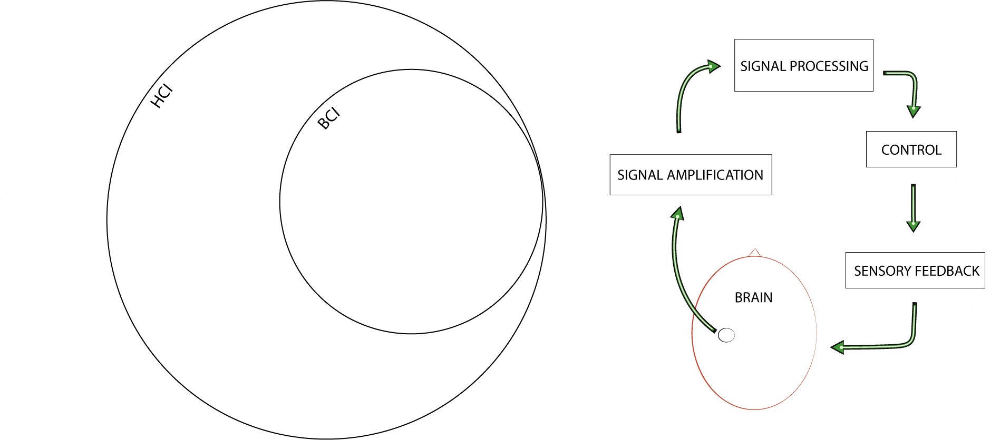

## 3.1 Brain-Computer Interfacing (BCI)

{: .no_toc }

## Table of contents
{: .no_toc .text-delta }

1. TOC
{:toc}

---

### 3.1.1 Introduction
In the field of BCI, a subdomain of HCI, BCI systems, also referred to as brain–machine interfaces or mind–machine interfaces, allow for non-muscular, real-time interaction between the human brain and machines (Fig. 3.1). What the received information is and how it is processed on both sides of this closed-loop interaction are essential to the success of BCI applications (Daly et al., 2014).

Figure 3.1: Venn diagram depicting BCI as a subdomain of HCI (left) and an outline of the steps of a real-time BCI loop (right). The loop begins with amplifying brain signals, progresses through signal processing and then advances to control and sensory feedback before going back to the brain.

### 3.1.2 Applications and classifications
BCI systems consist of both hardware and software parts and are often designed for specific applications. In their systematic review, Mridha et al. (2021) classify BCI applications based on usability as biomedical or non-biomedical. Biomedical applications can access and diagnose central nervous system (CNS) functions lost through sickness or by trauma and functions linked to enhancing the cognitive abilities of healthy people. In addition to assessment, applications are also used to repair (Hara, 2015), replace (McFarland and Wolpaw, 2008) or enhance functions (Gruzelier, 2018; Ehrlich et al., 2019; Daly et al., 2020; Hunkin, King and Zajac, 2020) in their respective clinical or non-clinical settings. While many non-biomedical applications are recreational, such as those in gaming (Kerous, Skola and Liarokapis, 2017; Cattan, 2021) and artistic performance settings (Nijholt, 2019), some applications are also used in domestic smart-home settings (Laport López, 2022; Nijholt et al., 2022) and in industry — for instance to increase the safety of people working on demanding tasks (Zhang, Wang and Fuhlbrigge, 2010; Binias, Myszor and Cyran, 2018). While BCI systems are often designed for one specific application, some systems can be used for multiple applications (e.g. bio-medical ability-enhancing and non-biomedical recreational applications). For example, the domain of BCMI (detailed in Section 3.6), has numerous applications enhancing an ability while performing music (Fig. 3.2).

Figure 3.2: A tree diagram visualising on-line BCI classifications based on invasiveness, grade, interfacing, dependability, synchronisation and usability. The dotted lines indicate how the BCMI-2 system developed in this research can be classified. ‘Ability enhancement’ is linked to my project that tested this system’s suitability in NFT, and ‘recreation’ is connected with my artistic performance setting.

While all clinical applications are biomedical, non-clinical applications can be bio-medical or non-biomedical (Nijholt et al., 2022). For instance, the biomedical application of NFT can be used in clinical settings to move clients’ brain functions away from clinical and towards normative, and in non-clinical settings to enhance certain abilities of healthy people. BCI systems can be non-invasive, in which electrodes record brain activity outside the skull, or invasive, in which electrodes are implanted inside the skull using surgery. While the key function of BCI is to provide real-time (on-line) interaction between human brains and machines, the software parts of some systems can often be used for non-real-time (off-line) signal processing as well (e.g. to visualise or sonify brain signals with scientific or more artistic purposes). BCI can also be categorised as hard, soft or hybrid:

- In hard (active) systems, the control parameters are based on operant conditioning providing positive or negative feedback on users' conscious efforts. This type is often referred to as explicit BCI with active control. An example of hard BCI is motor imagery, in which the user performs a mental task to control an external device.
- In soft (passive) systems, the control parameters are based on machine-learning. The system learns and optimises the interaction between the user and the computer. This type is often referred to as implicit BCI with passive control.
- Hybrid systems use both hard and soft methods.[^hybridBCI]

[^hybridBCI]: The term ‘hybrid’ can also refer to a system that measures not only neurological signals but other physiological signals as well, e.g. as in Daly et al. (2020).

Krol, Andreessen and Zander (2018) clarify passive systems:

> [The] use of the word 'passive' here results from a user-centred perspective on HCI. It refers to the role of the end user of a system with respect to the BCI: the underlying signals being automatic, spontaneous brain activity, it is an inherent and defining aspect that the user exerts no effort to actively, explicitly, or voluntarily elicit or modulate this activity. Instead, the user focuses on the task at hand while a passive BCI system, in the background, monitors their brain activity for informative correlates of relevant cognitive or affective states.

BCI systems can also be research- or consumer-grade, with the latter sometimes being referred to as ‘off-the-shelf’ or ‘low-cost’ systems. While clinical applications generally use expensive research-grade systems certified for medical purposes, other biomedical and non-biomedical applications can use either. For instance, non-biomedical applications of BCI in recreational settings have used research-grade (Eaton and Miranda, 2013a) and consumer-grade systems (Rosenboom and Young, 2015). However, while the most popular applications of consumer-grade systems support meditation, relaxation, and other ability-enhancing practices (and, more recently, gaming in non-clinical settings), their potential for clinical research has also been evaluated (Ratti et al., 2017; Lau-Zhu, Lau and McLoughlin, 2019; Vasiljevic and Miranda, 2019; Sawangjai et al., 2020; Kawala-Sterniuk et al., 2021).2 A BCI system can be classified as independent when users have some level of motor control or as dependent, for instance, when users are severely disabled. The interaction between a BCI system and a brain can also be synchronous or asynchronous. Interaction is synchronous when users are required to perform a specific cognitive activity at a particular moment in time. It is asynchronous when they are free to perform activities at any time
(Ramadan and Vasilakos, 2016).

[^signpostBCMI2advantages]: The advantages and disadvantages I discovered by developing two systems, BCMI-1 with consumer-grade NeuroSky and BCMI-2 with research-grade OpenBCI, are discussed in Chapter 5.

### 3.1.3 Interfacing steps with EEG
Several methods can measure brain activity: EEG, electrocorticography (ECoG), single-neuron recordings, magnetoencephalography (MEG), positron emission tomography (PET), functional magnetic resonance imaging (fMRI) and functional near-infrared spectroscopy (fNIRS). According to Ramadan and Vasilakos (2016), while it is ECoG, single-neuron recordings and EEG that are considered valid methods for BCI systems based on cost, quality of communication and the available number of control channels, the most common method is EEG due to its ease of use, security and affordability. Also, out of these three methods, only EEG is non-invasive.

In essence, in real-time BCI with EEG, the electrical fields on the scalp are measured with sensitive electrodes and then sent to a hardware device that amplifies these signals. Next, the amplified signals are processed with analogue or digital signal processing (DSP) on this hardware or later with software on a computer. These signal processes involve noise reduction, feature extraction and classification. Finally, classified features are mapped to control parameters, such as the movement of a robotic arm (McFarland and Wolpaw, 2008) or the algorithms in computer-generated music (Daly et al., 2020). This process is depicted in Fig. 3.3 and further detailed below.

Figure 3.4: EEG electrode placements with the 10-20 system available on the Greentek gel-free cap used with the BCMI-2 system (left) and a photo of this cap on my head recording eight active electrodes (right). Caps can read pre-frontal (Fp), frontal (F), temporal (T), parietal (P), occipital (O), and central (C) areas of the brain.

(1) electrical fields - The electrical activity generated by the biological brain cells, the neurons, are measured as analogue signals by sensitive electrodes. It is the specific application of the BCI that informs the number of electrodes needed and their locations on the head. Some systems record only one or two channels, some 10 (Fig. 3.4), while others record above 100.

Figure 3.4: EEG electrode placements with the 10-20 system available on the Greentek gel-free cap used with the BCMI-2 system (left) and a photo of this cap on my head recording eight active electrodes (right). Caps can read pre-frontal (Fp), frontal (F), temporal (T), parietal (P), occipital (O), and central (C) areas of the brain.

(2) amplification and conversion - The analogue signals from the electrodes are received on the EEG hardware, where they are amplified and digitalised. Systems can use research- or consumer-grade hardware for EEG amplification and analogue-to-digital (A/D) conversion. Some hardware send the digital signals to a computer for further processing, while others perform specific processes (e.g. noise reduction, feature extraction, and classifications) still on the hardware, as do NeuroSky headsets used with my BCMI-1 system, for instance.

(3) noise reduction - The amplified and digitalised signals (the raw EEG signals) are cleaned of user- and system-related artefacts. While systems often attenuate frequencies below 1 Hz and above 50 Hz with a bandpass filter and frequencies of the mains hum with a notch filter, numerous other methods have been used to remove artefacts (e.g. muscle movements and eye blinks), some of which involve machine-learning techniques (Lai et al., 2018).

(4) feature extraction - The cleaned raw signals are analysed for recognisable patterns, e.g. in the amplitude domain (event-related potential (ERP), peak latency, zero-crossing), the frequency domain (band power fast Fourier transform (FFT), power spectral density, phase coherence, complex networks) or with a combinatorial method, i.e. a combination of some of these techniques.

(5) classification - Patterns extracted are organised to application-specific meanings (e.g. increased low-alpha indicating relaxation or increased high-beta stress). Classification is also referred to as 'feature translation' (Mason and Birch, 2003).

(6) mapping - The variables storing classified data (meanings) are linked (mapped) to application-specific control parameters.

(7) control parameters - The now brain-controlled parameters are application-specific activities (e.g. robotic arm movements or carrier frequency changes in a sound synthesiser).[^sign-bcmisonilit-bcmi67]

[^sign-bcmisonilit-bcmi67]: Ways in which brain signals mapped to sound have been used in artistic and academic settings since the 1960s is detailed in Sections 3.6 and 3.7. How my BCMI-2 system used sound with a neurofeedback protocol to entrain (reward) theta brainwaves is discussed in Section 4.2.2.

Besides the earlier cited publication by Mridha et al. (2021), I found the reviews by Kawala-Sterniuk et al. (2021) and Ramadan and Vasilakos (2016) also informative.