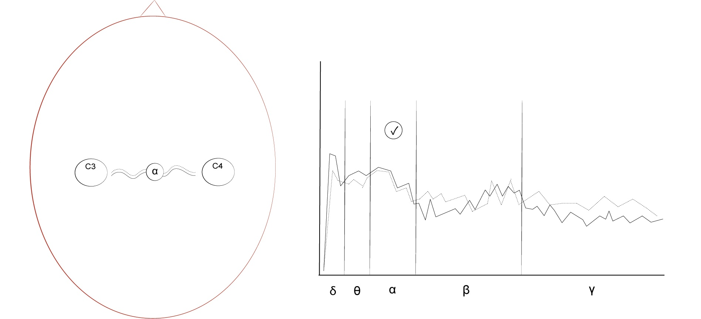

## 3.2 Neurofeedback Training (NFT)

{: .no_toc }

## Table of contents
{: .no_toc .text-delta }

1. TOC
{:toc}

---

### 3.2.1 Introduction
Besides BCI, HCI offers a range of other methods to map biological signals to feedback to help improve mental or physical conditions. The signals often used in these biofeedback systems are heart rate variability (HRV), electromyogram (EMG), electrodermal activity (EDA) and EEG (McKee, 2008), with the latter often called EEG biofeedback, neurofeedback or neurofeedback training. While the terms ‘neurofeedback’, ‘neurofeedback training’, ‘neurofeedback therapy’, ‘neuro therapy’, ‘neuro-biofeedback’ and ‘brainwave biofeedback’ have been used fairly interchangeably in the literature, the most commonly used terms are ‘neurofeedback’ and ‘neurofeedback training’. As ‘neurofeedback’ technically does not necessarily imply training, in this thesis, I use ‘neurofeedback training’ (NFT) to refer to the practice in which BCI systems provide feedback on neurological activity to trainees for a specific length and regularity of time defined by trainers in clinical or non-clinical settings. To yield anticipated progress, the trainers decide how long sessions should last and how often sessions should be held. After initial assessments, sessions usually last 20 to 30 minutes and are held 10 to 20 times. Also, to avoid ambiguity, I will refer to the technique of mapping classified brain activity to control parameters in real time with the term ‘neurofeedback protocol’ instead of with the more umbrella term ‘neurofeedback’ (Fig. 3.5).

Figure 3.5: Venn diagram (top) illustrating the field of NFT as a part of BCI and an outline of the BCI steps (bottom) handled by the neurofeedback protocol.

Also, because NFT can use EEG, fNIRS (Kohl et al., 2020) or PET (Ros et al., 2021), the most accurate term to describe the NFT explored in my research could be ‘real-time EEG NFT’. Suggestions to refine terminology can be found in Swingle (2021). The International Society for Neuroregulation and Research
(ISNR) defines NFT as follows:

> Like other forms of biofeedback, NFT uses monitoring devices to provide moment-to-moment information to an individual on the state of their physiological functioning. The characteristic that distinguishes NFT from other biofeedback is a focus on the central nervous system and the brain. NFT has its foundations in basic and applied neuroscience as well as data-based clinical practice. It takes into account behavioral, cognitive, and subjective aspects as well as brain activity (ISNR, 2022).

The success of NFT, and many other BCI applications, relies on neuroplasticity, the brain’s ability to advance its neural networks on two levels: (1) on a functional level by strengthening or weakening existing synaptic connections and by creating new connections and (2) on a structural level by changing existing neural pathways and creating new pathways. Although the concept existed previously, the mature brain was believed to have a fixed structure until the 1960s, when neuroscientific discoveries began proving that the brain’s structure can change after maturity. Costandi (2016) provides a detailed overview of the history of neuroplasticity, highlighting key findings and methods.

### 3.2.2 Applications and classifications
Since Joe Kamiya’s first experiments training college students to control alpha brainwaves in the 1960s (Kamiya, 2019), NFT ‘has become the most widely applied psychophysiological procedure enabling individ- uals to self-regulate specific characteristics of the EEG’ (Mirifar, Keil and Ehrlenspiel, 2022). According to two recent and comprehensive bibliographies listing research of the field (Applied Psychophysiology Education, 2021; ISNR, 2021), NFT has been explored in a range of clinical and non-clinical settings. In clinical settings, to address an illness or symptom with clinical relevance, including attention deficit disorders, anxiety, autism, chronic pain, depression, epilepsy, substance abuse and post-traumatic stress disorder, and in non-clinical settings to enhance healthy people’s ability in the areas of sport, mood and
cognitive enhancement as well as in performing arts.

While the key function of NFT systems is to provide feedback to users in real time, the same system often also archives the raw brain data in files for later, off-line processing. These off-line processes could be carried out on the same NFT system or on other systems providing additional, perhaps more advanced DSP tools. NFT sessions can also be video recorded, which, when replayed together with the brain signal, can help, for instance, to align movements contaminating signals or closed eyes raising alpha brainwaves.[^bcmi2-off-line-data]

[^bcmi2-off-line-data]: While testing BCMI-2 (Sections 5.4 and 5.5), I archived brain data to be analysed later with BCMI-2's plotter function and recorded screencasts that captured users while meditating.

Clinical settings can only be facilitated by trainers who are licensed clinicians, such as medical doctors, psychologists or occupational therapists. In contrast, non-clinical settings can be facilitated without these licences (e.g. by trainers described as neurofeedback coaches). Also, with BCI systems becoming more affordable, user friendly and customisable, even users themselves can become their own trainers in their own homes (e.g. by using consumer-grade NeuroSky or Muse systems). However, this irregularity can become problematic, as pointed out by Swingle (2021):

> The result is that too often neither the public nor otherwise very qualified professionals can tell the difference between the bona fide research practitioner, the trained practitioner, the naive (insufficiently trained) but otherwise well-intended practitioner, the fully ignorant, and the spurious business person. ... Despite professional associations and certification bodies such as AAPB, ISNR, BFE, BCIA, and IQCB[^SwindleAcr], in 2021, the field is still largely unregulated, and our scope of practice remains fully reliant upon complementary competence.

[^SwindleAcr]: Association for Applied Psychophysiology and Biofeedback, Inc. (AAPB), International Society for Neuroregulation and Research (ISNR), Biofeedback Federation of Europe (BFE), Biofeedback Certification International Alliance (BCIA), International QEEG Certification Board (IQCB).

Although NFT has begun to attract the attention of the scientific and medical mainstream (Ros et al., 2020), due to the above-described irregularities, as Swingle (2021) put it, valid and invalid criticism has also surfaced. Systematic reviews, while acknowledging the effectiveness or potential of NFT, have provided similar recommendations for improvement, including the need for more randomised control trials and larger samples sizes (Panisch and Hai, 2018; Patel et al., 2020; Steingrimsson et al., 2020; Baena et al., 2021; Hesam-Shariati et al., 2021; Trambaiolli et al., 2021), more optimal treatment protocols for trainers (Hoogdalem et al., 2021), revised method classifications (Gong et al., 2021), methods to identify trainees who are unlikely to benefit from NFT prior to the actual training (Alkoby et al., 2018) and implementation of unified reporting and experimental design standards (Ros et al., 2020).

### 3.2.3 EEG neurofeedback protocols
NFT addresses different goals with different neurofeedback protocols, each with specifically designed mappings between classified brain data and control parameters. For instance, alert, focus and peak protocols are commonly used when treating attention deficit disorders, a relax protocol when addressing anxiety and a deep protocol for personal exploration (Collura, 2017). Most NFT systems extract the frequency spectrum from the raw EEG signal with either digital filters or FFT, then classify characteristics of selected frequency bands in line with the training goals and then map this classified data to the control parameters (e.g. auditory or visual feedback). The most commonly defined frequency bands, also called brainwaves, can be seen in Fig. 3.6.

Figure 3.6: An FFT plot of a one-channel EEG signal separated into brainwaves: delta (δ) between 0-4 Hz, theta (θ) between 4-8 Hz, alpha (α) often divided as low-alpha (alpha1) between 8-12 Hz and high-alpha (alpha2) between 12-16 Hz, beta (β) often divided as low-beta (beta1) between 16-20 Hz; mid-beta (beta2) between 20-30 Hz and high-beta (beta3) between 30-35 Hz and gamma (γ) between 35-45 Hz.

In general, while all these frequency bands are active in ordinary waking consciousness, strong (high relative amplitude) delta is linked to sleep and the unconscious mind, strong theta to deep relaxation, meditation, trance and hypnosis, and access to unconscious materials. Strong alpha is linked to wakeful relaxation, increased self-awareness and focus, strong beta to alertness and active thinking and even stress or intense mental activity and strong gamma to simultaneous processing of information from different brain areas (Kawala-Sterniuk et al., 2021). In addition to these frequency bands, neurofeedback protocols can also use ERPs (Kropotov, Mueller and Ponomarev, 2011), features extracted with z-score (Thatcher and Lubar, 2014; Collura, 2017, pp.154–179), low-resolution brain electromagnetic tomography (LORETA) and synchrony (Collura, 2017, pp.180–183) methods, etc.

A typical mapping technique is to set thresholds for the classified data. These thresholds are often called indicators or inhibitors. An indicator rewards the user when classified data moves above a threshold, and an inhibitor rewards when classified data stays below a threshold (Fig. 3.7). Protocols can also have multiple thresholds and rewards when multiple conditions are met (Fig. 3.8). Thresholds are usually set by the trainer manually at the beginning of a session and adjusted manually during this session. However, with some modern software, automatic thresholding, where the software adjusts the thresholds to the ongoing success of the training, can also be used (Dhindsa et al., 2018).

Figure 3.7: One-channel neurofeedback indicator and inhibitor plots. An indicator rewards (top left) and does not reward (top right). An inhibitor rewards (bottom left) and does not reward (bottom right).

Figure 3.8: Two-channel neurofeedback indicator and inhibitor plots. Two indicators reward (top left) and do not reward (top right). One indicator used on two signals rewards (bottom left) and does not reward (bottom right).

Collura (2017, p.184) suggests that feedback (the control parameter) must be accurate, timely, meaningful and aesthetic. It needs to be mapped to classified signals derived from accurate EEG readings and signal processing. The timing of the feedback needs to be immediate, especially when training fast brainwaves (beta, gamma), to allow temporal binding, the brain’s ability to link separate events into one piece of meaningful information. Feedback also needs to be aesthetic so that the brain aims to receive it as a positive reward, something to seek. While most feedback is visual on a computer screen, it can also be auditory (Steffert, 2018), haptic (Shabani et al., 2021) or coming from real-world devices (Neuper and Pfurtscheller, 2009).

Auditory feedback can use short (discrete) and continuous sounds. While short sounds are often played when classified signals move beyond indicators or inhibitors, continuous sounds are often mapped to classified signals to provide uninterrupted feedback (e.g. when the amplitude of an alpha brainwave is mapped to the amplitude of a sound). Auditory feedback can be synthesised in real time or be played back from pre-recorded audio samples. While there are BCI systems that use brain signals to generate not only music in real time but also music that can help induce desired emotional (affective) states (Ehrlich et al., 2019; Daly et al., 2020), music used as a control parameter is more often a pre-recorded composition. For instance, in the ‘musical neurofeedback’ of Ramirez et al. (2015), elderly people suffering from depression controlled the tempo and loudness of audio files containing music chosen by these users themselves. In the ‘music-based auditory neurofeedback’ by Takabatake et al. (2021), trainees needed to increase the power of their alpha brainwaves to minimise the volume of white noise superimposed onto classical music played back from an audio file. In Fedotchev, Radchenko and Zemlianaia (2018) and Fedotchev et al. (2021), trainees are rewarded with a volume increase on a file playing a famous classical music piece. NeuroMeditation protocols (Tarrant, 2020), discussed shortly in more detail, also increase the volume of pre-recorded music to reward trainees. The reasons for generative music not being applied widely in NFT is likely due to trainers not having the complementary expertise and skillsets required (e.g. music theory and computer science), that make algorithmic music challenging to implement into BCI systems or due to trainers being sceptical about the effectiveness of music generated by algorithms over music composed by humans regarding how they can affect mental states.

### 3.2.4 Examples of standard neurofeedback protocols
Collura (2017, p.147) outlines some standard neurofeedback protocols. An alert protocol (Fig. 3.9) inhibits theta and rewards increased high-beta generally on C3 or Cz. It is often called ‘beta training’ and is used to help people with attention deficit disorder (ADD) and attention deficit hyperactive disorder (ADHD). A sharp protocol (Fig. 3.10), a type of squash protocol, inhibits brainwaves from 4 to 20 Hz, usually on Cz, to create optimal readiness before performing a particular task (e.g. hitting a ball in golf or shooting an arrow in archery). Synchrony protocols (Fig. 3.11) commonly train relaxation-related alpha inter-hemispheric and intra-hemispheric synchrony or clarity-related gamma synchrony in more recent studies. Metrics extracting synchrony between signals include (1) pure coherence measuring phase separation, (2) training coherence measuring zero phase separation and similar amplitudes, (3) spectral correlation measuring similar spectral energy, (4) comodulation measuring similar amplitude variations and (5) phase measuring phase coherence. Finally, a deep protocol (Fig. 3.12) is a type of alpha-theta protocol that rewards increased alpha and theta brainwaves on Pz to help move trainees into relaxed states. It is used to help drug abusers overcome addictions, and healthy individuals create internal change in personal explorations.

> During an alpha/theta session, there is an event called 'crossover' that is expected some time into the session. At this point, whereas the alpha is generally the largest rhythm, theta becomes the dominant rhythm. It appears that at this point, the alpha magnitude drops, leaving the theta as the largest component. It is when the client is in this crossed-over condition that the hypnagogic state occurs component. It is when the client is in this crossed-over condition that the hypnagogic state occurs
(Collura, 2017, p.134).[^cross-break-sign]

<!-- he write hypongogic, not hypnagogic -->

[^cross-break-sign]: This ‘crossover’ is also referred to as the ‘breakthrough’ (Washburn, 1978). To test the suitability of my BCMI-2 system for meditation practices in NFT and artistic performance settings, I explored a hypnagogic state called the SSC. My use of a neurofeedback protocol rewarding increased theta at Fz in addition to ARE is outlined in Section 5.2.2.

Figure 3.9: An alert protocol’s electrode location (left) and spectral plot (right) show the application of one inhibitor applied on theta and one indicator used on high-beta.

Figure 3.10: A sharp protocol’s electrode location (left) and spectral plot (right) show the application of one wide inhibitor between 4-20 Hz. The peak with the dotted line indicates the brain activity of the particular task performed.

Figure 3.11: An alpha-phase synchrony protocol’s electrode location (left) and spectral plot (right) show reward given when alpha between C3 and C4 are in phase.

Figure 3.12: A deep protocol’s electrode location (left) and spectral plot (right) show the application of two indicators, one on theta and one on alpha.

This hypnagogic state — also called hypnagogia — is described by Gruzelier (2018) as ‘the reverie or twilight state between waking and sleeping’. When comparing alpha-theta to sensorimotor rhythm (SMR) and low-beta training, Gruzelier (2008) found that an alpha-theta protocol rewarding the ‘crossover’ was the most useful for enhancing the performance of elite and novice musicians. His specific alpha-theta protocol rewarded increased theta over alpha by raising the volume of a pleasant soundscape featuring waves crashing on the shore and sensual gong sounds. A detailed review of his research with a variety of neurofeedback protocols designed to enhance the performance of musicians, dancers and actors as well as schoolchildren can be found in Gruzelier (2014a; 2014b; 2014c) and in his more recent overview (Gruzelier, 2018), all providing an excellent source of methodologies and recommendations for those interested in using NFT for cognitive enhancement.