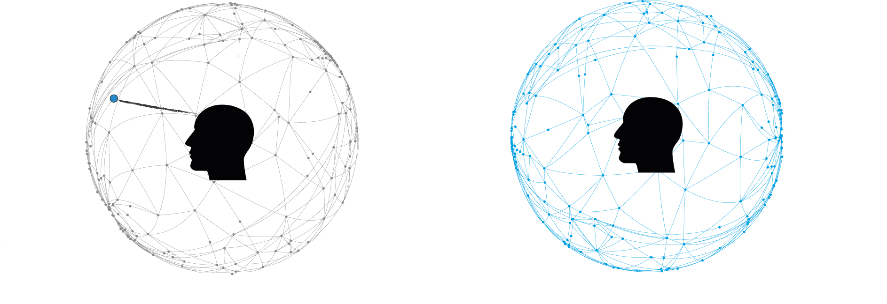
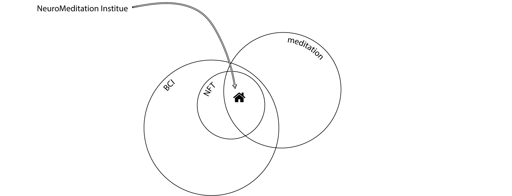
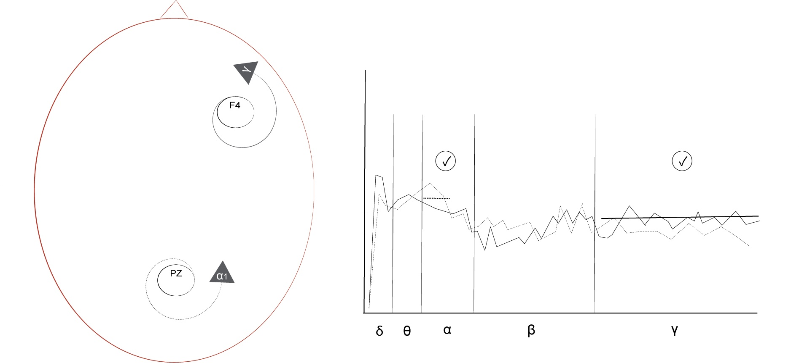
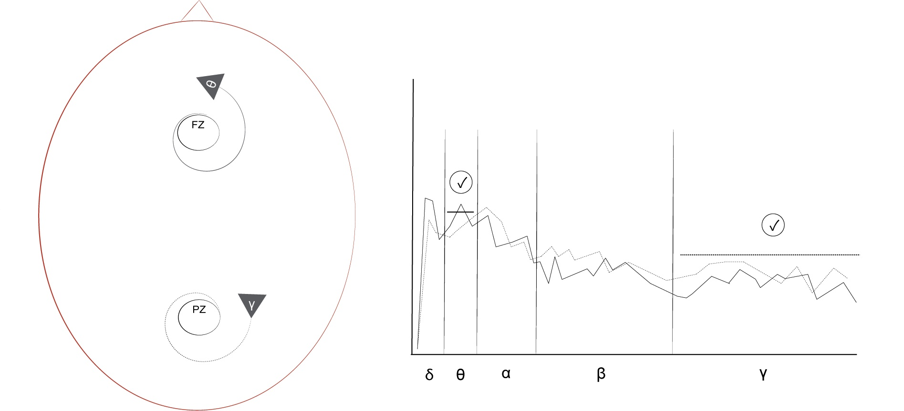
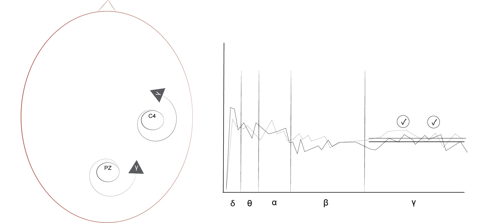
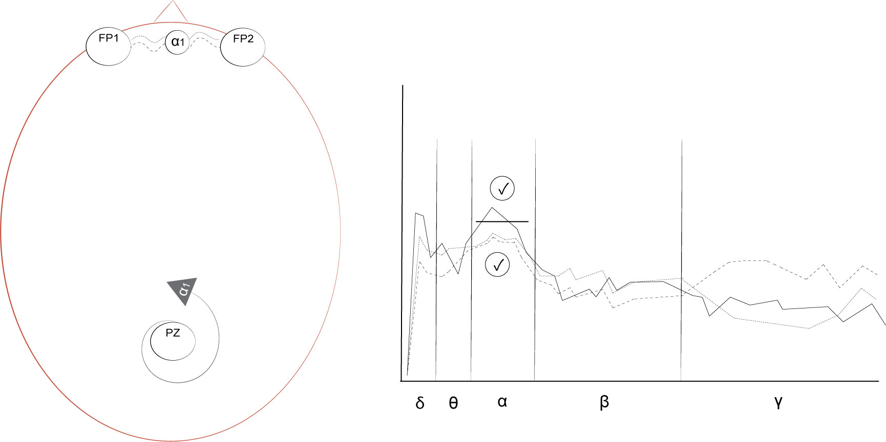

## 3.3 Meditation with NFT

{: .no_toc }

## Table of contents
{: .no_toc .text-delta }

1. TOC
{:toc}

---

### 3.3.1 Meditation
Meditation is a set of mind-body practices that, by regulating attention, can help induce a variety of physiological and mental changes that range from simple relaxation to dramatic mystical experiences. Its methods include different practices, e.g. breath-work (Holmes et al., 1996; Bing-Canar, Pizzuto and Compton, 2016), visualisation (Margolin, Pierce and Wiley, 2011) and repetitive mantras (Lynch et al., 2018). While some consider meditation to originate from shamanism in the Stone Age (Monaghan and Viereck, 1999), more commonly, it is believed to have emerged from religious and spiritual practices
‘originally developed by and for religious women and men who lived within monastic contexts or at the margins of society’ (Farias, Brazier and Lalljee, 2021). While we cannot precisely define when and where meditation began, we know that Buddha in India, Lao-Tze in China, and Dosho in Japan were the leading advocates of its use in the East. Although meditation has also been practised in Judaism (Storedalen, 2013), the ancient Islamic tradition of Sufism (Jamal, 2013) and Christianity (Casiday, 2013), only after the more recent translations of Eastern texts to European languages has it become more widespread and later secularised in the West, e.g. by the works of Jon Kabat-Zinn on mindfulness meditation (Kabat-Zinn, 2003). Throughout history, the definitions and practices of meditation have changed in line with how cultures have used it for their religious and spiritual practices (Bronkhorst, 2014). Over the last few decades, as meditation became more secularised, it has also become of interest to the research community for its positive effects on general well-being (Heppner and Shirk, 2018) and serious health issues (Grossman et al., 2004; Rubia, 2009; Kwon et al., 2021; May and Maurin, 2021).

The theoretical study by Washburn (1978) separates meditation into two main types; concentrative and receptive (Fig. 3.13).

Figure 3.13: Visual interpretation of concentrative (left) and receptive (right) meditation. The colour blue indicates the object of focus.

Concentrative meditation focuses on one object while trying to neglect all other objects. This one object can be external or internal, for instance, the flame of a real or an imaginary candle. While concentrating on the selected object, the state of mind is constantly shifting sometimes until a breakthrough — the crossover — where the meditator becomes absorbed in the object. This absorption has been referred to as ‘samiidhi’ in Hinduism, ‘jhana’ in Buddhism and ‘enstatis’ in contemporary research on yoga. Receptive meditation is a more passive method of paying attention to internal or external objects. Attention is not fixed on any object specifically for an extended period; rather, objects are first acknowledged and then maintained with passive attention. With this technique, the meditator can pay attention to several objects simultaneously. Receptive meditation is associated with mindfulness (‘satipatthana’) and insight (‘vipassana’) meditations in Buddhism, just-sitting (‘ishikan-tazat’) in Zen-Buddhism, choice-less awareness in Krishnamurti’s, and self-remembering in Gurdijeff’s teachings. Washburn highlights that both practices have been encouraged in Tibetan Buddhism and Zen Buddhism. Table 3.1 juxtaposes the two types.

|                          | concentrative   | receptive      |
|--------------------------|-----------------|----------------|
|                          | active          | passive        |
|                          | closed          | open           |
|                          | forced          | voluntary      |
|                          | focused         | delocalised    |
|                          | zoom in         | zoom out       |
| internal/external object | both            | both           |
| number of objects        | single          | multiple       |
| filter                   | narrow          | wide           |
| length of meditation     | unfixed         | unfixed        |
| information flow         | sequential      | non-sequential |
| Taoism                   | jang            | jin            |

Table 3.1: Comparing concentrative and receptive meditation.

The further meditation transcends our attention, the more secrets of our subconscious processes can it reveal to our conscious processes. In receptive meditation, we can step back and look at our framing of reality, discover where it might be distorted and then use these discoveries to break out of inappropriate framing (e.g. undesired instinctive behaviours triggered by certain situations). With concentrative meditation, we train our attention to ignore irrelevant information and focus on what is salient for progress. Meditation can help our sense-making and the integration of insights into our everyday lives. 

In the light of cognitive and neuroscientific studies (Banquet, 1973; Cahn and Polich, 2006; Lutz, Dunne and Davidson, 2007; Lee et al., 2018; Tarrant, 2020), meditation has also been defined more empirically. These new studies contribute to previous theoretical and qualitative research with quantitative measurements of biological rhythms (e.g. brainwaves monitored by BCI systems).

### 3.3.2 NeuroMeditation
Despite a growing interest in meditation over the last few decades, it is still a difficult practice for many people for various reasons ‘ranging from a lack of time to general laziness’ (Brandmeyer and Delorme, 2013). How NFT can support meditation is the key research focus at the NeuroMeditation Institute in Eugene Oregon (Fig. 3.14). Director Jeff Tarrant defines meditation as follows:

> A systematic mental training designed to challenge habits of attending, thinking, feeling, and perceiving (NeuroMeditation Institute, 2019)

Figure 3.14: Venn diagram situating the NeuroMeditation Institute at the intersection of the domains of NFT and meditation.

NeuroMeditation is a type of NFT that can help novice and advanced meditators improve their meditation practices by providing immediate feedback on their internal states (Tarrant, 2017; 2020). NeuroMeditation combines the ancient wisdom of meditation with modern computer science. It provides a secular framework to begin and maintain the practice of meditation with neurofeedback protocols using standard qEEG or LORETA feature extractions. The five standard qEEG protocols are:

- focus protocol
- two mindfulness protocols: thoughtless awareness and thoughtful awareness
- open heart protocol 
- quiet mind protocol [^nMLorete]

[^nMLorete]: As my research has not used LORETA feature extraction, I have only outlined the standard qEEG protocols. More information on the LORETA protocols can be found in Tarrant’s cited papers and brief video introductions to these protocols on the NeuroMeditation (1995) YouTube channel.

The focus protocol proposes to improve focus, attention and executive functions to aid people with cognitive decline, memory problems and attention deficit disorders. It is based on how meditators shift and sustain attention using three different brain networks. In mind wandering the default mode network, when redirecting attention the salience network, and when maintaining attention on a specific object (e.g. breathing), it is the executive attention network that is most active (Hasenkamp et al., 2011). To be focused, the executive attention network needs to be engaged, and the default network mode needs to be quiet; therefore, as seen in Fig. 3.15, this protocol rewards

- increased gamma (35-45 Hz) on F4 and
- increased alpha1 at 8-10 Hz on Pz 

Figure 3.15: A focus protocol’s electrode location (left) and a spectral plot (right) showing the application of two indicators, one applied on gamma on F4 and the other on low-alpha at Pz.

Figure 3.16: A thoughtless awareness protocol’s electrode location (left) and a spectral plot (right) showing the application of one indicator on Fz and one inhibitor on Pz.

Figure 3.17: A thoughtful awareness protocol’s electrode location (left) and spectral plot (right) showing the application of two gamma indicators.

Figure 3.18: An open heart protocol’s electrode location (left) and a spectral plot (right) show the application of one indicator on the right hemisphere (F4) and one inhibitor on the left hemisphere (F4), with the addition of another indicator on Fp1 rewarding increased gamma.

Tarrant sometimes rewards increased gamma in the first part of the training session, and then, instead of increased gamma, he rewards increased beta in the second half of the session (NewMind Technologies, 2018). He also suggests experimenting with rewarding the decrease of faster brainwaves (beta or gamma) with an inhibitor on the default network mode, e.g. on Pz (NewMind Technologies, 2019). During a focus session, trainees intend to hold their attention on a single object, and when their mind wanders, they intend to bring attention back to the object. It is important to note that increased high-beta could indicate trying to focus too hard instead of actually being focused. Therefore, a qualitative questionnaire after the session is essential to provide clarification.

The institute distinguishes two types of mindfulness meditations and has designed two different protocols accordingly (NewMind Technologies, 2019): thoughtless awareness and thoughtful awareness. These protocols propose to help meditators distance their attention from thoughts and feelings while sustaining a calm awareness with open monitoring. They are often used to alleviate stress and anxiety. With these two protocols, trainees intend to pay attention to what is happening in the present moment while trying not to become attached to anything. The state of mind aimed for is an observer mode with a non-judgemental awareness of the present moment. With a thoughtless awareness protocol, trainees intend to allow whatever objects emerge in their awareness and pay attention to these objects while trying not to get attached to them. This protocol, as seen in Fig. 3.16, rewards

- increased theta on Fz and
- decreased gamma on Pz

With a thoughtful awareness protocol, trainees have slightly more control over their attention than with the previous mindfulness protocol. Similarly to thoughtless awareness, trainees also need to pay attention to objects emerging in their awareness without getting attached to them however, they are encouraged to guide their attention from object to object. This protocol is often used in connection with body scanning, progressive muscle relaxation and healing imagery. The protocol, as seen in Fig. 3.17, rewards

 - increased gamma on C4 or T4 and
 - increased gamma on Pz

The open heart protocol proposes to help improve trainees’ moods by making them feel more empathetic and kind. It is often used to heal depression and improve relationships by building empathy. Trainees with this protocol first intend to activate positive emotional states associated with loving-kindness and compassion (Hutcherson, Seppala and Gross, 2008), gratitude (Kyeong et al., 2017) or forgiveness meditation practices (Menahem and Love, 2013) and then ‘do something’ with the positive emotional energy arising from these mental states. For instance, trainees can move this emotional energy around their bodies to target an unhealthy organ or ‘send out’ this positive energy with healing intentions to other people. The protocol is designed to train trainees’ nervous systems to focus on the positive aspects of life. It is based on the asymmetry of frontal brainwave patterns linked to positive and negative emotional states. In a more positive emotional state, the left, in a more negative emotional state, the right hemisphere is more active (Sutton and Davidson, 1997). Therefore, the protocol, as seen in Fig. 3.18, rewards

- increased alpha (8-12 Hz) on F4 while
- decreased alpha (8-12 Hz) on F3 and 
- increased low-beta (15-18 Hz) or gamma (35-50 Hz) on Fp1 or F3 or F7

The quiet mind protocol proposes to help minimise internal self-talk by experiencing peace and calmness. It is often used to address eating disorders, obsessive-compulsive and personality disorders and to facilitate transcendence. With the focus protocol, the intention is to hold attention on one thing, while with quiet mind to not hold attention an anything. A quiet mind training should start with similar brainwave patterns to those aimed for in a focus training (less rear and more frontal brain activity in the higher frequencies); however, after some time, the whole brain should become ‘quieter’. A type of meditation that falls into this category is Transcendental Meditation (Tarrant, 2017, p.70). In a successful quiet mind session, the low-alpha (8-10 Hz) is the most active, while all other brain rhythms are subtle. This protocol, as seen in Fig. 3.19, rewards

- increased low-alpha at 8-12 Hz to start with, and later at a narrower 8-10 Hz on Pz and
- low-alpha coherence between Fp1 and Fp2 or between F1 and F2

Figure 3.19: A quiet mind protocol’s electrode location (left) and a spectral plot (right) showing the application of one indicator rewarding increase of low-alpha on Pz and another indicator rewarding low-alpha coherence between FP1 and FP2.

The focus protocol clearly trains concentrative, while the two mindfulness protocols receptive meditation. As we need to focus on a specific feeling or emotion in the open heart training, I believe we could consider it training concentrative meditation. Quiet mind seems to benefit from initially using mental techniques that zoom in (concentrate) and then methods that zoom out (receive) until the meditator reaches a breakthrough