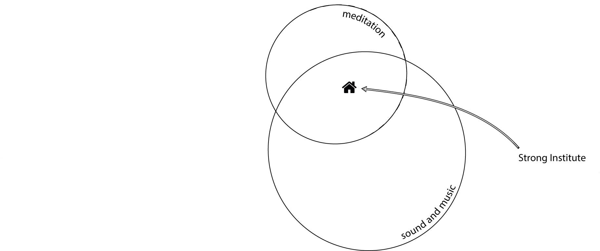
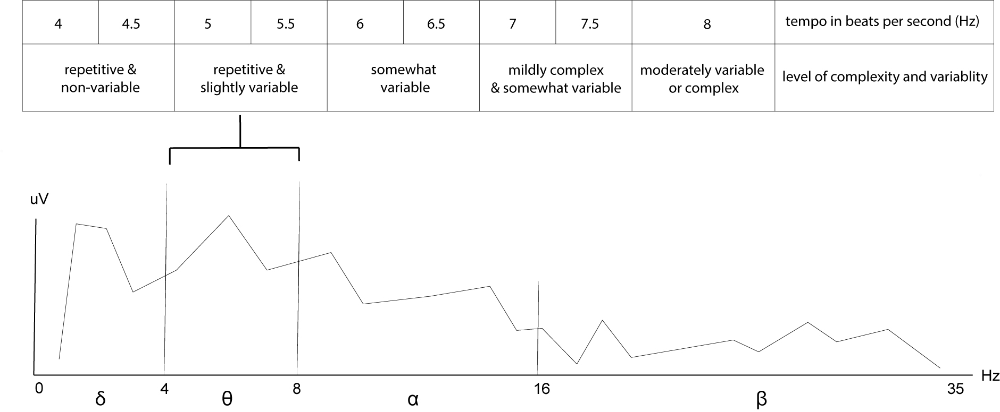
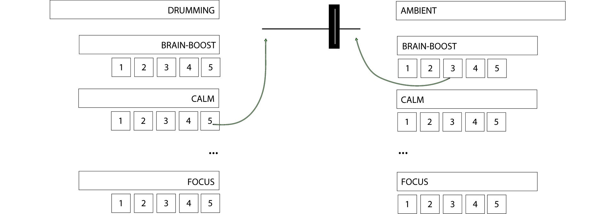
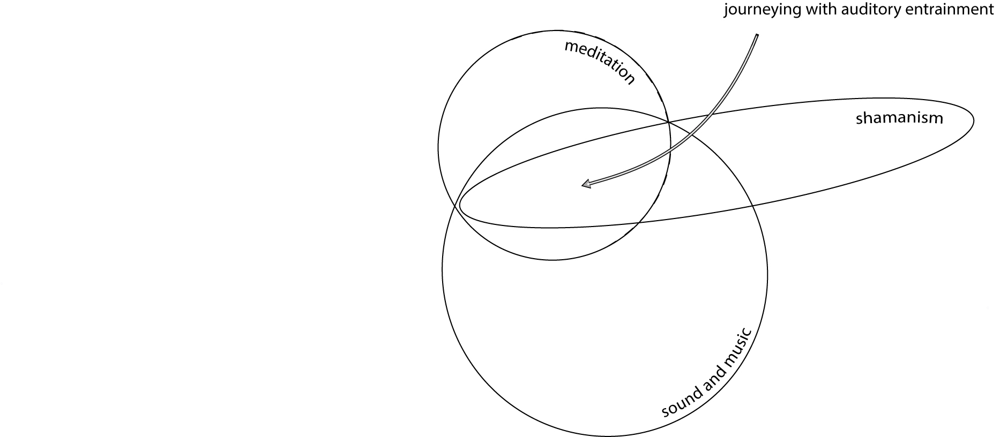

## 3.4 Auditory Rhythmic Entrainment (ARE)

{: .no_toc }

## Table of contents
{: .no_toc .text-delta }

1. TOC
{:toc}

---

### 3.4.1 Introduction to entrainment
Research suggests a relationship between the tempo of music and the physiological changes that take place in the listener (Neher, 1962; Huang and Charyton, 2008; Jovanov and Maxfield, 2011). This relationship is thought to be based on the principles of synchronisation, often referred to as entrainment, frequency entrainment, frequency following response, locking or phase-locking (Pikovsky et al., 2001). When it relates to sound and music, entrainment is also described as sonic entrainment (Goldman, 2000), rhythmic entrainment (Strong, 1998; Trost, Labbé and Grandjean, 2017), sonic driving (Wright, 1989; Brilla and Hatcher, 2000; Harner, 2013), auditory driving (Turow, 2005; Fachner, 2011; Will and Turow, 2012) and sometimes as auditory beat stimulation (Chaieb and Fell, 2017). The essence of synchronisation, first written about by Christiaan Huygens in 1665 (Pikovsky et al., 2001), is the adjustment of two or more rhythms of oscillating objects due to their weak interaction. Weak interaction means that

> ... [the synchronisation] is not qualitatively changing the behaviour of either one of the interacting systems and should not deprive the systems of their individuality... (Pikovsky et al., 2001, p.17)

For example, stopping one system should not stop the other system. 

Synchronisation can be in-phase, anti-phase, phase-shifted or complete. It is not to be confused with resonance, where one of the systems in the interaction has no rhythm of its own. In synchronisation, all systems have their individual rhythms. The synchronisation of rhythms is a universal phenomenon. It can be perceived in other non-music-related disciplines, such as biological sciences (McClintock et al., 1971; Bramble and Carrier, 1983; Niizeki, Kawahara and Miyamoto, 1993) and social sciences (Blasius, Huppert and Stone, 1999; Néda et al., 2000). A common method of synchronisation is pacing and mirroring in nonverbal communication, often used to establish rapport in business (Fatt, 1998) and parenting (Bryson and Siegel, 2012). A general principle of music therapy also links to synchronisation:

> If music is to be used to reach and change a person, it should begin with matching the medium to the individual’s current condition. (Donald and Pinson, 2012, p.19)

> [The iso-principle is] a technique by which music is matched with the mood of a client, then gradually altered to affect the desired mood state. (Davis, Gfeller and Thaut, 2008)

To help induce and maintain meditative states, I reviewed two methods of auditory entrainment:

 1. Binaural beats, in which a monotonous rhythm is a subjective percept processed in the brain's medial superior olivary nuclei before being transmitted to the CNS. 
 2. Monaural beats, in which a repetitive rhythm is demodulated in the cochlea before being transmitted to the CCNS (Chaieb and Fell, 2017).

A difference between binaural beats and monaural beats (e.g. repetitive drumming) is that binaural beats need to be listened to through headphones for the best effect and monaural beats do not. The headphones are required when listening to binaural beats due to the technology used to generate them. When listening to slightly different frequencies (e.g. 100 Hz through the left and 104 Hz through the right ear), the brain perceives the difference in frequencies (in this case, as a monotonous beat pulsating at 4 Hz). However, drumming with repetitive rhythms does not require headphones for entrainment, as its beats are within the human hearing range. Both methods are considered helpful for increasing the amplitude of a brainwave or, more specifically, the power of a specific EEG frequency band that aligns with the frequency selected for the entrainment. For example, binaural beats monotonously pulsating at 4 Hz should have the same synchronisation effect as repetitive drumming in which the beats hit the drum four times per second. When synchronisation is effective, the 4 Hz rhythm of either of these two methods is 'locked' to neurones in the brain firing at 4 Hz.[^real-unreal-stim]

[^real-unreal-stim]: Whether the amplitude of the selected frequency in the brain can increase by exposure to the stimuli through passive hearing or whether we can produce this increase only by actively (intentionally) listening to the stimuli is an important question I am still investigating. I am also interested in finding out how imaginative stimuli could affect brainwaves — for example, how we entrain our brainwaves by simply 'drumming' in our heads.

### 3.4.2 Rhythmic Entrainment Intervention
Since ancient times, monaural entrainment with repetitive drumming has been used to help induce and maintain ASCs. A specific type of monaural entrainment is ARE, thoroughly explored in the works of Jeff Strong, the co-founder of Rhythmic Entrainment Intervention (REI) at the Strong Institute in Santa Fe, New Mexico (Fig. 3.20).

Figure 3.20: Venn diagram situating the Strong Institute at the intersection of the domains of meditation and sound and music.

> Rhythmic Entrainment Intervention is an auditory brain stimulation program that uses musical rhythm to stimulate and re-pattern neurological function. A unique blend of modern advances in brain research and ancient rhythmic techniques, REI facilitates long-term behavioral and cognitive improvement in individuals with neurological disorders. (Strong Institute, 1994)

REI is a six-month-long programme aiming to alleviate the suffering of people with symptoms related to attention deficit disorders, behavioural issues (e.g. aggression), cognitive issues (e.g. memory loss), mood issues (e.g. depression), self-stimulatory behaviours (e.g. rocking), sensory processing issues (e.g. sensory defensive and sensory seeking behaviours), sleep problems (e.g. insomnia) and social challenges (e.g. inability to interact with others). The programme evolved from live stimulation through customised audio CDs to the current online platform. During live stimulation, the trainer adjusts the music in response to the changes seen in the patient in the same physical space and time. With CDs and the online programme, the trainer and trainee do not share the same space and time; the work is done remotely using feedback forms. The current online programme consists of a series of weekly updated audio files, each carefully customised to trainees' initial conditions and developments throughout the programme. The audio files are between 20 and 30 minutes long and are generally encouraged to be listened to passively as background music. These files contain solo drumming that pulsate around 8 beats per second (BPS), double the tempo heard in most traditional shamanic drumming. Listening to REI is proposed to help reduce trainees' symptoms by increasing alpha brainwaves associated with calm.

> In order to induce calm, with drumming, play rhythms at 8 beats per second that are variable enough to keep the brain engaged, but not so variable as to make the brain have to work too hard... (Strong, 2018a)

The REI was created in 2004. It is based on the ethnomusicological research of Jeff Strong, who has worked with percussionists from different traditions, including Haitian Vodou, since 1983. In REI, he synthesised his discoveries on how tempo and rhythm have been used in different traditions to alter listeners' states of mind. He says:

> You can affect consciousness, cognition, and behavior by employing only two specific rhythmic techniques. One consists of a repetitive pulse while the other employs complex rhythmic structures. (Strong, 2010)

Strong’s secularised methods have been investigated in controlled settings (Strong, 1996b; 1996a; 2012a;
2012b; Oostra, 2012), more recently, involving OpenBCI (Strong, 2018b).

The REI method uses the principle of synchronisation. As with binaural and monaural beats, the drumming in REI also has a specific tempo to increase the amplitude of the trained brainwaves, but in addition to this, the complexity of its rhythm is also aligned with these brainwaves. In general, the faster the tempo, the more variation Strong suggests the rhythm needs to keep the brain engaged. For instance, when entraining slower brainwaves (delta, theta, low-alpha), the drumming can be repetitive with simpler rhythms. However, when entraining faster brainwaves (high-alpha, beta, gamma), the drumming should be less repetitive and use variations of more complex rhythms (e.g. with odd meters and random changes). Strong’s ARE works to entrain brainwaves with the stimuli's tempo and rhythm:

> As I developed Rhythmic Entrainment Intervention (REI), my first step was to identify the core mechanisms of the traditional techniques. It turns out that these mechanisms are simple, powerful, and easily understood. First, human consciousness can be directly affected by an auditory stimulus. This is called ‘auditory driving’ (Goldman, 2000). Auditory driving states that a listener’s brain wave activity will synchronise with the pulsation of an auditory rhythm (provided certain conditions are met). . . . The second core mechanism involved in traditional therapeutic rhythm techniques consists of using complex rhythms to activate the brain (Shatin, 1961; Scartelli, 1987; Parsons, 1996). Here complex auditory rhythms stimulate the Reticular Activating System (RAS), a part of the brain that controls sensory input (Scartelli, 1992). Applying rhythm - especially complex rhythm – to activate the brain is one level of the stimulation provided by REI. As we conducted research we discovered another dimension to the rhythms: one that appears to be more important than just complexity. It seems that each rhythm produces a different response. (Strong, 2010)

The customised audio files in REI are constructed from short audio samples capturing over 600 rhythmic patterns. In general, entrainment in the audio files starts with less complex rhythms and, throughout the programme, gradually moves towards more complex rhythms (Strong, 2016), as seen in Fig. 3.21.

Figure 3.21: FFT plot aligning tempo and rhythmic complexity (top) with theta brainwaves (bottom) as in Strong’s research.

The Strong Institute offers a similar programme called Brain Shift Radio (BSR) (2012), a dual-music- streaming platform where users can mix two types of music: solo or orchestrated (layered) drumming with ambient music (Fig. 3.22). Both types can be selected from various categories (e.g. brain-boost, calm, energy uplift, focus and meditation) and played simultaneously. Within each of these categories, sub-categories defined as ‘energy levels’ help further refine the intensity and uniqueness of the mix. The user controls the choice of audio samples and the volume crossfader between the two players and can even rate the created mix from one to five stars. The more stars a mix gets, the more likely the automatic playing mode will select this unique blend in the future. BSR was developed to fulfil an emerging need expressed by REI trainees; the need for music better suited for active listening (i.e. listening with a focus on the music instead of on another activity while the music is played in the background). Also, as some trainees found audio files with only drumming too hard to listen to, with the ambient sounds and customisability added, BSR expanded on REI and reached a wider audience. The main difference between the two programmes is that the audio file selection is trainer-controlled and contains primarily solo drumming in REI, while it is trainee-controlled and contains solo or orchestrated drumming mixed with ambient music in BSR. Trainees have more control over the entrainment with BSR however, they do not receive the personalised support offered with the six-month-long REI programme.

Figure 3.22: Brain Shift Radio’s dual-music-streaming platform.

### 3.4.3 Shamanic journeying
Inspired by REI, I investigated how shamanic drumming has been claimed to help induce and maintain an ASC. Shamanic journeying is a specific type of guided meditation used in shamanic traditions in which practitioners aim to enter an ASC to communicate with 'spirits' and retrieve specific information from them (Fig. 3.23).

Figure 3.23: Venn diagram situating shamanic journeying with auditory entrainment at the intersection of the domains of meditation, sound and shamanism.

Shamanic journeying, often referred to as journeying or soul flight, aims to take participants on a trip to a non-ordinary reality (NOR), a hypnagogic state more recently defined as the SSC (Harner, 1980; Rock and Krippner, 2011; Huels et al., 2021). In the SSC, shamans or shamanic practitioners enter into

> controlled out-of-body experiences in which they experience themselves roaming at will through this or other worlds and meeting, battling, or befriending the spiritual inhabitants. (Walsh, 2001, pp.31–52)

Frecska, Hoppál and Luna (2016) define an SSC as an alternate source of environmental information that is opened through a ‘nonlocal-intuitive’ channel after a shift occurs in the journeyer’s awareness through the use of psychedelics or contemplation. In Flor-Henry, Shapiro and Sombrun (2017), an SSC is

> a distinct sub-category of ASCs characterized by lucid but narrowed awareness of physical surroundings, expanded inner imagery, modified somatosensory processing, altered sense of self, and an experience of spiritual travel to obtain information necessary for solving a particular individual or social problem.

The methods with which the ASC is accessed in shamanic journeys are subject to cultural differences. For example, to create and maintain an SSC, some shamanic practices employ repetitive stimulation with psychedelic substances, and some do not (Fachner, 2006b; 2006a). As a result of his cross-cultural research, Michael Harner developed core shamanism to preserve shamanic knowledge and distil it for ordinary people to use for healing purposes. He states that ‘most of the world’s indigenous cultures did their work without the appreciable use of psychedelic substances’ (Harner, 2013, p.40). With regard to differences in journeying, he writes as follows:

> ... in some indigenous societies, there are shamans who do not journey at all, and others who journey only in the Middle World or, if they journey beyond the Middle Worlds, may not go to both the Upper and Lower Worlds. What they do share is disciplined interaction with spirits in nonordinary reality to help and heal others. (Harner, 2013, p.49)

NORs are most often experienced through visual imagery (Noll, 1983; Houran, Lange and Crist-Houran, 1997), but other sensory modalities can also occur (Walsh, 1995). Shamanic journeys are often accompanied by drumming to help induce an SSC, often by entraining theta brainwaves at 4 Hz in the EEG spectrum using drumming at a 4 BPS tempo (Jovanov and Maxfield, 2011). Participants in a journey often ask for clarity on a specific question. Shamanic practitioners believe that the clarification comes from the Spirit or spirits (Harner, 2013), while from a more scientific understanding, it is believed to come from the subconscious mind (Jung, 1960). It is also important to highlight that, although two shamanic practitioners can share a tradition (a belief system), their maps of meaning linked to the actual environments and spirits experienced in their individual journeys can differ (Harner, 2013, p.71).

> These original techniques are some of the most pervasive therapeutic practices known to man, existing on every continent even among people who had no contact with one another. (Harner, 1980)

Depending on the specific tradition, the tempo and rhythmic complexity of drumming in shamanic journeying sometimes does and sometimes does not change. For example, while core shamanic practices (Harner, 1980; Hove et al., 2015) use repetitive rhythm with a steady 4 BPS tempo, some shamanic traditions vary the rhythm and tempo, as does Strong (1998) in his REI for instance. In Drums of Vodou, the authors not only highlight the importance of different rhythms for calling different spirits but also emphasise that among the different instruments used for calling them, it is the sound of the drums that spirits prefer the most:

> The spirits love music, ... each has his/her favourite beat. From their locations in the cosmos, spirits respond to a complex of invitational signals sent out to servants, but the drum might be the most compelling of these. (Wilcken, 1992, p.47)

Maas and Strubelt (2003), in their study on Iboga healing ceremonies of central West Africa, also comment on the role of varied drumming patterns:

> The melodic motifs are repeated mostly after 2x12 or 4x12 elementary beats and undergo minimal melodic or rhythmic variations. Here the melodic rhythm frequently diverges slightly from the elementary beats, thus suspended between the two fundamental metrics. The repetitions lead to mental anticipations that are systematically frustrated by these minimal changes in order to 'keep you on the move', as the Mitsogho told us: they create the open-minded attention that is required.

The soundscapes generated with the BCMI-2 system attempt to employ both repetitive and varied stimuli (ARE), with additional sound textures that provide context for meaning and immersion (Chapter 5).