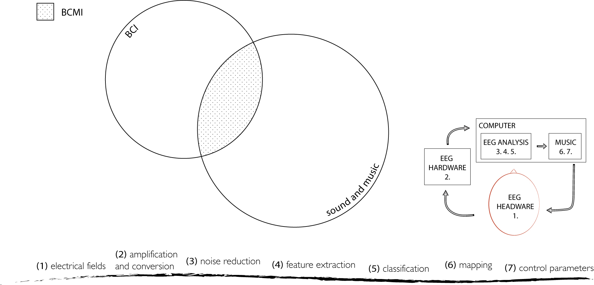
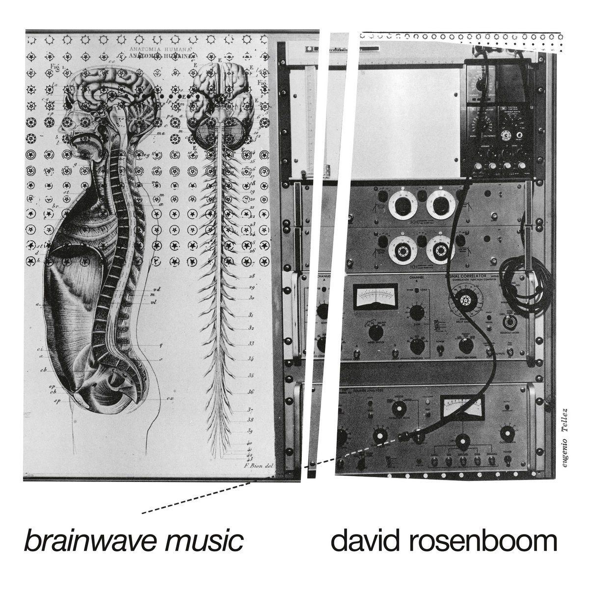
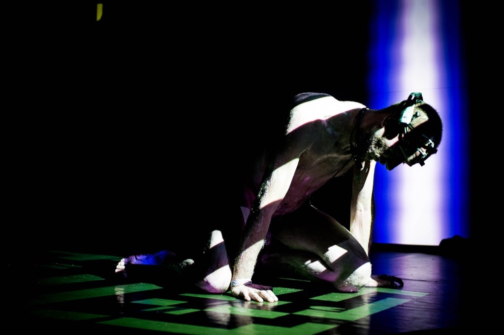
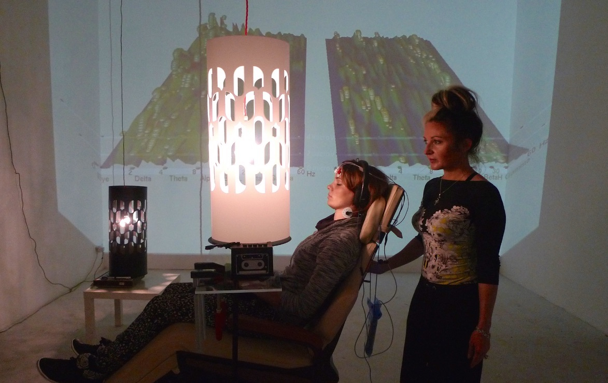
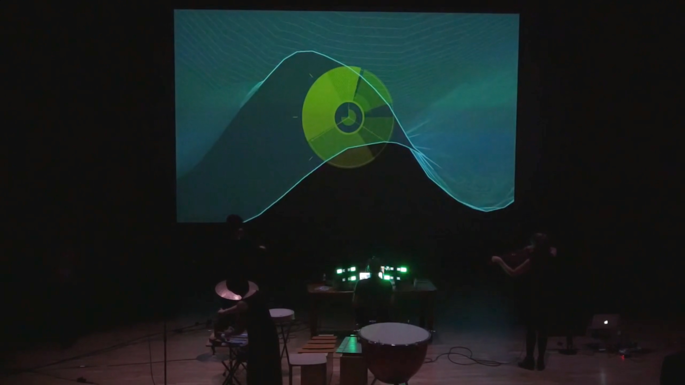
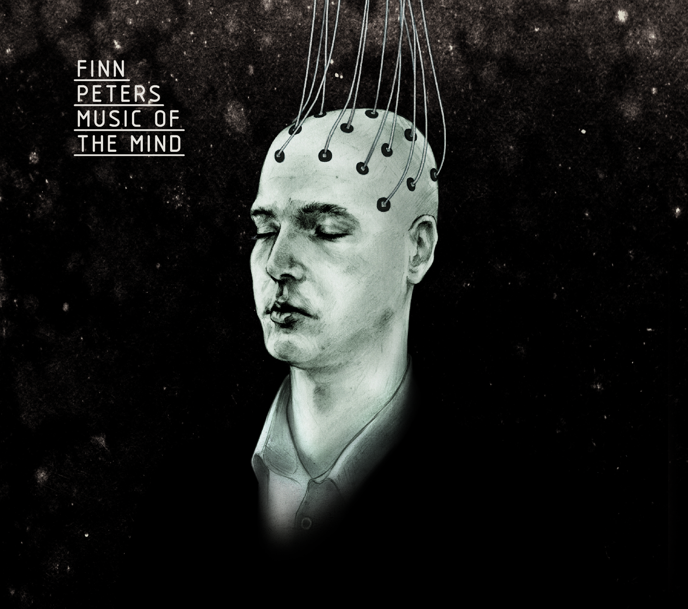

## 3.6 Brain-Computer Music Interfacing (BCMI)
<!--#brainart #science-art -->

{: .no_toc }

## Table of contents
{: .no_toc .text-delta }

1. TOC
{:toc}

---

### 3.6.1 Brain art
As outlined earlier, BCI systems are used in biomedical and non-biomedical, clinical and non-clinical settings, where the clinical applications focus on helping unhealthy people and the non-clinical applications on helping or entertaining healthy people (Mridha et al., 2021). Due to their technical nature, all BCI applications involve advanced scientific methodology, yet the methodology’s level of rigour and the degree to which artistic methodology is integrated often depends on the purpose of the application (and the developer’s skill) and not on whether the application is used in clinical/non-clinical or biomedical/non- biomedical settings. For instance, as evidenced in art therapy practices, art, including dancing, painting, and music, can be used in clinical and non-clinical settings (Landgarten, 2013; Fish, 2019). Also, while visualisation or sonification of brain data in surgical monitoring must focus on accuracy and timeliness with little room for creative (artistic) expression, recreational settings can turn this around. Novello (2012) states: ‘Contrary to science, art can better accept instability and turn it into an interesting parameter’. BCI applications used for artistic purposes fall under the umbrella term ‘brain art’ (Nijholt, 2019), also referred to as ‘artistic brain-computer interfacing’ (Wadeson, Nijholt and Nam, 2015). Recent reviews of brain art with examples can be found in Nijholt (2019) and Gruber (2020).

### 3.6.2 BCMI systems
BCI systems mapping brain activity to parameters of sound or music are recently referred to as brain- computer music interfaces, a term originating from the Interdisciplinary Centre for Computer Music Research (ICCMR) at the University of Plymouth (Miranda and Castet, 2014). A BCMI system allows sound to be both the input for and the output of the brain, i.e. users can hear how their brain activity changes the sounds they are listening to (Fig. 3.24). 

Figure 3.24: Venn diagram indicating the domain of BCMI being at the intersection of the BCI and sound and music domains (top left). All steps of a BCMI (bottom and right).

Eaton and Miranda (2014b) distinguish between the following three types of BCMI systems: 

> 1. In a computer-oriented system, the user adapts to the functions of the computer. The computer model stays fixed, and the system's success relies on the ability of a user to learn how to perform control over musical events.
> 2. A user-oriented system is programmed to understand the meaning of user input in an attempt to adapt to its behaviour to achieve control.
> 3. A mutually-oriented system combines aspects of both user and computer orientation, whereby the two elements adapt to each other.[^softhardinterchangeable] 

[^softhardinterchangeable]: These terms are interchangeable with those established terms for BCI types in Section 3.1. A computer-oriented system can also be called hard, active or explicit and is linked to conscious operant conditioning. In this system, the user’s deliberate cognitive choices are mapped to musical features. A user-oriented system can also be called soft, passive or implicit and be linked to spontaneous operant conditioning. Here the BCI is used to monitor unconscious activities that are used to inform the musical features. A mutually-oriented system can also be called a hybrid, in which both active and passive controls are used together.

As BCI systems, BCMI systems can also be classified based on their usability. They can be biomedical when used with unhealthy people (e.g. to aid their communication in music therapy settings) or with healthy people (e.g. to enhance a particular ability in NFT settings), and they can also be non-biomedical (e.g. when used in recreational settings with artistic expressions for composition and performance). BCMI systems can also be dependent or independent, synchronous or asynchronous, research- or consumer-grade.

### 3.6.3 A brief history of BCMI
BCMI grew out of artists performing with biofeedback systems in the 1960s. Since the advancement of technology towards the end of the last century, BCI systems became not only more accurate in recording and processing brain signals but also smaller, more affordable and often accompanied by software development packages - all helping their potentials to be further explored in artistic performances, in academic research and more recently in domestic settings. The following paragraphs will briefly outline this history and highlight some important and inspiring works.

At the beginning of the last century, advances in HCI allowed artists to experiment with biofeedback using sensors (e.g. cardiac sensors to measure HRV, EMG to measure muscle tension, proximity sensors to measure distance and EEG to measure brain activity). The first reading and visualisation of EEG are attributed to the German psychiatrist Hans Berger (1929), whose goal was to find proof of telepathy.[^berger-spiritual] This development was largely ignored until five years later, when Edgar Adrian and his research student Bryan Matthews verified the method and created the first EEG sonification, which they proposed to be a good tool for exploratory analysis of brain signals (Lutters and Koehler, 2016). They wrote about the experience as follows:

[^berger-spiritual]: The link between Berger's spiritual and scientific life and a detailed outline of how he developed methods to understand the mind-brain relationship can be found in @Millett2001BergerPsy.

> In this particular experiment, Adrian investigated whether disappearance of the alpha rhythm, which generally occurred upon opening the eyes, would still take place in the absence of visual stimuli. Hence, the subject (Adrian or Matthews) was placed in a dark room to see whether the eyes could be opened without terminating the alpha rhythm (which was indeed the case). However, deprived of sight, it was no longer possible to watch one's own EEG recordings; a problem that was overcome by sonification, allowing the subject to detect temporal EEG changes upon opening or closing the eyes in the dark. (Adrian and Matthews, 1934) [^ffr]

[^ffr]: This paper was also the first one to describe the frequency following response of the EEG, the basis for entrainment as discussed previously in Section 3.4.

This, and subsequent developments in brain science, inevitably drew 'artists with an experimental bent' to collaborate with scientists (Rosenboom, 1990).

> If we accept that the perception of an act as art is what makes it art, then the first instance of the use of brainwaves to generate music did not occur until 1965. (Brouse, 2007) [^priorlucier]

[^priorlucier]: Prior to Lucier’s well-known Music for Solo Performer (1965), I found three notable projects that mapped EEG onto sound. One was the EEG spectrophone (Kamp, Kuiper and Leeuwen, 1958), which ‘transformed the EEG frequency analysis into sound by assigning a specific tone to each frequency band, rising in pitch with increasing frequencies’ (Lutters and Koehler, 2016). Second, the previously mentioned Joe Kamiya and his neurofeedback system using sound to help learn control alpha brainwaves (Kamiya, 2019). Third, Krzysztof Penderecki’s Polymorphia (1962) was composed for a large string orchestra in which a section in the musical score maps amplitude fluctuation of pre-recorded brainwaves to pitch notations for traditional instruments. Krzysztof recorded these brainwaves on people listening to one of his earlier compositions dedicated to the 1945 Hiroshima bombing victims. Polymorphia’s distressing sound would later be used in two famous films, the supernatural horror The Exorcist (1973) by William Friedkin and the psychological horror The Shining (1980) by Stanley Kubrick.

The first artistic performance using real-time EEG is widely considered to be Music for Solo Performer (1965) by Alvin Lucier in which alpha brainwaves were mapped to transducers accentuating percussion instruments ‘including large gongs, cymbals, tympani, metal trash cans, cardboard boxes, bass and snare drums. . . ’ (Lucier, 1976). Since its 40-minute long premier, encouraged and live-mixed on eight channels by John Cage at the Rose Art Museum of Brandeis University, the piece has been performed by many other artists modifying the length of the performance and the mapping (e.g. by using switches operating radios, televisions, lights, alarms and other audio-visual devices instead of transducers accentuating percussion) (Lucier, 1995). Besides Cage, another person linked to this performance was the physicist and amateur organist Edmond Dewan, who developed a ‘brain-control system’ in the early 1960s that could not only turn a lamp on and off with alpha brainwaves but also send Morse code by producing shorter or longer audio signals (Kahn, 2013, p.95).[^DewanVideo] It was Dewan who initially introduced Lucier to an EEG and encouraged its use for performance. A detailed account of how Cage and Dewan helped Lucier, along with the technical details of this piece can be found in the work of Kahn (2013).

[^DewanVideo]: Dewan demonstrates his system in a short video at [https://youtu.be/tvo7w1BvF2g](https://youtu.be/tvo7w1BvF2g).

Soon after Lucier’s experiment, another American composer, Richard Teitelbaum, also started mapping biological signals to sound in a series of artistic performances titled *Spacecraft* (1967) as a part of the Rome-based live electronic music group Musica Elettronica Viva. In these improvised experiments, he mapped brainwaves acquired with EEG hardware, as well as heartbeats and breath with contact microphones to sound parameters on analogue Moog synthesisers. Teitelbaum carried on using EEG in other musical performances (e.g. in 1968 in *Organ Music* and *In Tune*) (Teitelbaum, 1976). As in Lucier’s work, Teitelbaum’s arrangements also involved an assistant fine-tuning the mapping between brain and music as well as the overall sound mix during the performance. However, while Lucier had performed and others had assisted in creating an aesthetically pleasing composition, in Teitelbaum’s work, it was the other way around. *In Tune* visualised EEG for the first time in performance. Since its premiere, it has been performed multiple times with different performers and different sound materials. In ‘Improvisation, computers and the unconscious mind’, Teitelbaum (2014) outlines his early biofeedback music and its connection to meditation.

Another important American composer pioneering the use of brainwaves in musical performances is David Rosenboom, whose first public ‘participation-performances’ with EEG alpha-monitoring and heartbeat monitoring technique using visuals and sound is called Ecology of the Skin (1970). How the ‘performer- participants’ interacted with his custom-made electronic circuit to generate immersive sonic and visual environments is described in Rosenboom (1972). His first composition with EEG, *Piano Etude I* (1971), links repetitive motor tasks to increased alpha brainwaves. In the recorded version of this composition, Rosenboom played fast repetitive patterns on the piano, while at the same time, the fluctuations of his averaged alpha brainwave amplitude were mapped to filters processing the sound of these piano patterns. The more alpha waves he produced, the more high frequencies were allowed in the overall mix from the processed piano sounds. The result is a 14-minute flow of hypnotic patterns. His second piece with EEG, *Portable Gold and Philosophers’ Stones* (1972), provides instructions for up to four performers. Each performer’s theta and alpha brainwaves, galvanic skin response and temperature were analysed and mapped to frequency dividers and filters controlled by Rosenboom on his custom electronics system. To extract more meaningful data, besides the previously used FFT in *Piano Etude I*, the new works also extracted the coherence time of brainwaves and mapped it to parameters of sounds. ‘The result is a slowly unfolding web of filtered electronic tones over a tanpuraesque fundamental, possessing the unhurried, stately grandeur of an electronic raga’ (Rosenboom, 2019). His third piece using one performer’s EEG, *Chilean Drought* (1974), continued the use of fast repetitive piano patterns, with additional live or pre-recorded instruments (e.g. voices speaking or chanting, electronics and percussion). The system mapped the relative levels of a performer’s theta, alpha and beta brainwaves onto the volumes of three different recorded versions of a text about the Great Drought of 1968–69 in Chile (Rosenboom, 1997).

Figure 3.25: Cover art of David Rosenboom’s Brainwave Music. This release is a collection of Rosenboom’s compositions with EEG and other biofeedback hardware. Image courtesy of Black Truffle record label.

Another work from this period arose from the collaboration between French musique concrète composer Pierre Henry and scientist Roger Lafosse. In a series of live improvisation performances, Henry acquired his and the audience’s brainwaves with Lafosse’s *Corticalart* BCI system and mapped it to parameters of synthesised sound (Henry, 1971). Neidich and Anglès (n.d.) on their [artbrain.org](https://www.artbrain.org/) blog comment on this work as follows:

> The raucous blat-sound is an unrelenting analog free-electronic skree noise. Modern art is highly invested in the dream of unmediated musical/artistic expression, yet Henry directly attempts to locate a pure music flowing from the composer's head that results in discordant sound rather than anything that can be immediately recognized as a 'sensible aesthetic' or a deliberate sonic interpretation of conscious thought. Instead it is the uncontrolled and discordant epiphenomena of precognitive neuromodulated chemical activity. As a musician, Henry's head is covered in electrodes to capture alpha waves of relaxation and inattention, beta waves of alertness and attention, and 'artifacts' created by eye movements.

The BCMI projects in this period usually mapped the amplitude of brainwaves to various sound control parameters. While doing so, these performances highlighted BCI’s potential for new artistic, ability- enhancing and therapeutic applications. The connection between biofeedback and artistic explorations comes as no surprise, as many of the pioneers I have mentioned were part of the counterculture growing strong in the 1960s and 70s, where followers commonly explored the use of meditation for raising individual and collective consciousness (Novello, 2012, p.16; Kahn, 2013, pp.90–91). Other notable works mentioned by Brouse (2007), Forcucci (2018) and Ortiz (2012) in their overviews of this period include the system designed by Manford Eaton (1973) intended to be used for ‘bio-music’, the artistic works of Stelarc, the Wellenfeld quartet, the Montréal group SONDE in Toronto, the Peabody Electronic Music Consort in Baltimore and the multimedia artist Erkki Kurenniemi in Finland. In addition, an excellent collection of essays reflecting on other early experiments can be found in *Biofeedback and the Arts - Results of Early Experiments* edited by Rosenboom (1976).

In 1973, UCLA-based computer scientist Jaques Vidal published his paper ‘Toward Direct Brain-Computer Communication’, describing the use of ERPs for conscious control. The first BCMI system using this feature was developed by Rosenboom for his On *Being Invisible* (1976-1979) project. Besides his earlier used touch-sensors, microphones and raw and spectral information of EEGs, this project also mapped ERPs to synthesised sound, providing an additional possibility to control sound parameters. The piece ‘deals with the evolution of a system, of which the person [the brainwave performer] is a part, that goes through its own tendencies toward and away from order’ (Polansky and Rosenboom, 1983). In general, the brainwave performer shapes the soundscape by consciously or unconsciously shifting between listening more actively or passively to specific parts of the soundscape. Rosenboom calls the soundscape an ‘attention dependent sonic environment’ produced by a self–organising, dynamical system (1997, p.74). The result is an over 40-minute-long synthetic piece gradually evolving from calm and meditative to sharp and alert. For Rosenboom, this piece ‘contains the richest aesthetic, symbolic and metaphorical content arising from the import that biofeedback systems had on [his] work as a composer’ (2022). Miranda (2014) sums up how the BCMI research community refers to this piece:

> This was an important step for BCMI research as Rosenboom pushed the practice beyond the direct sonification of EEG signals, towards the notion of digging for potentially useful information in the EEG to make music with.

After the initial attention that ‘brainmusic’ received in the 1960s and 70s, during the 1980s and 90s, artists seem to have lost interest in further experiments, which Brouse (2007) links to ‘lack of funding and of sufficiently powerful computers’ while Novello (2012) ponders whether artists were discomforted by the complexities involved in BCI signal processing. However, further technical advancements led to more affordable hardware, more advanced DSP, more user-friendly options for customisation, further research into sonification and the internet allowing swift discourse between collaborators (Ortiz, 2012). All of which contributed to the renewed interest in BCMI from artists and scientists.

While Rosenboom has continuously refined his On Being Invisible system over the years (for exammple to predict ERPs and detect shifts in performers’ attention more precisely), the major components of it have remained untouched. However, after several years of hibernation, it formed the basis of a new system to perform the multimedia chamber opera *On Being Invisible II - Hypatia Speaks to Jefferson in a Dream* (1994). Rosenboom writes about this new system as follows:

> A powerful, widely–used software tool which I co–authored, known as HMSL, (Hierarchical Music Specification Language), is used to manipulate formal musical elements referred to as morphologies, or morphs, for short. ERPs' from the performer–subjects are then analyzed to determine if the computer's predictions correspond to signals from the brain that should accompany important, attention–securing events. If they do not, the music generating algorithms are allowed to mutate into new forms and new predictions are tested. If the predictions are confirmed, the kinds of events reliably associated with these confirmed predictions gain prominence in the musical fabric. (2022)

A few years later, he revisited BCMI with three new projects. For *Ringing Minds* (2014), he developed a new system with cognitive scientists Tim Mullen and Alexander Khalil that controls sound and visuals with the inter-brain synchronisation of four performers' (e.g. averaged simultaneous ERPs). In addition to the EEG sonification using electronic sound resonators, two performers also respond to the changes in the soundscape, one with a 'stone-xylophone' and the other with an electric violin (Mullen et al., 2015). *The Experiment* (2015) maps classified EEG from four audience members to a bank of pre-recorded audio samples in real time. The classification uses 'significant, coincident shifts in brainwave frequencies coming from all audience members simultaneously' (Rosenboom and Young, 2015), representing shifts between specific states of mind, e.g. agitation, alertness or meditative focus. When recognised by the system, these shifts trigger audio files containing soprano singing with relevant lyrics and emotional tones. The piece starts with a male actor explaining the goal and the methods of 'the experiment' in baritone singing while a technician sets up the consumer-grade Muse EEG headbands on four audience members. This setup time also features electronic dance music (I assume to comfort the brainwave performers). Then, the actual experiment starts with the actor asking the brainwave performers to monitor their emotions while imagining themselves as children alone in a dark room: 'Are you tired, are you afraid, are you happy, or are you helpless?' Next, the interface detects the four performers' affected states and plays audio files with matching emotional content. With support from the Swartz Center for Computational Neuroscience, his *Portable Gold and Philosophers Stones* (1972) was reconstructed as a 35-minute-long performance with the subtitle *Deviant Resonances* (2015). The performance had two brainwave performers and a third performer using machines and traditional instruments. The composition's narrative is based on the two brainwave performers interacting with sounds by actively listening to them. These sounds are either generated algorithmically by the computer system or by the third performer, Rosenboom himself.[^rosenboom-links]

[^rosenboom-links]: Rosenboom (2022) provides more information about these three projects, including technical details. More information can also be found at [https://davidrosenboom.com/](https://davidrosenboom.com). Rosenboom introducing and then performing *Ringing Minds* with his team at the Whitney Museum of American Art can be seen at [https://vimeo.com/245622585](https://vimeo.com/245622585). We can find the audio recordings of the other two pieces on his album *Deviant Resonances*, published by Ravello Records in 2019 at [https://www.ravellorecords.com/catalog/rr8009/](https://www.ravellorecords.com/catalog/rr8009/).

Two other inspiring BCMI projects used in artistic performance settings during the last 10 years are as follows. *Fragmentation* (2012) by Alberto Novello is an artistic performance in which a system using Emotiv hardware and SuperCollider software was trained to recognise affected states in the EEG using correlation methods (Fig. 3.26). The performer uses these affected states consciously, in a non-synchronous way, to control sound parameters. ‘The recognition of a specific pattern triggers pre-defined synthesis algorithms that have inbuilt stochastic variation to keep the audience interested’ (Novello, 2012). Luciana Haill’s *The Phrontesterion* (2014-17) is a series of installations in which visitors to the exhibition meditate in a dentist's chair while a Dreamachine (originally designed by Ian Sommerville in the 1960s) attempts to increase their alpha and theta brainwaves with a stroboscope flickering at the relevant frequencies (Fig. 3.27). During this entrainment, Haill’s IBVA system rewards increased alpha and theta brainwaves, via MIDI, by increasing the volume of an audio sample that loops the phrase 'I am that I am.' This sample is embedded in a multi-layered soundscape, including audio recordings of reactions from previous visitors, field recordings and quotes from the *Red Book* (Jung et al., 2009). Amongst other venues, the installation was exhibited at The Royal Academy and The Kinetic Art Fair in London, The Transmission Symposium in Bournemouth and the KIBLA Multimedia Centre in Slovenia.

Figure 3.26: Photo of Fragmentation (2012) with the performer. Image courtesy of Novello.

Figure 3.27: Photo of The Phrontesterion (2017) with user and artist. Image courtesy of Haill.

The academic environment probably most widely recognised for BCMI research is the aforementioned ICCMR, run by Brazilian composer Eduardo Miranda. Research at the centre covers musicology, composition, artificial intelligence (AI), quantum computing, neuroscience and the development of biomedical applications. In regard to BCMI, Miranda and his team’s publications have focused on addressing the possibilities of using BCMI systems for musical performance in biomedical settings to aid the expression of mentally or physically impaired people and in recreational settings with healthy users making electronic music. One of their first computer-oriented systems, the BCMI Piano, acquires EEG signals from two or more channels, extracts the most prominent brainwave with FFT and the complexity of these signals with a Hjorth analysis and then maps these two features to parameters of an AI generating music in different styles, tempos and complexity. This music can have 'more Schumann-like elements when the spectrum of the subject's EEG contains salient low-frequency components and more modern or jazzy elements when the spectrum of the EEG contains salient high-frequency components' (Miranda and Boskamp, 2005). One of their other systems, the 'Combined EEG System’ extracts frontal hemispheric asymmetry, an indicator of arousal and valence of emotions, and maps this feature to an affective-based algorithmic composition’s key, pitch and tempo to help people deal with expressing emotions through verbal communication. An exciting part of this system is that each piece generated is based on a simple musical phrase supplied by the user at the start of the process (e.g. a phrase with musical notes such as ‘ABA’, ‘ABCD’ or ‘AABB’) (Kirke and Miranda, 2011). A few years later, Miranda and his colleagues developed systems using steady-state visual evoked potentials (SSVEPs)<!-- if later defined no need for full text-->. These systems flash separate visual targets on a screen using unique frequencies, which, when gazed at by a user, are detected in their visual cortex's raw EEG. They used variations of these systems to help locked-in syndrome patients control music (Miranda et al., 2011; Eaton and Miranda, 2013a) and healthy people to perform electronic music (Eaton and Miranda, 2013b; 2014a). Other projects developed with Joel Eaton use emotion recognition to control sound, such as *Affective Jukebox* (Eaton, Williams and Miranda, 2014) and *The Space Between Us* (Eaton, Jin and Miranda, 2014), as well as *A Stark Mind* (Eaton and Miranda, 2015), where besides SSVEP and emotion recognition, their system also used motor imagery to control sounds (Fig. 3.28). ICCMR researcher Andrew Brouse's works are also important contributions to the field (Brouse, 2001; 2007; Miranda and Brouse, 2005). More recent BCMI work from ICCMR includes Horrell (2020), Venkatesh, Braund and Miranda (2020) and Puetate (2022).

Figure 3.28: Photo of A Stark Mind (2015) performance at The House. Image courtesy of Eaton.

Other academic research advancing BCMI is linked to Mick Grierson and his collaborators, whose developments at Goldsmiths, University of London, have focused on providing active control over musical parameters with P300 ERPs using consumer-grade EEG hardware (Grierson and Kiefer, 2011; Grierson, Kiefer and Yee-King, 2011). Based on P300 spellers, their P300 Composer triggers synthetic notes (e.g. A1, A2, … B1, B2) when relevant P300 ERPs are detected in users’ EEG, first with research- (Grierson, 2008) and later with consumer-grade EEG amplifiers. A simplified version of this system is their P300 Scale Player, which by having fewer visual targets for the user to gaze at, provides faster interaction and therefore advantages for musical performances and video gaming. Another version of this system, as part of their EAVI BCI Toolkit, was used with ERPs controlling parameters of algorithmic composition in the audio-visual composition *Braindrop*. One method in this toolkit called Brainemin (Grierson, Kiefer and Yee-King, 2011) was used in the *Meditation* piece in Finn Peters’ *Music of the Mind* project (Fig. 3.29). Brainemin mapped two classified signals from a NeuroSky BCI, the Attention and Meditation signals, to the pitch and vibrato of a synthetic sound generated in SuperCollider. In addition to this real-time method, Peters also used off-line sonification techniques in two other pieces on this release, *Sleep Music 1* and *Sleep Music 2*. Grierson and Kiefer (2014) outline these projects and provide guidelines for developers who intend to use ERPs and repetitive serial visual presentation (RSVP) in BCMI systems.[^UAL] 

[^UAL]: In 2018, Professor Grierson moved from Goldsmiths to the University of the Arts London, where his work as Research Leader at Creative Computing Institute explores new methods to create audio-visual media with computer science. 

Figure 3.29: Cover art of Finn Peters’ Music of the Mind release. Image courtesy of Finn Peters and Finn Notman (visual artist).

BCMI is also linked to Duncan Williams, who worked at the ICCMR, the University of York, and since 2019, at the University of Salford as a researcher of acoustics and audio engineering. Besides undertaking two of the most recent reviews in the field (Williams and Miranda, 2018; Williams, 2019), he co-developed BCMI systems with researchers at ICCMR (Eaton, Williams and Miranda, 2014; 2015) and more recently with BCI expert and computer scientist Ian Daly at the University of Essex. Based on previous work (Daly et al., 2015; 2016), their current system (Daly et al., 2020) identifies and modulates users’ states of mind (their affective states) with algorithmically generated music. Their system’s classification of affected states is based on the neurophysiological correlates of positive and negative emotions established by Stikic et al. (2014) and refined (personalised) in initial calibration sessions with users indicating their valence and arousal via a FEELTRACE interface (Fig. 3.30).

!['The segmentation of the FEELTRACE response space into discrete regions. Regions are labelled as low (L), neutral (N), and high (H) arousal (A), or valence (V)' [@DalyEtal2015IdentifyingAffectedStatesForBCMI]. Image courtesy of Daly and Williams.](../../assets/img/daly-valence-arousal-map.jpg)
Figure 3.30: ’The segmentation of the FEELTRACE response space into discrete regions. Regions are labelled as low (L), neutral (N), and high (H) arousal (A), or valence (V)’ (Daly et al., 2015). Image courtesy of Daly and Williams.

In addition to EEG, their system also monitors galvanic skin response (GSR), electrical activity in the heart (ECG), respiration, and blood oxygenation levels to help identify the affective states. The music responding to the changes is an affectively-driven algorithmic composition (AAC). In this system, the AAC is a monophonic piano piece generated based on known affective correlates of tempo, mode, pitch range, timbre, and amplitude envelope  (Williams et al., 2014; 2015; 2017). While the system was able to modulate most users’ affective states to be happier, calmer and less stressed, it could not excite (i.e. not increase users’ levels of arousal). This, the researchers speculate, could be addressed in future work by generating polyphonic AAC with different types of instruments. Ehrlich et al. (2019) also developed a similar BCMI system.

Since technology has become more advanced and affordable in the last 20 years, numerous practitioners have explored the combination of biofeedback, meditation, sound and music for artistic, scientific and therapeutic purposes. To outline all of these works is outside the scope of this chapter. We can find more information on the history of BCMI, and its theoretical and practical methods in Nijholt (2019), Miranda and Castet (2014), Williams and Miranda (2018), Rosenboom (1976), Rosenboom (1997), Novello (2012) and Lutters and Koehler (2016). BCMI research has also been demonstrated at The International Conference on New Interfaces for Musical Expression (NIME), the eNTERFACE workshops and the events organised by the International Community for Auditory Display (ICAD).