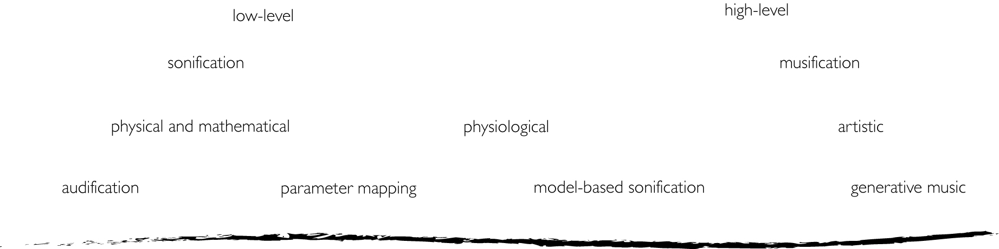

## 3.6.4 Sonification, musification and control in BCMI
<!--#brainart #science-art -->

{: .no_toc }

## Table of contents
{: .no_toc .text-delta }

1. TOC
{:toc}

---

BCMI offers a wide range of creative expressions in the final mapping and control parameters steps that can help create aesthetically engaging experiences. These parameters can relate to sound or music (e.g. rhythm, pulse, tempo, duration, structure, volume, pitch, timbre, tonality, harmony, spatial location) and may be controlled on analogue or digital sequencers, samplers, sound oscillators, filters or timers. Mapping to these parameters, in general, can be simple or more complex, single or multi-layered, direct or indirect, linear or nonlinear, continuous or intermittent. Parameters can change at the composition's micro-level (e.g. when mapping the amplitude of a brainwave to the volume of a sound oscillator in a linear manner) and at its macro-level (e.g. when a generative algorithm creates sad music if a brainwave is weak and happy music when strong). The more recent user- and mutually-orientated systems also use machine-learning techniques for adaptive mapping. A similar phrase for 'mapping brain data to sound' is 'sonification of brain data'. Sonification, often referred to as audio display, audification or auralisation, is generally defined as the use of non-speech audio to convey information and, more precisely, as 'the transformation of data relations into perceived relations in an acoustic signal for the purposes of facilitating communication or interpretation' (Kramer et al., 2010).[^nf-term]

[^nf-term]: Both terms, 'mapping brain data to sound' and 'sonification of brain data' in the strictest sense are functionally analogous to the term 'neurofeedback with sound', i.e. when sound provides a form of feedback on neurological activity, although 'neurofeedback' conventionally implies that the feedback provided is in real time (on-line).

I conceptualise sonification on a spectrum where mapping techniques towards one end are simpler and more concrete, and towards the other end more complex and abstract. The former is sometimes called low-level sonification, and the latter, high-level (symbolic) sonification (Toffa and Mignotte, 2020). This spectrum can also be pictured as starting with transformations at the objective physical and mathematical level, then expanding into a more subjective physiological level and finally, breaking into the artistic level where creativity can flourish 'without limits' (Trček, 2018). While sonifications that aim for clearly understandable (more objective) interpretations are drawn to low-level, tight and linear mappings, sonifications that strive for more ambitious and aesthetic (more subjective) interpretations are drawn to high-level, multi-layered mappings. Novello (2012) helps clarify this difference: 

> Several psychoacoustic facts show that translation of data into sound is useful when the data amount is too large or complex to be scrutinized by observation. It is easy to scroll through large amounts of data extremely fast, just by listening, because digitalized audio uses 44100 samples per second with CD quality. The sensitivity of a human ear for the detection of complex sound patterns and loops makes it a perfect tool for the detection of inner structures. The ability of the human auditory system to distinguish between several simultaneous voices or instruments even in a noisy environment (in contrast to the visual system's serial processing of multiple objects), provides a particularly good reason to use advanced sonification. ... in this field of research, however, the focal aspect is the reliability of parametric mapping and its recognizability. Aesthetics are a secondary priority.

Effective sonifications often map 'not just points but also the relationships among the points, from a source domain to a target domain' (Scaletti, 2018). However, as in functional translation in the field of linguistics (Nord, 2013), these points and their relationships should also be contextualised in the target domain. When a system sonifies data at the higher levels, mapping between the source and the target domains should not have to follow literal 'word by word', linear 'data by data' conversion; instead, it should be more agile and consider the new environment in which it needs to communicate meaning. Unfortunately, this liberty in artistic sonifications offers numerous temptations, often making the final output pleasing aesthetically but not engaging analytically. Neurofeedback trainer Tony Steffert comments on this temptation in regard to the sonification in his doctoral research:

> My sonification, for example, sounded horrible, but we aimed at faithfully representing the data. Some of the artistic sonifications lose their connection with the data, even though or maybe because of their beauty! (2022)

Sonifications can map single or multiple signals simultaneously to sound control parameters (e.g. to provide dynamics for nuanced sonic textures). While linear mapping of a single signal permits easier debugging of a computer program (Vickers and Alty, 2002), multidimensional mapping might be more useful when entertaining an audience of ‘general’ music listeners. The literature sometimes refers to high-level sonification as ‘musical sonification’ or ‘sonification-based music genre’ and includes several discussions on the similarities and differences between sonification and music (Dribus, 2004; Hermann, 2008; Schoon and Dombois, 2009; Vickers, 2016; Scaletti, 2018). The following definition from the BCMI literature provides a helpful distinction based not only on mapping but also on whether or not the output is performed artistically:

> The distinction between sonification and musification, both related forms of auditory display, is that in a musification, the data are not just auralized linearly, but instead, various constraints are created and applied in order to create a musical performance of the sonic data. This is an indistinct line and not easily delineated, but essentially the complexity and intent of the mapping involved determine whether the BCMI system is sonifying or musifying in its output. (Williams and Miranda, 2018)

Arslan et al. (2005) provide a similar distinction based on whether or not the output is intended for music production: 

> Some research has already been done toward integrating BCI and sound synthesis with two very different approaches. The first approach aims to sonify data issued from physiological analysis by transforming them in sound (Berger, Lee and Yeo, 2001; Dribus, 2004; Potard and Schiemer, 2004). This process can be viewed as a translation of physiological signals into sound. The second approach aims to build a musical instrument (Miranda, Durrant and Anders, 2008). In this case, the musician tries to use his physiological signals to control intentionally the sound production.

Daly et al. (2016) also distinguish between sonification and musification:

> Sonification provides a method for passively monitoring affective states and translating them into audio output in a way that, it is suggested, may be useful for music therapy. In contrast, our aBCMI [affective BCMI] system first aims to classify a users' current affective state and then actively modulate that affective state via a music generator. Specifically, sonification generally provides a linear mapping between the neural signals (EEG or fMRI) and music, whereas our method is able to produce a wide range of different nonlinear streams of auditory cues in response to the affective states encoded within the neural signals.

In their real-time EEG sonification research review, @ValjamaeEtAl2013EEGSonification distinguish between four mapping approaches. (1) Audification, the most straightforward, oldest and largely obsolete method, pitch-shifts raw signals into the human hearing range. (2) Parameter mapping, the most popular method, maps parameters of a brain signal to parameters of a sound (e.g. alpha brainwave amplitude to the amplitude of a sound oscillator). (3) Model-based sonification generates sound with mathematical models. (4) The last, the generative music method, controls musical rules and structures with EEG data.

Sonification spectrum comparing the terminology used to differentiate techniques.

Based on these differentiations (see Fig. 3.31), we could define BCMI as BCI that musifies brain signals in real time for research and public performance purposes. However, before concluding this section, it is important to review how ICCMR researchers have distinguished between three methods for making music with EEG as well (Miranda et al., 2011; Eaton, 2016; Venkatesh, Braund and Miranda, 2020):

- sonification
- musification 
- (BCI) control [^ICCMRclasses]

[^ICCMRclasses]: Venkatesh, Braund and Miranda (2020) add audification as the fourth method, which aligns with the audification method of Väljamäe et al. (2013).

Their definitions of sonification and musification align with the above descriptions, except they note that sonification, ‘while commonly used in non-musical, medical scenarios’ (Eaton, 2016) as a method that should be considered for musical purposes as well (Venkatesh, Braund and Miranda, 2020). ‘Control’, their third method, indicated (in some of their descriptions) ‘active control’ that provides users with ‘direct cognitive real-time control of music’ (Eaton, 2016), which then seemingly implies that when a system uses passive control, it is not BCMI:

> In addition to artistic use, sonification, and to a certain extent musification, can be useful for scientific applications; for instance, to monitor the EEG aurally. But they are of little value for BCMI proper because in those cases the user does not actively control the music; it is a passive affair. Conversely, in the control approach, the EEG signal is harnessed to control a musical system. Here the subject intentionally produces specific EEG patterns, which are detected by the system in order to control musical software. (Miranda et al., 2011)

> BCMI systems that sonify or musify raw EEG data without user control could be considered outside of the definition of BCI research. This is because BCI research is based on the premise that a BCI system allows for the active control of a system by the explicit thought of the command, and the results of the mental activity are fed back to the user in real-time. (Eaton, 2016)

However, elsewhere (Eaton and Miranda, 2015; Eaton, Williams and Miranda, 2015; Miranda and Eaton, 2018), it becomes clear that their definition of BCMI does indeed incorporate the use of passive control as well. Also, Williams, who developed passive BCMIs with ICCMR researchers and more recently with Daly, draws attention to the untapped potential of passive control:

> The potential to create systems for functional music (selection, performance, or even creation) in an unconscious manner (i.e., without the need for active management by the user) is enormous and perhaps the largest likely avenue for BCI music creation in terms of broad user base. (Williams, 2019)

It seems that while most researchers consider that BCMI can utilise both active and passive methods, their use of the terms sonification, musification and control is less consistent. They seem to define these terms as exclusive methods (Miranda et al., 2011; Venkatesh, Braund and Miranda, 2020) or methods that can be used in combination, e.g. musification with control or sonification with control (Eaton, Williams and Miranda, 2015; Daly et al., 2016; Williams and Miranda, 2018; Williams, 2019; Horrell, 2020, p.51).

To conclude, my purpose here is not to dive into philosophical arguments on terminology but to highlight some inconsistencies in the use of terms in the literature for the benefit of future BCMI researchers. To define our work, we can embrace an established classification or adapt it to form new interpretations. Based on this review and recent discussions, I believe my upcoming research in the field will benefit from a more open definition of BCMI that, rather than considering these methods to be used exclusively, allows for their combinations:

- sonification + passive control
- sonification + active control
- musification + passive control
- musification + active control
- sonification + passive and active control
- musification + passive and active control