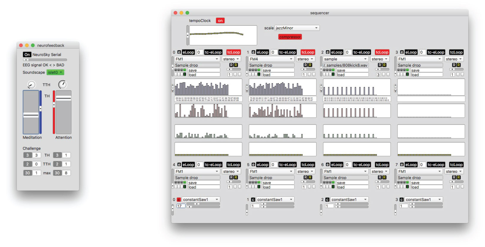
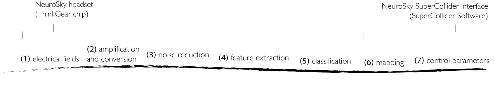
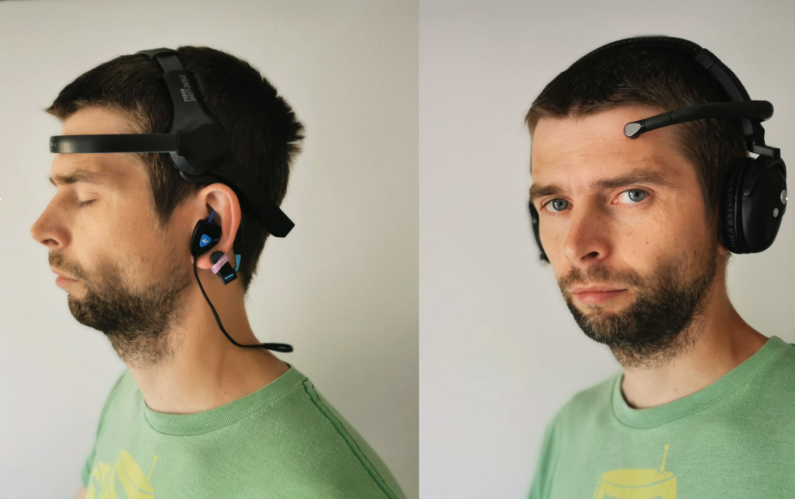
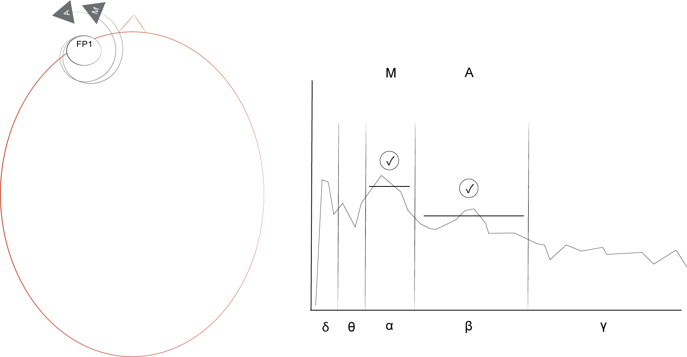
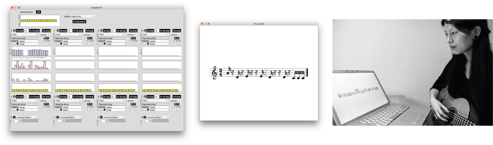
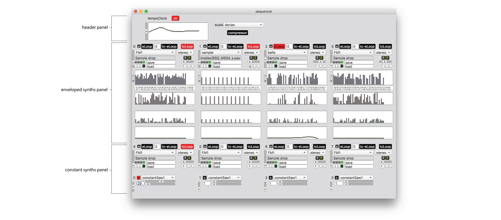
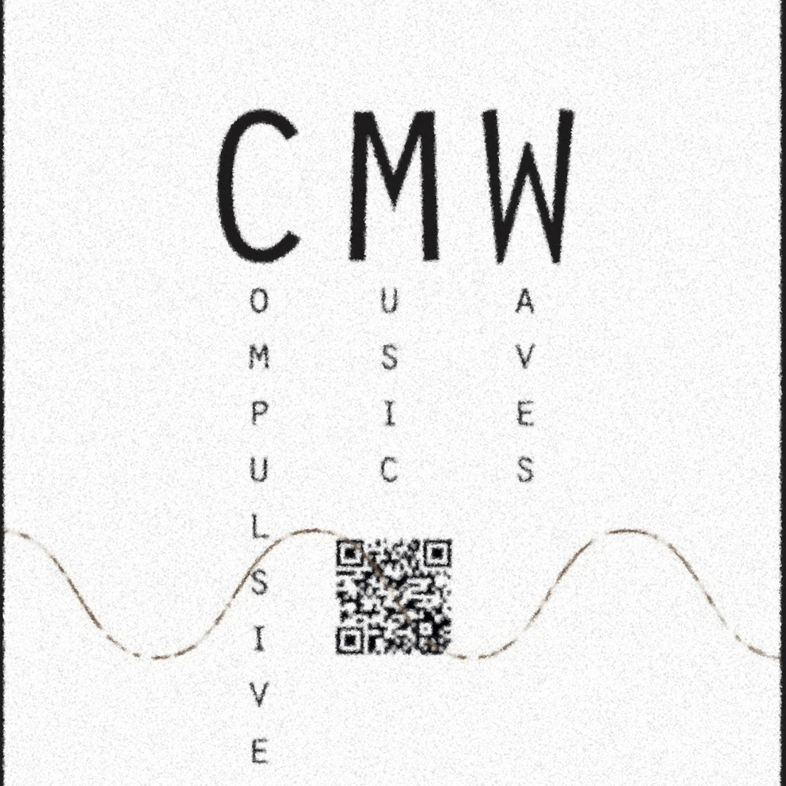
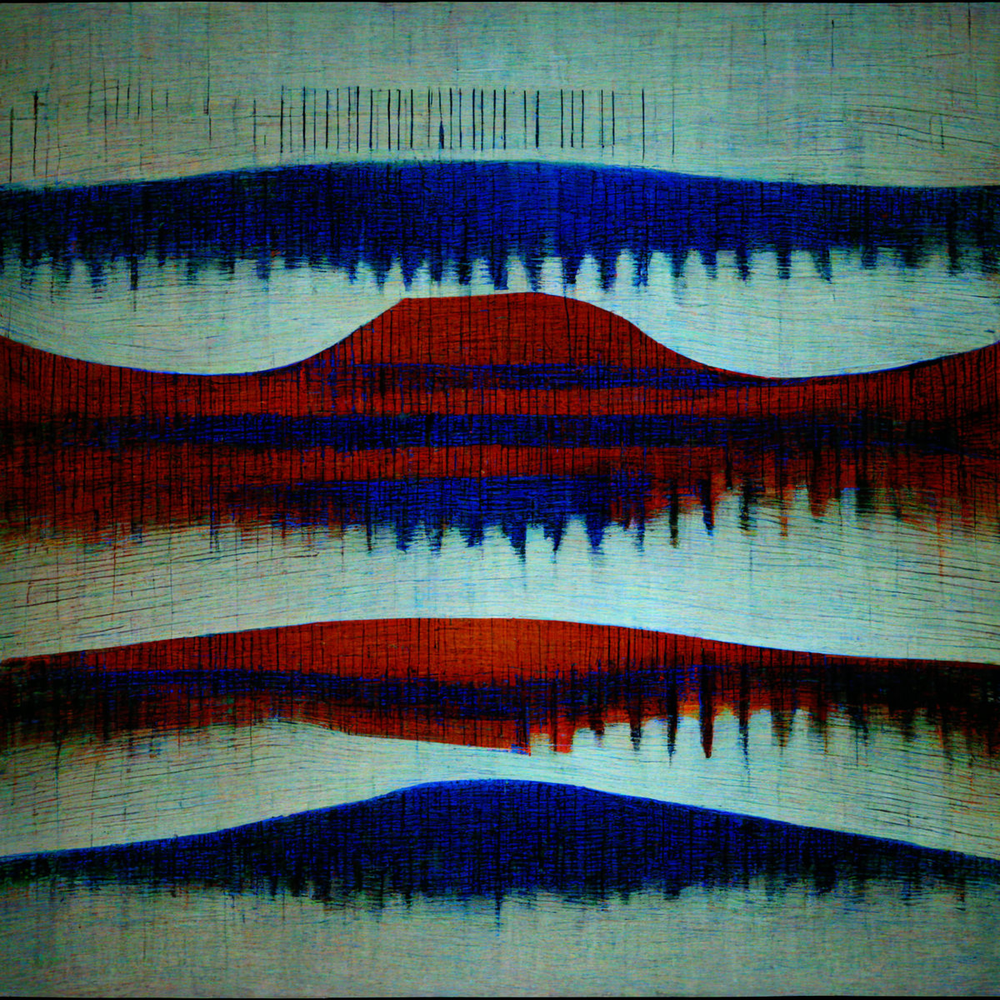

## 4 BCMI-1 Project
<!-- A single-channel auditory NFT and music compositional tool.-->

{: .no_toc }

## Table of contents
{: .no_toc .text-delta }

1. TOC
{:toc}

## 4.1 Project Overview
This chapter describes the project that developed the first BCMI system in this research: BCMI-1. The system has two main parts: a NeuroSky EEG headset and my NeuroSky-SuperCollider Interface software. This software acquires classified brain signals from a consumer-grade NeuroSky headset and maps them to sound control parameters of pre-composed soundscapes. I developed this software prototype in SuperCollider. The NeuroSky-SuperCollider Interface has two main parts: neurofeedback and sequencer. When using the system, these two parts run simultaneously in SuperCollider. The neurofeedback part is an audio neurogame featuring three default soundscapes that users can interact with using their classified brain signals, the eSenses. The soundscapes are pre-composed with the sequencer’s graphical user interface (GUI). The mapping of eSenses to soundscape parameters makes use of both immediate and accumulative neurofeedback protocols inspired by gaming. To support meditation practices with personal musical preferences, users can create new soundscapes with the sequencer GUI and customise relevant neurofeedback protocols using textual programming. The system’s design was informed by my first model (created in 2013), my initial and exploratory literature reviews, the additional workshops and courses I took, the feedback I received at events where I demonstrated the project and my informal tests. The project addressed RO2 — it developed an affordable and partially open-source BCMI system based on the literature review findings — and RO3 — it tested the suitability of this system to support meditation practices in informal NFT and artistic performance settings. The outcome of this project prompted the development of the affordable and fully open-source BCMI-2 system providing multi-channel EEG (Chapter 5) to address the limitations of BCMI-1. Although BCMI-1 did not become my research tool, I plan to port the code of its flex-time sequencer and accumulative neurofeedback protocols into the code of BCMI-2.

**Project time span**: September 2015—March 2018   

**Supporting materials**:

- [NeuroSky-SuperCollider Interface](https://github.com/krisztian-hofstadter-tedor/NeuroSky-SuperCollider-interface) | SuperCollider code on GitHub.
- [Video Demo Part 1](https://youtu.be/LSJEINRB2a0) | Demonstrating the neurofeedback part of the system.
- [Video Demo Part 2](https://youtu.be/frRVrZX4kS8) | Demonstrating the sequencer part of the system.

## 4.2 Goals
This project aimed to redevelop the first model (Hofstädter, 2013) with particular attention to the last stages of the interfacing process: the mapping and sound control parameters.

The **project objectives** were to

1. Address the first model's weaknesses, particularly the following:
	- poor core stability
	- poor GUIs
	- limited functionalities regarding musical expressions
	- inability to connect to other EEG hardware.

2. Redesign the first model's gaming environment, including
   - neurofeedback protocols and
   - soundscapes.

## 4.3 Design and Development
As seen in Fig. 4.1, the system has two main parts: neurofeedback and sequencer.

<center>Figure 4.1: BCMI-1 GUIs: The neurofeedback (left) and the sequencer (right) parts.</center>

I tested the system with two EEG headsets, the NeuroSky Mindset and NeuroSky Mindwave, both using a ThinkGear ASIC chip (NeuroSky Developer Program, 2014). Broadly speaking, the neurofeedback part acquires classified EEG signals from one of these headsets and, with neurofeedback protocols, controls the parameters of sounds control parameters of soundscapes. Users can interact with the three default soundscapes I designed and, if somewhat experienced in programming, create their own soundscapes and neurofeedback protocols.

### 4.3.1 The interfacing process
Fig. 4.2 and the paragraphs below outline BCMI-1's interfacing process in detail:

<center>Figure 4.2: BCMI-1 interfacing steps.</center>

**(1) electrical fields**  
A NeuroSky headset measures electrical activity from an active electrode on the forehead (Fp1) and a reference electrode on the ear in the form of analogue signals (Fig. 4.3).

<center>Figure 4.3: Photo of NeuroSky headsets. Mindwave (left) with additional Bluetooth headphones and Mindset (left) with built-in over-ear headphones.</center>

**(2) amplification and conversion**  
The difference between these two analogue signals is amplified and converted into one raw digital EEG signal by the ThinkGear ASIC chip on the headset. The sample rate is usually 128 Hz but can be as high as 512 Hz.

**(3) noise reduction**  
The converted raw EEG signal is passed through low and high pass filters to retain frequencies between 1 and 50 Hz and is cleaned of noise and artefacts by NeuroSky's proprietary algorithms. 

**(4) feature extraction**  
Band power features (delta, theta, alpha, beta, gamma) are extracted from the clean signal with standard FFT and then analysed again for artefacts in the spectral domain by NeuroSky's proprietary algorithms.

**(5) classification**  
While still on the ThinkGear ASIC chip, two signals are classified based on power band features and defined as the eSenses: Attention and Meditation (Fig. 4.4).

<center>Figure 4.4: BCMI-1 neurofeedback protocol with electrode location (left) and a spectral plot (right) indicating the application of two neurofeedback indicators on the eSenses.</center>

As the classification process of the eSenses is also proprietary, it is unclear which features or algorithms the headset uses to generate them. However, NeuroSky’s support site (2011) reveals that Attention is based on beta band power features and Meditation on alpha band power features. Both eSenses are presented on a scale of 1 to 100, depending on their strengths. NeuroSky’s Developer Program (2014) explains the classification process as follows:

> On this scale, a value between 40 to 60 at any given moment in time is considered 'neutral', and is similar in notion to 'baselines' that are established in conventional EEG measurement techniques (though the method for determining a ThinkGear baseline is proprietary and may differ from conventional EEG). A value from 60 to 80 is considered 'slightly elevated', and may be interpreted as levels being possibly higher than normal (levels of Attention or Meditation that may be higher than normal for a given person). Values from 80 to 100 are considered 'elevated', meaning they are strongly indicative of heightened levels of that eSense.

> Similarly, on the other end of the scale, a value between 20 to 40 indicates 'reduced' levels of the eSense, while a value between 1 to 20 indicates 'strongly lowered' levels of the eSense. These levels may indicate states of distraction, agitation, or abnormality, according to the opposite of each eSense.

> The reason for the somewhat wide ranges for each interpretation is that some parts of the eSense algorithm are dynamically learning, and at times employ some 'slow-adaptive' algorithms to adjust to natural fluctuations and trends of each user, accounting for and compensating for the fact that EEG in the human brain is subject to normal ranges of variance and fluctuation. This is part of the reason why ThinkGear sensors are able to operate on a wide range of individuals under an extremely wide range of personal and environmental conditions while still giving good accuracy and reliability.

> [The Attention eSense] indicates the intensity of a user's level of mental 'focus' or 'attention', such as that which occurs during intense concentration and directed (but stable) mental activity. ... Distractions, wandering thoughts, lack of focus, or anxiety may lower the Attention meter levels.

> [The Meditation eSense] indicates the level of a user's mental 'calmness' or 'relaxation'. ... [it] is a measure of a person's mental levels, not physical levels, so simply relaxing all the muscles of the body may not immediately result in a heightened Meditation level. However, for most people in most normal circumstances, relaxing the body often helps the mind to relax as well. Meditation is related to reduced activity by the active mental processes in the brain, and it has long been an observed effect that closing one's eyes turns off the mental activities which process images from the eyes, so closing the eyes is often an effective method for increasing the Meditation meter level. Distractions, wandering thoughts, anxiety, agitation, and sensory stimuli may lower the Meditation meter levels.[^eSense-med]

[^eSense-med]: Based on NeuroSky's information, we could relate the two eSenses to the two main meditation techniques discussed in the literature review (Section 3.3) and then assume that it is possible to practise concentrative meditation with the Attention and receptive meditation with the Meditation signal.

Before the next step, the headset transmits various EEG data (including the raw EEG, band power features and the eSenses) to the computer where SuperCollider's `SerialPort` acquires, and a `Task` parses them. Then, the eSenses are smoothed and stored in global variables with the following code:

```
~neuroSkyConnect = Task(sP = SerialPort(
		"/dev/tty.MindWaveMobile-DevA",
		baudrate: 57600,
		crtscts: true);
	});
	if(~parser.isPlaying,
    ...
		~attSig = payloadData[29];
     	~medSig = payloadData[31];
    ...
)}
```

**(6) mapping**  
The neurogame consists of levels called ‘islets’. In essence, on each islet, a neurofeedback protocol maps significant eSense behaviours to parameters of the islet's soundscape. My 2013 model had four islets: a practice islet and three sequential islets connected with a linear narrative. Apart from the practice islet, each islet had a challenge, which, when completed, allowed users to enter the next islet. The challenge on the first islet was the easiest, with a more difficult challenge on the second and the most challenging on the last (Fig. 4.5).

<center>Figure 4.5: BCMI-1 gaming narratives. The first model has linear gameplay (left) in which completed challenges automatically move users to higher levels. The current version of the system (right) has levels that do not have a linear narrative; users can exit and enter islets voluntarily at any time. Green arrows indicate voluntary movements, and blue arrows indicate automatic (involuntary) movements.</center>

The current version of the game does not have a practice islet, only three new islets. While these new islets still have challenges, the system does not automatically take users to another islet once a challenge is completed. Instead, it only triggers a 'victory sound' and allows users to stay on the islet and continue listening to the soundscape for as long as desired. In the current version, users enter the first islet when starting up the game but can exit and enter any islet voluntarily at any time (i.e. they don't need to complete the challenge on an islet to experience the soundscape of another one). Allowing users to move freely between the islets provides a more relaxed environment for practising meditation.

As in common NFT systems, a protocol in this neurogame is also based on

1. the amplitude of a classified EEG data (an eSense) and
2. the threshold (TH) on the scope of this data.

To create more engaging protocols, I added two more elements:

3. the timer and
4. the time-thresholds (TTHs).

A timer helps monitor how long an eSense stays above its TH, while a TTH is a threshold on the timer. With these four elements, the following **eSense behaviours** are monitored:

An eSense

- moves above or below its TH
- moves above its TH the X'th amount of time
- stays above its TH for X amount of time in seconds
- moves above its TTH the X'th of time.

THs are set as integers, usually between 50% and 100% on the upper side of an eSense. TTHs are also set as integers but indicate elapsed seconds. For example, if Meditation's `TH=70` and `TTH=10`, this eSense is rewarded a TTH point when it stays above its TH (70%) for 10 seconds. After 10 seconds, the TTH cycle restarts. In the first model, THs and TTHs were preset for all islets and could not be altered. In the current version, THs and TTHs can be adjusted manually by users in the GUI while playing the game.

The two functions mapping classified EEG data to musical expressions are `~rewCalcTask` and `~rewTask`. The `~rewCalcTask` function monitors the above four eSense behaviours. It is run once when entering an islet and stopped before exiting this islet. Its four primary responsibilities are to

1. monitor eSense behaviours
2. update timers
3. update reward points
4. initiate an action for completed challenges (e.g. play the victory sound).

When monitoring eSense behaviours, `~rewCalcTask` updates a six-slot array [0,0,0,0,0,0] (`var tm = Array.fill(6,(0))`) where each slot is a timer. The timers indicate the number of seconds

* [0] Attention has been above its TH
* [1] Meditation has been above its TH
* [2] Attention has been enrolled in its TTH cycle
* [3] Meditation has been enrolled in its TTH cycle
* [4] Attention has been above its TH in total on this islet
* [5] Meditation has been above its TH in total on this islet

Slots [0] and [1] restart when the monitored eSense goes below its TH, slots [2] and [3] restart when the monitored eSense goes above its TTH and slots [4] and [5] restart when entering a new islet.

Based on changes in the above timers, `~rewCalcTask` updates a 2D array, [[0,0,0,0],[0,0,0,0]] (`~rewardPoints = Array.fill2D(2, 4,(0))`), which is responsible for keeping the data on **significant eSense behaviours**. The slots in this 2D array indicate:

* [0][0] Attention currently above its TH
* [0][1] the number of times Attention has been above its TH
* [0][2] the number of times Attention has been above its TTH
* [0][3] the maximum number of seconds Attention has been above its TH
* [1][0] Meditation currently above its TH
* [1][1] the number of times Meditation has been above its TH
* [1][2] the number of times Meditation has been above its TTH
* [1][3] the maximum number of seconds Meditation has been above its TH


* [0][0] and [1][0] are updated when an eSense goes above or below a TH
* [0][1] and [1][1] are updated when the monitored eSense goes above a TH
* [0][2] and [1][2] are updated when the monitored eSense goes above TTH
* [0][3] and [1][3] are updated when the monitored eSense has been longer above its TH than earlier in the current islet [^update-later]

[^update-later]: [0][3] and [1][3] only update when the monitored eSense goes below the TH. This is not ideal as it should update while the eSense is above TH as well. I plan to address this issue in upcoming versions of the system.

Later, in this step, the system maps changes in `~rewardPoints` to control parameters of the soundscapes with `~rewTask` functions.

A challenge for an islet is defined as a 2D array, (`~toMoveVal=[[0,0,0,0],[0,0,0,0]];`). It is defined at the beginning of each islet and is continuously compared with the `~rewardPoints` array within the ongoing `~rewCalcTask` function. When all numbers in `~rewardPoints` are equal to or higher than the numbers in `~toMoveVal`, the challenge of the islet is completed. The following code demonstrates this:

```
1.do(toMoveTrueArrayCheck = ~rewardPoints >= toMoveVal);

// automove in current version disabled;
if	(toMoveTrueArrayCheck == toMoveTrueArray, er
		//stop islet and move to next islet:
		i[~presentIslet][1].reset.play;
	});
	if(victoryDone == 0,.schedAbs(t.beats.ceil, (~schedElasticOnce.value(9).play));
	})
});
```

The system uses the `~rewTask` function to create a variety of specific mappings: reward tasks (RTs). These tasks map significant eSense behaviours (`~rewardPoints`) to soundscape parameters. Several RTs are executed when entering an islet and stopped before exiting this islet. There are three types of reward tasks:

- (RT1) loads file(s) to be looped in a bar
- (RT2) plays (triggers) a file once
- (RT3) schedules a file to be played once at a specific beat in a bar

With significant eSense behaviours at [0][1], [0][2], [1][1] or [1][2], RT1 can rotate up to 5 files to be looped in a bar.

**(7) control parameters**  
With the first model’s linear gameplay, the islets’ challenges gradually became more difficult and protocols more complex. Simpler protocols with more linear mappings in the first two islets generated soundscapes with sonification techniques. On the other hand, more complex protocols with increased multidimensional mappings in the second and third islets composed soundscapes we may musifications. Consecutive soundscapes also increased in tempo and density. For a sense of consistency, all soundscapes in the first model used similar musical instruments playing melodic expressions composed in the same musical scale. The first model's islets trained both eSenses.

The current system's three new islets (islet_0, islet_1, islet_2) also propose to train both eSenses, although with a different approach. The main difference is that users have more authority. They can

- enter any islet without the need to complete challenges in other islets
- manually change thresholds (THs and TTHs) and the challenges on each islet
- stay for as long as they wish on an islet after completing its challenge

Because users of the current system can change several aspects of the protocols, the three islets do not have specific neurofeedback goals. Instead, users are first encouraged to experiment with the default islet settings, then change them according to their meditation needs and create their own, unique islets. The key aspects of the three current islets are as follows.

**islet_0**’s soundscape has an abstract, electronic style and could be considered more of a low-level than a high-level sonification. Its mappings have two types of immediate responses for each eSense: one that triggers sounds when eSenses go above THs (RT2) and another that maps the amplitude of the eSenses to parameters of two continuous sounds. These parameters are frequency, panning, cutoff frequency in a low-pass and cutoff frequency in a resonant low-pass filter. The soundscape proposes the synchronisation (entrainment) of brainwaves to the following:

1. the pulsations of the two continuous sounds
2. the synchronised pulsation of these two pulsations.

I will refer to these continuous sounds with the names of the synthesisers (synthDefs) with which they were made. `constantSaw1` is a somewhat sharp, pulsating sound with its fundamental frequency at 587 Hz. `constantSaw2` is a more complex sound with two pulsating components. One component is a drum-like texture with its loudest frequencies around 150 Hz. The other component is a noise texture with a variety of short percussive frequencies above 1000 Hz. The Attention eSense is mapped to one parameter of `constantSaw1`. The Meditation eSense is mapped to one parameter of `constantSaw1` and three parameters of `constantSaw2`. Attention is mapped to the cutoff frequency in `constantSaw1`’s resonant low-pass filter. When this eSense increases, the sound becomes louder and more present. Meditation is mapped to the cutoff frequency in `constantSaw2`’s low-pass filter, its oscillator frequency, and the speed of its cyclical panning position between stereo left and right. When this eSense increases, the sound is removed from its high-frequency noise textures, its pulsation slows down from 2.2 to 2.0 BPS, and its panning position becomes more fixed. Meditation also slightly changes the pulse of `constantSaw1`. Due to the nature of the synthesis in `constantSaw1`, its pulsation is ever-changing, even on the same input value. As a result, its pulse varies between 2.0 and 1.0 BPS except when Meditation is very high, making the pulse more consistent. Also, when Meditation increases, the individual pulsations of the two sounds (`constantSaw1` and `constantSaw2`) become increasingly aligned, i.e. their pulses synchronise. Also, a lower-pitched short sound is triggered when Meditation goes above its TH and a higher-pitched short sound when Attention goes above its TH. Out of the three islets, islet_0 follows Collura's (2017) suggestion most closely regarding how to best use audio feedback: the protocol uses discrete/short sounds to reward and constant sounds to provide a continuous indication of relevant changes. In general, the soundscape’s slow and synchronised pulsations achieved by increasing both eSenses aim to help induce and maintain a deep meditative state characterised by low brainwave frequencies.

**islet_1**’s soundscape is a low-density, ambient composition that uses more high-level than low-level sonification techniques. Its mappings have immediate and accumulative responses. An immediate response triggers short sounds when an eSense moves above its TH (RT2). An accumulative response plays the next file in a loop from a list of five files. The list is repeated (i.e. after the fifth file, the first in the list is played again). The following code snippet exemplifies this:

```
~usedTasks[3]=~rewTask.value(track:3,idx0:0,idx1:1,
	style:0,fromBeat:0,loadFile0:0,loadFile1:430,loadFile2:431,
	loadFile3:432,loadFile4:433).start;
```

This islet has no immediate mappings between the amplitude of the eSenses to sound parameters. Here, I aimed to help create a passive, receptive state of mind. The soundscape's low density and slow tempo aim to calm the listener while the sounds rotated by RT1 provide feedback on the eSense behaviours. As on islet_0, in addition to the above mappings, a short, lower-pitched sound is also triggered when Meditation moves above its TH, and a short, higher-pitched sound when Attention moves above its TH.

**islet_2**’s soundscape is a 105 BPM electronic dance music (EDM)-style composition that I would consider high-level sonification. Its beat pulses at 7 BPS aiming to help entrain high-theta brainwaves. The mappings here have various immediate responses and one accumulative response. The islet only uses RT1 for mapping but in two ways. First, it loads different files when an eSense goes above and below its TH to provide an immediate response. Second, using accumulative feedback, it selects and loads the next file in a five-slot array every time the selected eSense goes above its TH. As on islet_1, the array in the accumulative feedback is repeated after the last file (i.e. after the `loadFile4` argument, `loadFile0` is loaded again). The following code provides examples of both processes:

```
~usedTasks[2]=~rewTask.value(track:2,idx0:1,idx1:0,
    style:0,fromBeat:0,loadFile0:421,loadFile1:420).start;

~usedTasks[3]=~rewTask.value(track:3,idx0:0,idx1:1,
    style:0,fromBeat:0,loadFile0:0,loadFile1:430,loadFile2:431,
    loadFile3:432,loadFile4:433).start;
```

This islet proposes to help create a more active, concentrative state of mind. With its higher density and faster tempo, I aimed to arouse and energise the listener, while the sound textures swapped with multiple RT1s provide feedback on the eSense states. In contrast to the other two islets, no short sound textures are triggered on islet_2 when eSenses move above THs with RT2 to avoid off-beat sounds that might distract users from focusing on the music. The only immediate response with RT1 is the swapping of files in four instruments when Meditation moves above its TH. Three of the four instruments trigger audio samples of percussion (kick drum, hi-hat and snare), and one of the instruments triggers audio synthesis. When Meditation moves above its TH, the style of the music changes from breakbeat to four-on-the-floor, which makes the music more energising and controlled. The accumulative response (RT1) linked to Attention rotates five melodic patterns played with a sine oscillator (`\sine`). Table 4.1 compares aspects of the three islets.

|              | islet_0                         | islet_1                 | islet_2                    |
|--------------|---------------------------------|-------------------------|----------------------------|
| style        | abstract                        | ambient                 | EDM                        |
| mapping      | TH and eSense amplitude         | TH                      | TH                         |
| reward       | indicators and continuous mapping | indicators             | indicators                 |
| response     | immediate                       | immediate & accumulative | immediate & accumulative   |
| s/m          | sonification                    | musification            | musification               |
| tempo        | 2.1 BPS - 2 BPS                 | elastic/flex-time       | 7 BPS                      |
| entrainment  | BPS and phase                   | low density             | BPS                        |

<center>Table 4.1: Aspects of BCMI-1 islets.</center>


### 4.3.2 MIDI and INScore
In addition to synthesising or sampling sounds with SuperCollider, I also experimented with sending MIDI values to other audio software (e.g. Logic Pro) and pitch values to INScore (Fober, Orlarey and Letz, 2012) with Richard Hoadley’s class (Hoadley, 2011; Hofstädter, 2016d). Because many digital audio workstations and hardware can access MIDI for synthesis or sampling, this technique extends the variety of sounds available for meditation. On the other hand, as seen in Fig. 4.6, sending data to INScore allows a real person to play the soundscapes (or parts of them) on traditional musical instruments. Unfortunately, I had to postpone the development of these methods due to other research priorities.

<center>Figure 4.6: BCMI-1’s sequencer GUI (left), one of its patterns visualised with INScore (middle) and the pattern played on a guitar by a musician (right).</center>

### 4.3.3 Sequencer GUI
As mentioned earlier, the sequencer part of the system can be accessed as a GUI separately from the neurofeedback part. While this GUI’s primary purpose is to compose and then save musical patterns into files that the neurogame can use on the islets, we can also use it for other musical activities (e.g. as a tool for live performances or to create compositions for other projects). As seen in Fig. 4.7, it has three main panels: header, enveloped synths and constant synths.

<center>Figure 4.7: BCMI-1 sequencer GUI panels: header (top), enveloped synths (middle) and constant synths (bottom).<center>

The **header panel** has three parts:

1. tempoClock - synchronises flexible timing of beats across `tracks` used in the enveloped synths panel. It can be turned on and off, and its flexible timing can be adjusted with two sliders.
2. scale - selects musical scales from a drop-down menu. Each scale is an array of MIDI numbers relevant to the selected scale. Random number generators use these arrays in the enveloped synths panel to generate arbitrary melodic expressions.
3. compressor - flattens the dynamic range of the main audio output.

The **enveloped synths panel** can control up to eight tracks. Each track can select an instrument from various synthesisers. All but the last synthesiser in the list synthesises sounds with SuperCollider's sound oscillators. The last is a sampler that plays audio files dropped onto the track's sample-drop (`DragSink`) area. To create sounds, each synthesiser requires three input parameters (`arguments`) for each sound (note): pitch (`freq`), volume (`amp`) and length (`sustain`). We can alter these three parameters manually in the top three multi-sliders or by using buttons that populate the multi-sliders with an array of numbers. Each track can schedule notes with the tempoClock using the `~sched` function or without the tempoCock using the `~schedElasticOnce` or the `~schedElasticLoop` functions. The array of numbers 'behind' the fourth multi-slider contains `wait` times for the two tasks that run independently from tempoClock.

To save space on the GUI, only the top four instruments have multi-sliders controlling the parameters of the notes. We can save the values 'behind' the multi-sliders to the following locations:

- files that can be reloaded in the sequencer (e.g. when using the neurofeedback part)
- three separate local memories that we can use on the same track only
- one global memory that other tracks can use as well

In this panel, we can also change the output from audio (stereo) to MIDI so it can be accessed by other audio tools.

The **constant synths panel** can control parameters of up to four continuously sounding instruments. The synthesisers creating these instruments do not have envelopes like the synthesisers used in the enveloped synths panel. Instead, each can generate one long pad sound until freed manually.

## 4.4 Testing
I tested the system after minor and major design and development stages. Although the NeuroSky headsets only take a couple of minutes to set up, I often tested minor improvements by myself, first without, and only after some substantial work with real-time EEG. Individuals also provided feedback on major improvements at my residence and at events (Hofstädter, 2016a; 2016c; 2017). They tested the neurogame with real-time EEG and commented on the system’s technical and aesthetic qualities. On the technical side, most people wished for the system to be cross-platform and available on mobile computing devices (e.g. Android or iOS smartphones). On the aesthetic side, they were all excited about composing soundscapes that they could control with their thoughts. However, while many were confident that they could make the soundscapes in the sequencer GUI, most worried that they lacked sufficient textual programming experience to link these soundscapes to the neurofeedback part of the system.

BCMI-1 uses ‘slow-adaptive’ algorithms on the headset’s chip to classify signals and operant conditioning when mapping these signals to sound control parameters. A complicated issue that often arose while testing was deciding how much I should tell users about the mapping (i.e. how conscious or spontaneous [unconscious] the operant conditioning should be). Should users know about and be conscious of every aspect of the reward system (e.g. what constitutes a positive or negative reward), or should conditioning happen spontaneously without users being aware of the mapping at all? Perhaps how much users should know about the system depends on the NFT goals. For instance, if users are required to focus, knowing precisely what is happening in the mapping might be helpful. However, if users want to relax and let go, they might not want to know anything about the system’s technicalities.

## 4.5 Deployment
Apart from the demonstrations mentioned above, the system’s potential use for stress management was presented in a form of a poster at the Anglia Ruskin University’s 10th Annual Research Student Conference (2016). The same year, I demonstrated the sequencer GUI’s ability to compose music for a collaborative piece with Dr David Belin, who researches addictions at the University of Cambridge. My work was a music video reflecting on my caffeine addiction at the time. I demonstrated the piece at the Cambridge Pint of Science Festival after Belin’s presentation and at the final show at St Barnabas Church in Cambridge (2016). The sequencer is also available as a standalone application compiled with Platypus (2016). A future objective is to upload BCMI-1 to the NeuroSky’s App Store, a possibility that NeuroSky welcomed in our communications. I also used the sequencer to produce two audio releases, Compulsive Music Waves I (Hofstädter, 2016b) and Compulsive Music Waves II (Hofstädter, 2018) (Figs. 4.8, 4.9).

<center>Figure 4.8: Cover art for Compulsive Music Waves I. (2016)</center>

<center>Figure 4.9: Cover art for Compulsive Music Waves II. (2018)</center>

## 4.6 Conclusion
**Research and project objectives**  
The project addressed RO2 — it developed an affordable and partially open-source BCMI system based on my literature review findings — and RO3 — it tested the suitability of this system to support meditation practices in informal NFT and artistic performance settings. The main outcomes of the project are as follows:

- Functions providing timely/immediate feedback and compound/accumulative feedback.
- Sound control parameters providing numerous options for personalising aesthetic and meaningful feedback through musical expressions.
- An understanding that a multi-channel EEG hardware would be more beneficial for the research than the single-channel NeuroSky hardware.

I addressed most project objectives regarding the first model's weaknesses and all regarding the gaming environment:

- With cleaner code and SuperCollider's `s.latency` and `s.bind`, the core of the sequencer (tempoClock) is more stable. Hiccups when scheduling sounds are rare and only occur when other applications (e.g. a browser or SuperCollider's help menu, are open).

- Synthesisers have been improved with more precise signal flows, better psychoacoustic amplitude compensation using `AmpComp.kr` and more distinct sounds. Also, the new `sampler` provides the use of audio samples carrying meaning that synthesisers using oscillators could not.

- The neurofeedback and the sequencer GUIs have been redesigned with improved logic and clarity.

- The gaming environment, including narration, neurofeedback protocols and soundscapes, has been redesigned according to findings from the literature.

The current version of the software is more suitable for meditation than its first model, as it addresses several aspects of how a persuasive game can help achieve goals. For instance, users have control over many aspects of the challenges, namely the thresholds (TH and TTH) and the number of points needed to complete these challenges. Users can also control the time spent on an islet even after completing a challenge. Staying for as long as desired on an islet can be helpful (e.g. when wanting to maintain a meditative state induced by a soundscape for a longer period). To motivate users to keep playing and exploring compelling sounds and methods, they are also given the option to compose their own soundscapes, which can provide further emotional and intellectual challenges.

**New direction**  
I did not achieve one project objective: BCMI-1’s ability to acquire EEG from other hardware. While this should not have been an issue, as the eSenses measured on Fp1 can provide valuable data for meditation (Fink, 2012), the proprietary algorithms involved in classifying these eSenses and the sole Fp1 location still limited my options for answering the research question. To overcome the proprietary algorithm issue, I could have developed new feature extraction and classification steps, as BCMI-1’s SuperCollider code already acquires the raw EEG signal. However, primarily due to insight from my literature review suggesting that it is often locations other than Fp1 that best support meditation in NFT (Section 3.3), I began developing a new system, the BCMI-2, using another EEG amplifier, the OpenBCI Cyton. Due to this change in the research narrative, the implementation of De la Hera Conde-Pumpido’s (2017) serious
gaming strategies linked to social aspects has been postponed and added to Section 6.3 New Goals.