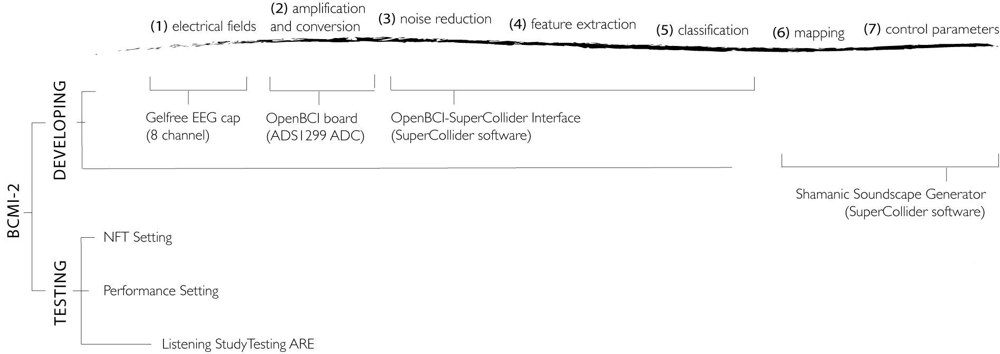

## 5.1 BCMI-2 Project Overview
In this project, I addressed RO2 by developing the affordable and open-source BCMI-2 system based on insights from the literature review, the previous BCMI-1 project and emerging questions and methods. Then, to address RO3, I tested the system's suitability to support meditation practices in NFT and artistic performance settings. In these tests, the BCMI-2 system used a combination of two methods for entraining theta brainwaves to help induce and maintain a specific meditative state, the SSC. One of these methods is computer-generated drumming with gradually decreasing tempo and decreasing rhythmic complexity, for ARE. The other is a neurofeedback protocol with auditory feedback embedded within this drumming. When using BCMI-2 myself in a performance setting, to enhance the audience’s engagement I also played a frame drum, the sounds of which were processed by the system using coherence features extracted from my brainwaves. Finally, to strengthen my understanding of the effectiveness of ARE using gradually decreasing tempo and rhythmic complexity to induce the SSC, I conducted a listening study without the BCMI-2 system (i.e. without the neurofeedback protocol).

**Supporting materials:**

- [BCMI-2 Demo 2022 (Corine Protocol Draft)](https://youtu.be/l8ymktV89YM) | A screencast highlighting BCMI-2's specific and legible musical output with my ongoing project developing the Corine protocol for artistic performances. 
- [NFT Sessions with Two Participants](https://www.youtube.com/playlist?list=PLRr9g36OjY6-48a-AdKazkDrB6QyGStmp) | YouTube playlist archiving the six NFT sessions in which BCMI-2 was tested. 
- [Cambridge Festival of Ideas 2019 Performance Video 1](https://youtu.be/lFVzwZtmecc) | A video collage of a screencast and two additional camera shots archiving my performance at the 2019 Cambridge Festival of Ideas.
- [Cambridge Festival of Ideas 2019 Performance Video 2](https://youtu.be/SdrYMDM7-Mg) | An alternative version of the above video, with additional binaural beats. The start of the video provides annotations clarifying the neurofeedback protocol used on theta at Fz. 
- [Practical Demo of BCMI-2 2021](https://youtu.be/ZzmO0Qk8Jlc) | Demonstration of the practical steps required to set up and use the BCMI-2 system.

As discussed in Chapters 1 and 2, the main contribution of this research is the creation of the BCMI-2 system and recommendations based on the knowledge gained while developing and testing its suitability to support meditation practices in NFT and artistic performance settings. Section 1.3 has already explained how this system makes an original contribution to knowledge. In this chapter, I describe five sub-projects within BCMI-2. The first two projects (Sections 5.1 and 5.2) developed the system parts. The next two projects (Sections 5.4 and 5.5) tested it in different settings. Finally, the last project tested the ARE method, without using the BCMI-2 system.

1. OpenBCI-SuperCollider Interface (Section 5.2)
2. Shamanic Soundscape Generator (Section 5.3)
3. NFT Setting (Section 5.4)
4. Performance Setting (Section 5.5)
5. Listening Study Testing ARE (Section 5.6)

Fig. 5.1 visualises these sub-projects: 

Figure 5.1: The interfacing steps of the BCMI-2 system and the sub-projects for developing and testing it.

At the end of this chapter, Section 5.7 summarises my personal experiences with shamanic journeying and engagement with the people from whom I sought guidance on shamanism. It also outlines my current approach to using ARE for deepening meditation and some new objectives to help understand the internal visual imagery encountered. 
