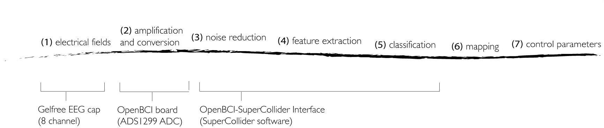

## 5.2 OpenBCI-SuperCollider Interface

### 5.2.1 Project overview
This project developed an open-source software, the OpenBCI-SuperCollider Interface, to acquire and process EEG from a multi-channel research-grade OpenBCI board within the SuperCollider IDE. The code of the OpenBCI-SuperCollider Interface was ported from the JAVA code of the open-source OpenBCI_GUI (OpenBCI, 2017a). The OpenBCI-SuperCollider Interface provides customisable functions for signal acquisition, noise reduction, feature extraction, neurofeedback protocols and plotting. When used as a part of the BCMI-2 system, it sends classified data to another software, the Shamanic Soundscape Generator, which also runs in SuperCollider. In BCMI-2, this soundscape generator software handles the last BCI steps; the mapping and sound control parameters. The project addressed RO2 — it developed part of an affordable and customisable BCMI system based on the literature review findings. The project was also informed by the outcomes of the previous BCMI-1 project (Section 5.1), emerging questions and methods and the feedback I received at events where I demonstrated early versions of the BCMI-2 system. Section 5.3 outlines the development of the Shamanic Soundscape Generator, and Sections 5.4 and 5.5 discuss the two settings in which BCMI-2's suitability to support meditation practices was tested.

**Roles:**

- Fredrik Olofsson (primary developer)
- Krisztián Hofstädter (secondary developer)

Fredrik is a multimedia artist and an active SuperCollider developer. I have known him through the SuperCollider mailing list since 2006 and have met him twice, in 2010 at the Berlin SuperCollider Symposium and in 2016 when he was a resident artist at the Music Department of Anglia Ruskin University. Fredrik was added to the supervisory team as an external adviser a few months after my second annual review panel in July 2017 resulted in concerns about the absence of a first supervisor for several months. Fredrik’s expertise in HCI streamlined this project’s design and development stages, allowing me to focus on testing and communicating my progress between projects.[^fred]

[^fred]: For more information about Fredrik, visit his website at [https://fredrikolofsson.com/](https://fredrikolofsson.com/)

**Project time span:** April 2018—February 2020

**Supporting material:**

- [OpenBCI-SuperCollider Interface](https://github.com/krisztian-hofstadter-tedor/OpenBCI-SuperCollider) | SuperCollider code on GitHub

### 5.2.2 Goals
To address RO2 — to develop an affordable and customisable BCMI system based on the literature review findings — the primary goal of this project was to address the limitations of BCMI-1 (i.e. to better equip my research, I needed a multi-channel system with a fully transparent interfacing process). The objectives of this project were to develop a BCI system that provides

- multi-channel EEG recording
- fully transparent interfacing
- mapping to the sound control parameters of the BCMI-1's neurogame
- clear code and video tutorials to help other OpenBCI board owners test the system

### 5.2.3 Design & development
After exploring the Emotiv EPOC+ and the IBVA BlueVas BCI systems, I decided to further my research with the 32-bit Cyton biosensing board from OpenBCI (2015).

> OpenBCI specialises in creating low-cost, high-quality biosensing hardware for brain computer interfacing. Our Arduino compatible biosensing boards provide high resolution imaging and recording of EMG, ECG, and EEG signals. Our devices have been used by researchers, makers, and hobbyists in over 60+ countries as brain computer interfaces to power machines and map brain activity. OpenBCI headsets, boards, sensors and electrodes allow anyone interested in biosensing and neurofeedback to purchase high quality equipment at affordable prices. (OpenBCI, 2013)

There were several reasons for choosing the Cyton board for BCMI-2. First, it can measure up to eight raw EEGs, or 16 when extended with the OpenBCI Daisy Biosensing module. Second, its modular design allows connections to various headwear (e.g. EEG caps) and other types of sensors (e.g. ECG and EMG).[^openbci-sens] Third, OpenBCI provides open-source code for all steps of the interfacing process, including the firmware on the boards and software for processing EEGs on the computer. The firmware updates use the Arduino IDE and the EEG signal processing the OpenBCI_GUI software running in Processing IDE, which I was familiar with from my previous work. Fourth, OpenBCI projects are supported by online communities at the OpenBCI forum and relevant GitHub repositories. Finally, the Cyton board is affordable and was demonstrated to be an effective tool in academic research (Frey, 2016; OpenBCI, 2022).

[^openbci-sens]: Researchers have often used these sensors along with EEG. See, for example, Alawieh et al. (2019) and Daly et al. (2020).

First, I examined whether the Cyton board could record clear EEG with the bare-bones kit, which included the board powered by four AA batteries, gold-plated electrodes, gel, sticky tape and the OpenBCI_GUI software (running on the computer). Due to difficulties with the tape not holding the electrodes firmly enough, especially where I had hair on my head, I began experimenting with printing the Ultracortex IV 3D cap (OpenBCI, 2017b). Unfortunately, after several failed prints, I also encountered issues adapting the OpenBCI_GUI code in Processing for my purposes. Furthermore, as a result of my attempts to update the firmware on the board, I damaged it physically.[^board-damage]

[^board-damage]: This damage happened when, after several unsuccessful attempts to update the Radio firmware, I soldered the FTDI connections from the converter cable to the communication pins on the board. After several attempts following suggestions on de-soldering and re-soldering with micro-soldering techniques using enamelled copper wire and a hot air gun, I managed to damage the board even further. I attribute this harm to not having the right tools nor having enough experience in micro-soldering.

To move the research forward, I got in touch with Fredrik, who was ready to investigate the issue. I shipped the damaged board to him, and he shortly repaired it.[^boardrepair] Because of his enthusiasm for the project, I asked him to consider becoming my external advisor. Soon he was officially appointed. To allow us to have the same type of board at both locations (Colchester and Berlin), I secured some funding for a second board.

[^boardrepair]: Fredrik's documentation on this repair can be found at [https://fredrikolofsson.com/f0blog/bluetooth-module-repair/](https://fredrikolofsson.com/f0blog/bluetooth-module-repair/).

#### 5.2.3.1 Which software to use for the BCI process?
Taking OpenBCI's Software Development Kits (SDKs) (2017) into consideration, we designed three systems (compared in Fig. 5.2):

1. Python-focused system
2. Processing-focused system
3. SuperCollider-focused system


<center>Figure 5.2: BCMI-2 interfacing considerations: Python-, Processing- and SuperCollider-focused systems.</center>

**1. Python-focused system**   

> Python is an interpreted, high-level and general-purpose programming language. (Python, 1986)

This system acquires raw EEG signals via Bluetooth or Wi-Fi using Python. First, we launched a Python script in the OS Terminal, where we processed EEG up to the classification step. Then, the classified data was sent to SuperCollider in Open Sound Control (OSC) messages and mapped to simple sound control parameters. An option with this system is to send classified data to Processing or p5.js for visualisation, as these applications are faster than SuperCollider for this purpose:

- Bluetooth (Serial)/Wi-Fi -> Python -> OSC -> SuperCollider, p5.js/Processing

An advantage of this system is that it can largely rely on the programming of OpenBCI's Python SDK, which processes EEG signals efficiently. Another advantage is that classified brain signals can be sent to two separate software programs via OSC simultaneously, to SuperCollider for sonification and to Processing or p5.js for visualisation. However, a disadvantage of this system is that setting up the Python environment on the computer is fiddly. The setup requires installing a package manager (e.g. Homebrew, Python packages), and depending on how the operating system is configured for software development, Python versions might also need to be kept separate for clarity.

**2. Processing-focused system**  

> Processing is a flexible software sketchbook and a language for learning how to code within the context of the visual arts. (Fry, 2001)

This system acquires EEG via Bluetooth or Wi-Fi in Processing, where it is processed up to the classification step and then via OSC sent to SuperCollider to be mapped to sound control parameters. We explored this system with two options:

- Bluetooth(Serial)/Wi-Fi -> OpenBCI_GUI (Processing) -> OSC -> SuperCollider

- Bluetooth(Serial)/Wi-Fi -> a 'NewSoftware' (Processing) -> OSC -> SuperCollider

The first option extends the OpenBCI_GUI code with a few lines that send EEG features or classified EEG to SuperCollider. In contrast, the second option creates an entirely new software program based on the OpenBCI_GUI, from which data is sent to SuperCollider. The advantage of the first option is that code for acquiring and processing EEG is available in the OpenBCI_GUI code. Its disadvantage is that the extensive code of the OpenBCI_GUI contains several functions not needed for my BCMI project. While the second option, with only the necessary code in the software, would allow the computer to focus on the processes required, it is more time-consuming to develop. An overall disadvantage of these Processing-focused systems is that they need external dependencies, which can introduce complications when users have different operating systems.

**3. SuperCollider-focused system**  

> SuperCollider is a platform for audio synthesis and algorithmic composition, used by musicians, artists, and researchers working with sound. (McCartney, 1996)

With this system, SuperCollider handles the entire BCI process from the EEG acquisition up to the final control parameter step, with the additional option to send classified data via OSC for visualisation to another software (e.g. Processing or p5.js):

- Bluetooth(Serial)/Wi-Fi -> SuperCollider -> Processing/p5.js

The foremost advantage of this system is the clarity provided by using only one platform, SuperCollider, for the entire BCI process (after the EEG acquisition) on the computer. Having the EEG signal processing and the sound engine of the control parameters under one hood allows for dynamic and streamlined development. Furthermore, the straightforward installation of SuperCollider on all major operating systems and not needing dependencies provide a good user experience. The disadvantage of developing a system with this design is that porting relevant code from OpenBCI SDKs to SuperCollider language is time-consuming.

Python, Processing and SuperCollider have supportive communities for developers and are well-maintained platforms for serious software development. When it comes to signal processing, they all have their pros and cons. Python performs math scripts quickly but is not as efficient in real-time signal analysis. It provides good serial port and network communication support, but these communication protocols require low-level Python scripts, which can be tricky to program. SuperCollider, on the other hand, has built-in features for real-time signal processing (e.g. filters and FFT), although these features are mainly documented for audio processing. Processing is primarily made for graphics, so it relies on external dependencies for math and signal processing. With regard to communication protocols, Python and Processing can communicate via User Datagram Protocol (UDP), Transmission Control Protocol (TCP) and OSC, while SuperCollider can only use UDP and OSC. They all support Bluetooth communication; however, only Python and Processing can link to the Wi-Fi shield due to a TCP issue in SuperCollider. SuperCollider not supporting TCP is a drawback as TCP is used in the OpenBCI Wi-Fi shield firmware. After several experiments and discussions regarding each system, we chose to develop the SuperCollider-focused system further.

#### 5.2.3.2 The interfacing process
This project focused on developing the OpenBCI-SuperCollider Interface to deal with the initial steps (1-5) of BCMI-2, the system I envisioned to be suitable to support meditation in NFT and artistic performance settings. These five steps are visualised in Fig. 5.3 and detailed below.

<center>Figure 5.3: Interfacing steps of the OpenBCI-SuperCollider Interface.</center>

**(1) electrical fields**  
The Gelfree-S3 EEG recording cap by Greentek (2018) measures electrical activity from eight selected locations with sintered Ag-AgCl electrodes as analogue signals using ground (GND) at location AFz and reference (REF) at CPz (Fig. 5.4). All electrodes are soaked in 2.5% saline water. The 10 electrodes are connected to the Cyton board pins with a cable loom clipped to the user’s clothes. I introduced the clip to help reduce artefacts in the EEG made by head movements.


<center>Figure 5.4: Available electrode locations on the Greentek Gelfree EEG cap, showing the ground (GND) and reference (REF) used in this research (left). A photograph (right) shows this cap on my head, with the cable loom clipped to my shirt.</center>

**(2) amplification and conversion**  
On the board, the eight EEG signals are referenced to the reference signal, amplified and converted from analogue to digital with the ADS1299 chip providing 24-bit channel data resolution.

After this step, the computer acquires and parses the EEG signals: First, the board's RFDuino module sends the eight digital signals via Bluetooth serial-data transmission at 250 Hz to the RFDuino USB dongle plugged into the computer. Then, the `CytonSerial.sc` class of the OpenBCI-SuperCollider Interface acquires the signals from this dongle with the SerialPort object by using the operating system's FTDI driver. Finally, the same class parses the received signals to make them accessible for further signal processing. This class is based on the Cyton Board SDK.

**(3) noise reduction**  
The interface's Butterworth bandpass filter attenuates frequencies below 1 Hz (to remove DC offset) and above 50 Hz (to help concentrate on the frequencies needed). Also, its 50 Hz notch filter attenuates the mains (electric power line) hum. (Relevant code can be found in the `DataFilterBandpass.sc` and `DataFilterNotch.sc` files.)

<center>Figure 5.5: Time series plot of the OpenBCI-SuperCollider Interface with only the 1-50 Hz bandpass filter enabled (left) and with an additional 50 Hz notch filter (right).</center>


<center>Figure 5.6: FFT plot of the OpenBCI-SuperCollider Interface with only the 1-50 Hz bandpass filter enabled (left) and with an additional 50 Hz notch filter (right).</center>

<center>Figure 5.7: FFT plot of the OpenBCI-SuperCollider Interface showing theta and gamma energy medians (left) with neurofeedback thresholds for theta at 4 uV (top slim red line) and threshold for gamma at 2 uV (top slim green line). Eight extracted theta medians (right) with a threshold for one at 7.5 uV (top
brown line).</center>

<center>Figure 5.8: FFT plot of the OpenBCI-SuperCollider Interface showing 12 band energies (left) and selected energies compared for phase coherence (right). Phase coherence is indicated as inverted percentages (100 percent = no coherence; 0 percent = total coherence).</center>

**(4) feature extraction**  
After noise reduction, the first sort of features extracted from the EEGs are the time series. As seen in Fig. 5.5, this feature can be visualised in a GUI (e.g. to examine the signals’ wave shapes for irregularities and to help reduce impedance in the electrodes before NFT and artistic performances, ideally below 10 kOhms). The second sort of features are the frequency spectrums extracted with FFT, again from all EEGs (Fig. 5.6). The third sort of features are energy medians (the brainwaves) of some EEGs’ selected frequency bands (Fig. 5.7). In my NFT setting, I extracted a theta energy median from Fz and a gamma energy median from Pz. In my performance settings, I only extracted theta energy medians, however, from all eight active EEGs. I used one of these signals in my neurofeedback protocol and four others for the following feature extraction method. The fourth sort of features extracted are coherences between specific bands' energy medians (Fig. 5.8). While previous versions of the software (e.g. the one used in my performance setting) could only extract amplitude coherence, current versions can also extract phase coherence.[^feat-foot]

[^feat-foot]: While I extracted both theta and gamma medians in my NFT sessions, I only used the theta median to control sound. The gamma was only visualised, not mapped to any sound. While I used amplitude coherence to spatialise sound in my performance settings, my forthcoming projects will use phase coherence for this control. Relevant code can be found in the `openbci_gui_timeseries.scd`, `openbci_gui_fftplot.scd` files and the `openbci_gui_fftplot_with_neurofeedback` folder.

**(5) classification**  
I classified increased theta energy median at Fz as a sign of an emerging deep meditative state, the SSC. To help myself and others induce and maintain this state, I used a single-channel neurofeedback protocol with a manually adjusted threshold. In the BCMI-2 system, this threshold is a neurofeedback indicator playing an auditory reward sound (a shaker sound embedded in computer-generated drumming). The drumming and the shaker sound are generated with the Shamanic Soundscape Generator in real-time with ARE. I describe this generator in Section 5.3.

#### 5.2.3.3 Recording and loading EEG for off-line data analysis and plotting
In addition to acquiring real-time EEG data from the board, the software can also synthesise or load data from files. It can load data that it previously saved (or that was saved by other software programs following the same comma-separated formatting convention). Similar to the OpenBCI_GUI, the OpenBCI-SuperCollider Interface can record raw EEG and accelerometer data into text files during real-time sessions. It can also record additional data into these files (the 'BCMI data files'). This additional data may include extracted features or sound control parameters from the Shamanic Soundscape Generator. We can easily add extra data to the default format by using the `~rec.extra` method of the `DataRecord` class:

```
var recorder= DataRecord(~openbci);
    recorder.extra=[~hiBandEnergy,~bandEnergyAvg[0],~bandEnergyAvg[1],
        ~bandEnergyAvg[2],~bandEnergyAvg[3],~bandEnergyAvg[4],~bandEnergyAvg[5],
        ~bandEnergyAvg[6],~bandEnergyAvg[7],~phaseSync1,~phaseSync2,
        ~currentForestDepth,~timer[0],~timer[1],~timer[2],~timer[3]];
~rec= recorder.start;
```

In addition to simply replaying the BCMI data files, the OpenBCI-SuperCollider Interface can also plot them. After manually adjusting the plotter (`nf-plotter-example.scd`) to fit the data file format, it can plot band energies, threshold changes, coherences between selected energy bands, and even the waveform of audio files.[^shortenBCMIfile] 

[^shortenBCMIfile]: Shortening the format is possible by sub-classing the `DataRecord` class. The simplest way to subclass `DataRecord` is by duplicating its code in a new .sc file (e.g. called `myDataRecord`) and then making modifications in this new file. We can find examples of this BCMI data file in Appendix 2. Sections 5.4 and 5.5 provide plot examples (Figs. 5.18, 5.19, 5.30).

### 5.2.4 Testing and challenges
To streamline development, I reproduced relevant aspects of Fredrik’s operating system on an appointed partition of my computer’s hard drive. We both worked with the same type of MacBook Pro laptop. For the entire project, we used macOS Sierra 10.12.6 and the same version of Python, Processing, SuperCollider and dependencies where needed. Our communication was primarily via email, often supported by screencasts. First, code drafts were either attached to emails or embedded in the email text. Later, I uploaded screencasts of my tests to Dropbox or YouTube (Hofstädter, 2019a). Finally, we pushed software updates to the project’s GitHub repository. Testing code often required comparing raw and spectral EEG visualisations between SuperCollider and OpenBCI_GUI with several methods, including closing eyes, tensing jaw, blinking eyes, and touching the computer screen to generate electrical noise.

My attempt to use the bare-bones kit failed. Using only gel and tape with an electrode where hair was present did not provide reliable signals. Sometimes, even minor head movements could contaminate the signals. Therefore, I decided to 3D print one of OpenBCI's 3D headsets (2017b). Unfortunately, my printing encountered several technical complications, primarily due to not having access to a reliable 3D printer. As this caused further delay to my progress, I purchased the Greentek S1 Gelfree EEG cap, which fortunately provided clear and stable EEGs. Due to the issues with corrosion and long electrode soaking time required with this S1 model, I discussed the improved S3 with the manufacturers and research institutes that have used both caps and developers of BCI systems. As their feedback on the new model was positive, I purchased one and used it in the last development cycles of the project. While the S3 was slightly more expensive than the S1, its electrode soaking time is shorter, and there is no corrosion on the cap (so far) either.

I  introduced the following improvements to my setup. First, one lithium polymer (LiPo) battery now powers the board instead of four rechargeable AA batteries. The LiPo battery not only has a much longer life but is also smaller and can be charged faster than AA batteries. I can also recharge the new battery via USB, so carrying a bulky AA charger around for demonstrations and performances is no longer needed. Second, I put the board in a 3D-printed enclosure. I designed this enclosure based on the `Ultracotex Mark IV Board Mount` and `Cover` stereolithography (.stl) files (OpenBCI, 2017b). One of my customisations made the enclosure higher to allow the Cyton board and the Wi-Fi shield to fit inside. Another customisation was a small window on the side to improve the connection between the radio module on the Cyton, and the radio module in the USB dongle plugged into the computer. Also, the enclosure now has a screw nut glued to the bottom to allow stable fixing on a camera tripod. Having the board on a tripod helps adjust the height and angle needed for different setups (e.g. sitting and standing), and it also helps electrically ground the board. The tripod's quick-release function is also handy for longer presentations or performances during which the user needs to move more freely without the tripod. Finally, the enclosure protects the board from occasional saline water dripping from the EEG cap.

After stably using Bluetooth communication for a while, we decided to develop Wi-Fi communication to provide more accurate EEG data with a higher sample rate. However, working with Wi-Fi turned out to be more complex than working with Bluetooth. It requires a Wi-Fi shield plugged into the board and, ideally, a designated router between this shield and the computer. Furthermore, we must customise the firmware on this shield when using SuperCollider for EEG acquisition.  After several attempts to make the Wi-Fi communication work, I was reminded of the Wi-Fi shield's disclaimer. It stated that the shield was not considered a finished end product, and its intended use was only for evaluation, demonstration and engineering development purposes (OpenBCI Archive, 2019). The OpenBCI Support also informed me that the shield had been working seamlessly with the 8-bit Ganglion board; however, due to a firmware imperfection, it had been found problematic by many Cyton board users. Therefore, developing the Wi-Fi transmission has been on hold but is planned to be revisited with the other OpenBCI board, the Ganglion.

The development of the feature extraction steps encountered two significant challenges. First, after porting the OpenBCI_GUI code to SuperCollider's client-side (sclang), it turned out that this client-side was too slow for the required DSP. Therefore, the code had to be rewritten into C++ for SuperCollider's server-side (scsynth), which provided faster processes. Secondly, developing the code to extract phase coherence was also challenging due to the advanced programming expertise required and the time pressure from a public event where I planned to use this feature. I was supposed to perform with this feature at the 2020 Cambridge Science Festival using my most recent neurofeedback protocol inspired by neuromarkers linked to shamanic trancing (Flor-Henry, Shapiro and Sombrun, 2017). Although my performance was cancelled, with the help of the SuperCollider Forum (2019), this feature extraction is now functional and ready for public performance. I briefly outline this neurofeedback protocol (the Corine protocol) in Appendix 5.

Besides using the OpenBCI-SuperCollider as a part of the BCMI-2 system, I also used it to monitor EEG while listening to audio releases by the Monroe Institute (1962a) and Andrej Hrvatin (2019), as well as my own live or pre-recorded drumming. These experiments informed the development of the OpenBCI-SuperCollider with a variety of valuable insights, for instance regarding (1) how I could use sound effectively in NFT, (2) the possible complications with using in-ear Bluetooth headphones while simultaneously recording audio, video and BCMI data on one operating system and (3) unwanted EEG artefacts from parietal and occipital lobes from users lying down instead of sitting upright. Another disadvantage of lying down to sitting upright during a session is that when lying down, impedance increases faster in the electrodes. Gravity aids adhesion when sitting and works against it when lying. Suggestions to overcome this issue include covering the EEG cap with a shower cap to slow water evaporation and using a roll-shaped pillow that pads the neck while raising the head slightly above the mattress.

### 5.2.5 Deployment
I first demonstrated the OpenBCI-SuperCollider Interface with an early prototype of the Shamanic Soundscape Generator at the Audio Engineering Society’s 2019 International Conference on Immersive and Interactive Audio in York (Hofstädter, 2019b). Later that year, with a more updated version of the soundscape generator, I tested its suitability for helping meditation practices in NFT and artistic performance settings (Sections 5.4 and 5.5). The code for the software is open-source and available for others to test on GitHub (Olofsson and Hofstädter, 2019).

### 5.2.6 Conclusion
**Research and project objectives**   
The project addressed RO2 — it developed one part of an affordable and open-source BCMI system based on the outcomes of the previous BCMI-1 project, my literature review and the feedback I received from events where I demonstrated versions of the system. The primary result of this project is a new software that 

- Acquires and processes multi-channel EEG.
- Has fully transparent, open-source code (it is free).
- Can be effortlessly linked within the SuperCollider IDE to another software that handles the mapping and sound control parameter steps of a BCMI (the Shamanic Soundscape Generator) to support meditation practices in NFT and artistic performance settings.
- Can save BCMI data files, including raw EEG and custom data (e.g. features extracted during NFT sessions).
- Can replay and plot BCMI data files for off-line analysis (or artistic work using off-line EEG data).
- Can be used to classify EEG signals to be acquired by another software to handle the remaining BCMI steps (perhaps via OSC).
- Uses hardware and other essential accessory parts, which in 2019 cost under £1000. In 2022 they will cost under £1400. These parts include the OpenBCI Cyton board, the Greentek Gel-free EEG cap, two rechargeable batteries, distilled water and salt.

All project objectives were addressed and demonstrated successfully, apart from the software's ability to connect to the neurogame developed in the previous BCMI-1 project and the making of concise video tutorials to encourage researchers to experiment with the software. I did not address the neurogame-related objective because of my shifted interest in composing soundscapes with ARE. Writing new code with a specific focus on generating ARE appeared to be less time-consuming than amending the sequencer of BCMI-1 to generate ARE. However, the objective regarding the video tutorials is still important; hence, I plan to address it as soon as possible.

**New objectives**   
New hardware-related objectives are to

- test the software with the 8-bit Ganglion board (4 EEG channels) and with a Daisy module added to the Cyton board (16 EEG channels)

- link a heart-rate monitor to the system to provide more comprehensive biofeedback

- continue developing the Wi-Fi communication to have a faster alternative to Bluetooth

New software-related objectives are to

- program a function that calculates neurofeedback success rates to adjust neurofeedback thresholds automatically (Dhindsa et al., 2018)

- program a function that extracts standardised LORETA features to help monitor the cortical connectivity of the brain (University of Zürich, 2001)

- program a function that extracts ERPs to help monitor how the brain processes specific audio signals and understand how directed attention has an impact on entrainment (Rosenboom, 1997, p.36)

- send extracted EEG features via OSC to Processing or p5.js, e.g. to visualise the frequency domain with the addition of a time dimension to create a waterfall analysis similar to the one in IBVA software (Fig. 5.9)

<center>Figure 5.9: Waterfall FFT analysis in IBVA software.</center>

- investigate how the FEELTRACE instrument recording users' perceived emotions (Cowie et al.,
2000) could be added to the system without introducing artefacts to the EEG

- continue investigating how impedance could be monitored while recording EEG signals (OpenBCI Forum, 2019)

- compare the data plotted in SuperCollider with data plotted in Matlab

- make conscious video tutorials demonstrating the interfacing process

I hope the project's open-source nature will attract other researchers who can help address these new objectives and develop new software for the remaining BCMI steps (i.e. alternatives to my Shamanic Soundscape Generator). Next, in Section 5.3, I outline the development of this soundscape generator, which, together with the OpenBCI-SuperCollider Interface, forms the BCMI-2 system. Then, Sections 5.4 and 5.5 outline how I tested this system's suitability to support meditation practices.