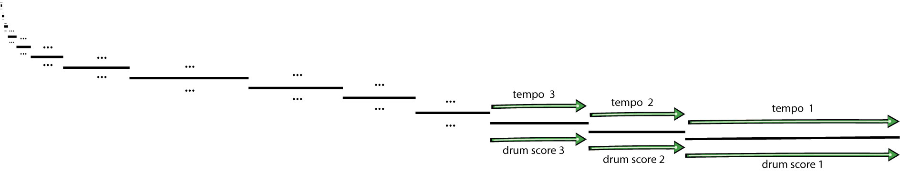
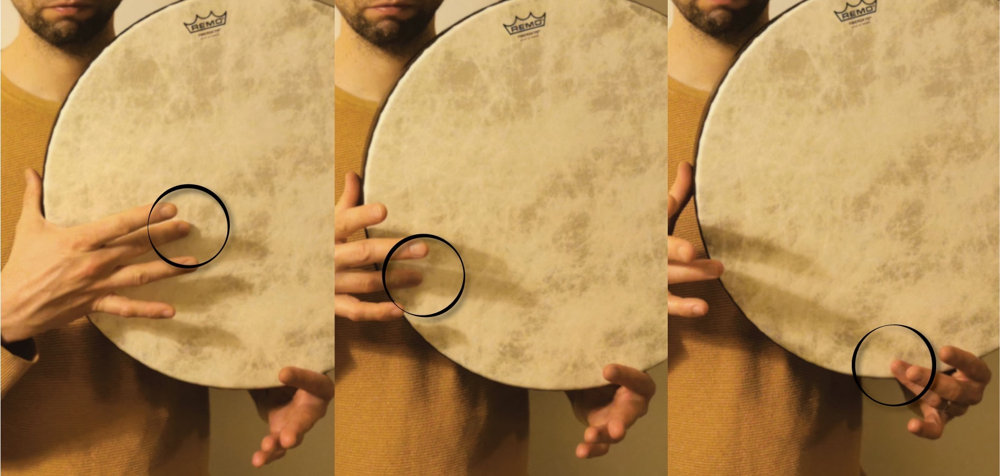
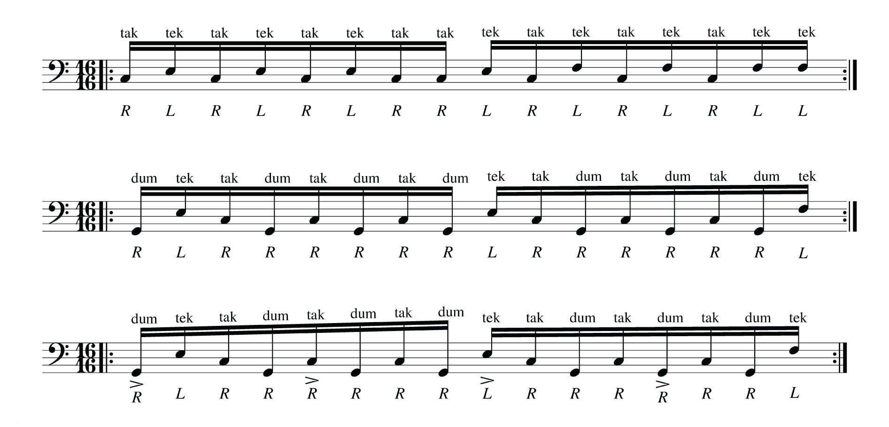
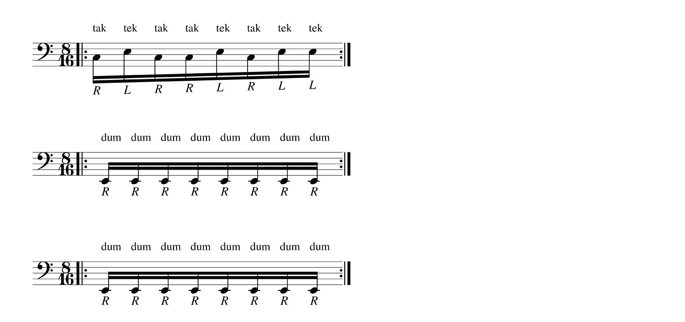
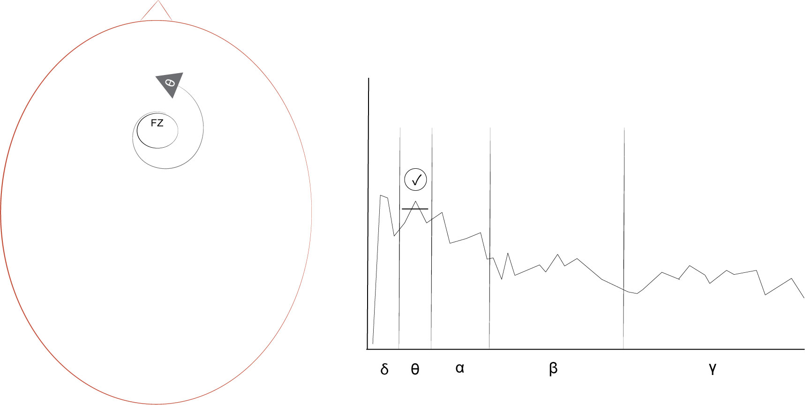

## 5.3 Shamanic Soundscape Generator

### 5.3.1 Project overview
This project developed the open-source Shamanic Soundscape Generator software in SuperCollider IDE. It acquires classified EEG from the OpenBCI-SuperCollider Interface and, using its neurofeedback protocol, triggers a discrete reward sound for operant conditioning. This sound, the control parameter, is embedded in soundscapes generated with ARE. The parameters of the soundscapes, including the reward and ARE sounds, are customisable. Running both software, the OpenBCI-SuperCollider Interface and the Shamanic Soundscape Generator in the same IDE provides straightforward mapping with global variables and numerous options for further development, especially with regard to the musical aspect of BCMI-2. The project addressed RO2 - it developed part of an affordable and customisable BCMI system. To answer my research questions, I tested the system's suitability to support meditation in NFT and artistic performance settings (Sections 5.4 and 5.5).

**Project time span:** February 2019—April 2020

**Supporting material:**

- [Shamanic Soundscape Generator](https://github.com/krisztian-hofstadter-tedor/bcmi-sc01-shamanic-soundscape-generator) | SuperCollider code on GitHub

### 5.3.2 Goals
To address RO2 — to develop an affordable and customisable BCMI system based on the literature review findings — the objectives of this project were to create a software program that

- acquires classified EEG from the OpenBCI-SuperCollider Interface effortlessly
- provides customisable mapping of this classified EEG to sound control parameters
- generates a soundscape with customisable ARE, of which the neurofeedback reward sound (the sound control parameters) is an integral element
- has fully transparent BCI steps.

These objectives were informed by technical aspects of the OpenBCI-SuperCollider Interface, relevant literature review findings and personal conversations with rhythmic entrainment expert Jeff Strong and NFT practitioners Jeff Tarrant and Tony Steffert.

### 5.3.3 Design and development
To address these objectives, I built the Shamanic Soundscape Generator in SuperCollider, the same IDE as the one used for building the OpenBCI-SuperCollider Interface. Running the two software programs in parallel in SuperCollider allows for straightforward mapping and scaling of classified EEG to sound control parameters via global variables.

As discussed in Chapter 1, existing NFT systems mainly focus on giving visual feedback (Stefert, 2018, p.136) and where they provide options for auditory feedback, these options are often limited, not allowing the development of engaging musical experiences (i.e. they do not employ the wide-ranging capabilities of music that could help induce and maintain the desired states of mind) (Miller, 2011; Mealla. et al., 2014; Stefert, 2018, p.84). Although the auditory feedback from the neurofeedback protocol used in BCMI-2 is simple, it is embedded as an integral element within the other entrainment method, ARE. Therefore, I hypothesised that the combination of these two methods would help increase theta waves and induce and maintain an SSC in my experiments.

I first developed the ARE component of the software, inspired by the works of Jeff Strong (Section 3.4). I programmed a sequencer to play sounds in various rhythmic patterns at different tempos. The sounds triggered can be synthesised or pre-recorded audio samples, allowing for the use of auditory stimuli with specific meanings and associations. Specific meanings associated with the triggered sounds should aid further immersion into the desired state of mind. For example, if the idea is to relax the listener, sounds used in the soundscape should probably not be harsh or unpleasant. However, if the idea is to create and maintain an alert, mindful state of mind, then harsh, unpleasant, or even frightening sounds might be helpful. Although it was technically possible, I resisted the idea of composing music in my usually preferred style (melodic EDM). Instead, I chose a minimal approach in order to have a more manageable number of variables in the music for later analysis. To add meaning to the soundscapes, I took ideas from the shamanic world, specifically from shamanic journeying, a type of guided meditation often accompanied by monotonous auditory entrainment (Section 3.4.3).

#### 5.3.3.1 Soundscape structure
I envisioned my soundscapes as journeys to the middle of an imaginary forest through several layers called 'levels'. A soundscape starts outside the forest and moves gradually inwards. At the end, when the journey reaches the middle of the forest, a ‘call back’, with drumming that suddenly slows down and changes in rhythm, returns the listener to the outside of the forest. While moving towards the middle of the forest, the drumming becomes gradually slower, more repetitive, less variable and slightly louder. Before generating a soundscape, levels could be set up with random durations to create a unique narrative or with exact durations to help compare results in analysis later Fig. 5.10.

<center>Figure 5.10: The duration of soundscape levels can be generated randomly (top left and bottom left) or with exact, predefned values (top right and bottom right). Three soundscapes are 30 minutes long, while one (bottom left) is 20 minutes long.</center>

The soundscapes generated have three tracks: noise, drum and shaker (Fig. 5.11):

<center>Figure 5.11: The fgure on the left depicts a soundscape as a forest and indicates level durations and instrument activities in the tracks. The fgure on the right visualises the neurofeedback protocol: when theta at Fz is above the threshold (black bold horizontal line), the protocol plays the shaker sounds, and when it is below the threshold, it mutes them.</center>

**Noise track**  
Each level in this track starts with ’a call’, represented by a short horn sound, while a long sound slowly fades in at the beginning and then out at the end of the level. The soundscapes are all set up with horns that sound the same in each level, but the noise sounds are different: their low-pass filters’ cutoff frequencies shift at the start of each level. For example, in the NFT setting, Level 0’s cutoff frequency is set to 500 Hz; Level 14’s to 600 Hz and Level 13’s to 700 Hz. The frequency goes up to 1900 Hz in the last level before the ‘call back’. However, in my artistic performance, this shift was reversed (i.e. listeners would hear less and less of the high frequencies in the noise sounds while stepping into deeper layers of the forest).

**Drum track**  
The drumming generated in this track uses ARE with frame drum sounds. It decreases in tempo and rhythmic complexity between the first outer and the last inner level. As seen in Fig. 5.12, these changes are introduced in stages. They are initialised at the start and retained until the end of each level.

<center>Figure 5.12: Shamanic soundscape levels with (horizontal) lines showing tempo and rhythmic complexity (drum score) remaining constant throughout each level.
</center>

The changes in rhythm from more to less complex patterns aim to help listeners gradually shift attention from more conscious (active) thinking characterised by higher brainwaves (e.g., beta) towards more subconscious (passive) thinking characterised by lower brainwaves (e.g., theta). On the other hand, the gradual decrease in tempo aims to help shift entrainment within the theta bandwidth from higher (6.6 Hz) to lower theta (4.5 Hz) brainwaves. To clarify, the decrease in rhythmic complexity aims to assist a wider shift (from beta to theta), while the decrease in tempo aims to assist a narrower shift (from high- to low-theta). Using these two changes in parallel, I hoped to be more effective in inducing and maintaining the SSC than I would if I used only one of these changes.

The frame drum sounds are ‘dum’, ‘tak’ and ‘tek’. In hand-held style, ‘dum’ is the bass tone made when a fingertip or the thumb hits the middle of the drum Fig. 5.13. ‘Tak’ is a higher frequency tone made when a fingertip hits the side of the drum. ‘Tek’, another higher frequency tone, is made when the drum’s rim is hit with a fingertip. For naturally-sounding drumming, each sound was recorded multiple times using the mid-side stereo technique and then grouped into folders on the computer. The soundscape generator randomly picks samples from these folders every time a particular tone needs to be triggered.

<center>Figure 5.13: Frame drum sounds ’dum’ (left), ’tak’ (middle) and ’tek’ (right).</center>


To generate rhythms, each level is set up with arguments that first fill a bar of single or double paradiddles with 'tak' (0) and 'tek' (1), then some of these notes are replaced with 'dum' (2) and at last, selected notes are accented. See these three steps represented as arrays in the code and with traditional notation in Fig. 5.14.

```
[ 0, 1, 0, 1, 0, 1, 0, 0, 1, 0, 1, 0, 1, 0, 1, 1 ] // tak, tek
[ 2, 1, 0, 2, 0, 2, 0, 2, 1, 0, 2, 0, 2, 0, 2, 1 ] // dum 
[ 1, 0, 0, 0, 1, 0, 0, 0, 1, 0, 0, 0, 1, 0, 0, 0 ] // accents 
```
<center>Figure 5.14: The generator’s three-step rhythm-making process in each level.</center>

Adding the ‘dum’ notes and the accents uses the Bjorklund class by Olofsson (2010), which generates traditional musical rhythms based on Euclid Bjorklund’s algorithm (Toussaint, 2005). It works by computing the greatest common divisor of two given integers. For example, `Bjorklund(9, 16)` creates a rumba rhythm by placing nine notes distributed as evenly as possible in a 16-note length bar:

[ 1, 0, 1, 1, 0, 1, 0, 1, 0, 1, 1, 0, 1, 0, 1, 0 ]

I used the following code to set up the forests in the NFT setting (Section 5.4):

```
// [depth,bps,bpb,bjorkdum,bjorkaccent,shamanvol,windlpf]
~forest[0] = [0,4,16,0,0,0.2,500]; //level 0
~forest[1] = [1,6.6,16,7,4,0.2,600]; //level 14
~forest[2] = [2,6.5,16,5,3,0.2,700]; //level 13
~forest[3] = [3,6.4,16,3,4,0.2,800]; //level 12
~forest[4] = [4,6.3,16,2,8,0.2,900]; //level 11
~forest[5] = [5,6.1,16,1,8,0.2,1000]; //level 10
~forest[6] = [6,5.8,12,1,4,0.2,1200]; //level 9
~forest[7] = [7,5.6,8,1,0,0.2,1200]; //level 8
~forest[8] = [8,5.5,8,2,0,0.2,1300]; //level 7
~forest[9] = [9,5.4,8,4,0,0.2,1400]; //level 6
~forest[10] = [10,4.9,8,8,0,0.2,1500]; //level 5
~forest[11] = [11,4.8,8,8,1,0.2,1600]; //level 4
~forest[12] = [12,4.7,8,8,2,0.2,1700]; //level 3
~forest[13] = [13,4.6,8,8,4,0.2,1800]; //level 2
~forest[14] = [14,4.5,8,8,8,0.2,1900]; //level 1
~forest[15] = [16,2,4,8,3,0.2,700]; //call back
~forest[16] = [17,2,4,8,3,0.0,400]; //level 0 (drums quiet)
```

To clarify, I will explain in detail the array of Level 14 (`~forest[1] = [1,6.6,16,7,4,0.2,600]`). This array first defines this level's depth as `1`, referring to the first outer layer of the forest, and its tempo as `6.6` BPS. Value `16` creates a paradiddle with 16 beats that has `7` 'dum' notes and `4` accents. Towards the end of the array, the overall volume of the frame drumming is set to `0.2` (range=0.0-1.0) and finally, the last value, `600`, sets the low-pass filter's cut-off frequency in the noise track's long sustained sound.

In the above example, when the number of 'dum' notes equals the number of beats in the bar (from Level 5 onwards), the paradiddles are replaced with monotone patterns consisting of 'dum' only. See score of Level 5 in arrays and traditional notation in Fig. 5.15 below:

```
[ 0, 1, 0, 0, 1, 0, 1, 1 ]
[ 2, 2, 2, 2, 2, 2, 2, 2 ] // tak & tek (0,1) replaced by dum (2)
[ 0, 0, 0, 0, 0, 0, 0, 0 ] // no accents
```

<center>Figure 5.15: The generator’s three-step rhythm-making process for Level 5.</center>


**Shaker track for the neurofeedback protocol**  
In this track, short synthesised shaker sounds are played when theta energy at Fz is above a threshold and muted when this energy is below this threshold. These sounds are immediate neurofeedback indicators, the reward sounds of the neurofeedback protocol (Fig. 5.16). Rewarding increased theta was inspired by research highlighting this increase during concentrative meditation (Baijal and Srinivasan, 2009), receptive meditation (Lagopoulos et al., 2009; Tarrant, 2017), alpha-theta NFT (Gruzelier, 2008; Collura, 2017, p.134), and while listening to repetitive music (Strong, 1998; Maas and Strubelt, 2003; Fachner, 2006b; 2006a; Jovanov and Maxfeld, 2011; Becker, 2012; Will and Turow, 2012). I chose location Fz based on the thoughtless awareness NeuroMeditation protocol outlined in Section 3.3.2.

<center>Figure 5.16: The electrode location of BCMI-2’s neurofeedback protocol (left) and a spectral plot (right) showing the application of one indicator at Fz.</center>

Table 5.1 summarises the main aspects of the three tracks: 

|          | noise       | drum           | shaker       |
|----------|-------------|----------------|--------------|
| type     | noises      | frame drum     | shaker       |
| source   | synthesised | audio sample   | synthesised  |
| trigger  | controlled  | semi-controlled| controlled   |
| BCI mapping | no    | no             | yes           |
| entrainment | change in pitch | change in tempo and rhythm | neurofeedback |


Table 5.1: The soundscapes’ noise, drum and shaker track summary.

### 5.3.4 Conclusion
**Research and project objectives**   
This project addressed RO2 — it developed the mapping and control parameter steps of BCMI-2 based on insights from the BCMI-1 project, my literature review findings, the feedback I received from public demonstrations and the technical aspects of the OpenBCI–SuperCollider Interface. The project's primary outcome is a novel soundscape generator that can be effortlessly linked to the OpenBCI-SuperCollider Interface and possibly to other BCI systems using OSC. The project addressed all its objectives successfully. 

The Shamanic Soundscape Generator

- Effortlessly acquires classified EEG in the form of global variables from the OpenBCI-SuperCollider Interface, also running in SuperCollider.
- Provides customisable options for mapping this classified signal to sound control parameters.[^ssc-custom1]
- Generates soundscapes with customisable ARE, of which the neurofeedback reward sound is an integral element. We can customise the length of the soundscape and its levels, the tempo and rhythmic variations in each level, and the sounds that are triggered (for example we can use different drum samples).

[^ssc-custom1]: While the neurofeedback protocol in this BCMI-2 project rewarded increased theta at Fz with a synthesised shaker sound, several aspects of this sound could be altered with textual programming or alternative sounds be synthesised or played back from audio samples instead. With little changes to the code, we could even map the classified data to other aspects of the soundscape, e.g. the parameters of the ARE or the continuous noise sound textures.

**New objectives**   
To improve this software, I will

- write code that creates smoother transitions between levels
- add extra drum tracks to experiment with polyrhythmic patterns
- add accumulative feedback to the neurofeedback protocol (based on the BCMI-1 neurogame)
- incorporate the use of the Ambisonic Toolkit as an alternative to the current surround spatialisation method to help control the sound field more precisely ([ambisonictoolkit.net](https://www.ambisonictoolkit.net/))

Next, in Sections 5.4 and 5.5, I outline how I tested BCMI-2 in NFT and artistic performance settings.