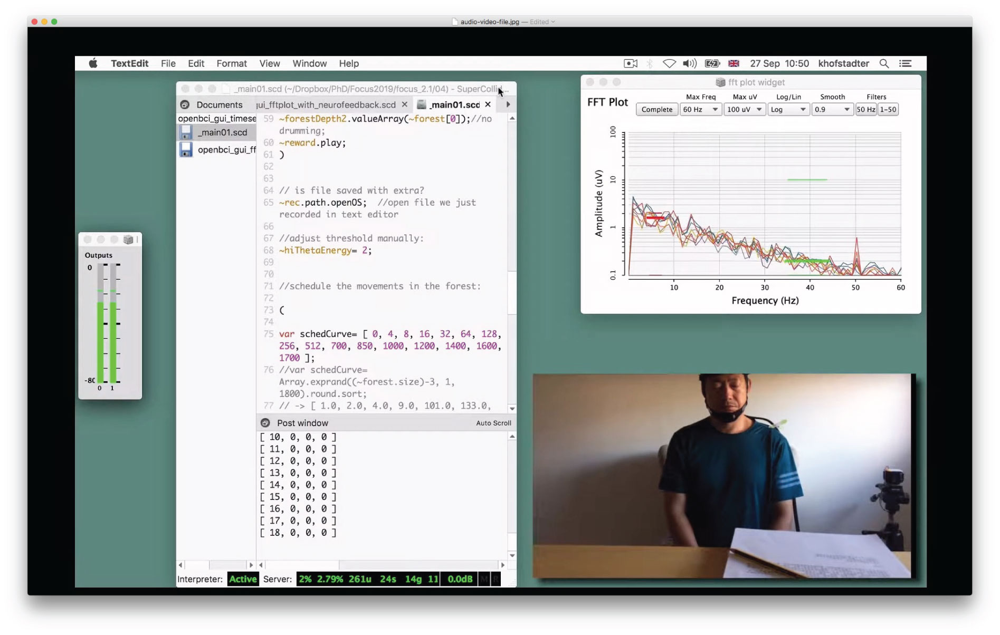
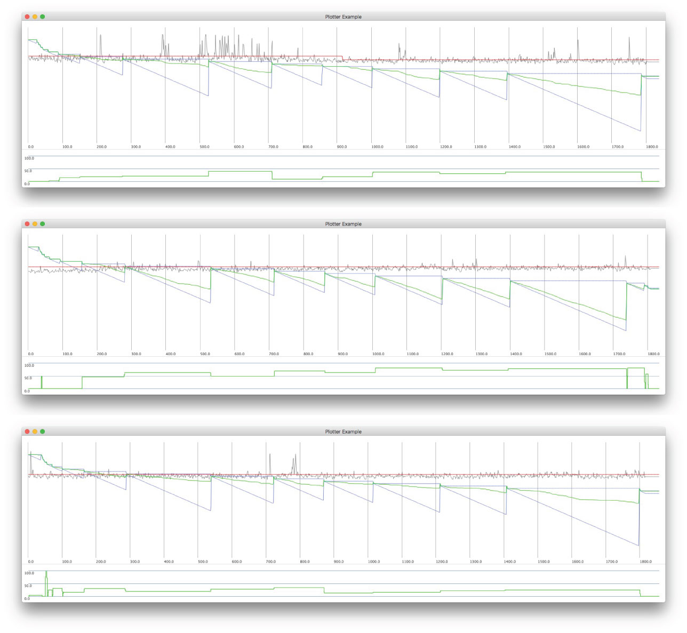
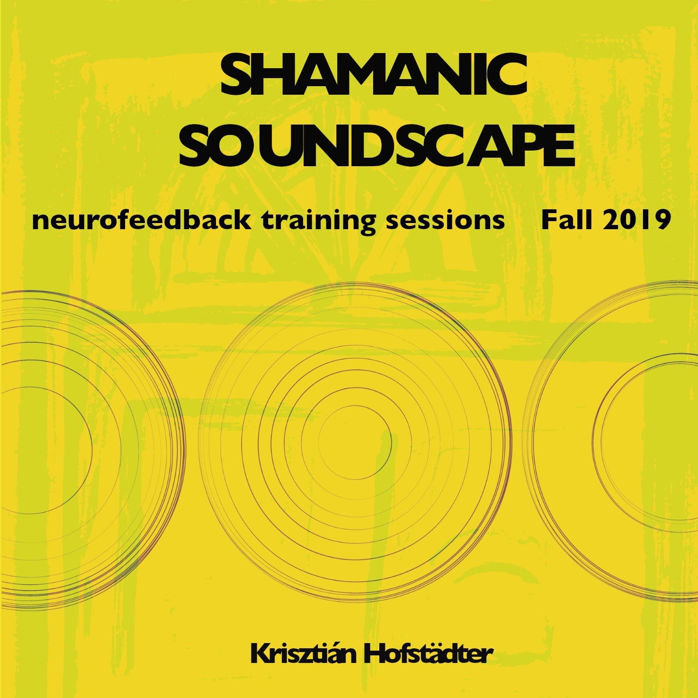

## 5.4 NFT Setting

### 5.4.1 Project overview
This project addressed RO3 — it demonstrated BCMI-2's suitability to support meditation practices in an NFT setting. After establishing the system's stability in tests that used my own brainwaves, I recruited two participants to gain experience using the system in supporting others interested in deepening meditation. The type of meditation practised was shamanic journeying (Section 3.4.3) with the two training methods (ARE and a neurofeedback protocol) as outlined in the previous section on the Shamanic Soundscape Generator software. After three sessions with each participant, I analysed the data gathered in their questionnaires, BCMI data files and screencasts. While they did not experience a breakthrough into the SSC, one participant made progress in deepening her meditation and expressed interest in a follow-up study. The system was stable throughout the project and has clarified new objectives that could make it more efficient. In addition to addressing RO3, the project also produced digital audio that was released on the internet, featuring soundscapes generated with the system.

**Project time span:** September 2019—February 2020

**Supporting materials:**

- [YouTube Video Playlist](https://www.youtube.com/playlist?list=PLRr9g36OjY6-48a-AdKazkDrB6QyGStmp) | Audio-video archive of the six NFT sessions described below and a short video introducing the environment where the sessions took place.
- [*Shamanic Soundscape - Neurofeedback Training Sessions*](https://tedor.bandcamp.com/album/shamanic-soundscape-neurofeedback-training-sessions) | A digital audio release with stereo files on Bandcamp for online streaming. The release contains three soundscapes, two of which were generated using BCMI-2 during the sessions described below and one that was created during a session in which I tested the system.

### 5.4.2 Goals  
To address RO3 — to test BCMI-2's suitability to support meditation practices in an NFT setting — the goal of this project was to prepare and run NFT sessions using the system and then analyse the archived data. Therefore, the objectives of this research were to 

- find participants and prepare the practical aspects of the sessions (e.g. the environment and questionnaires)
- prepare the BCMI-2 system to provide entrainment and archive BCMI data files for later analysis 
- prepare other software and hardware tools for archiving screencasts
- prepare participants and run the sessions
- analyse the archived data in the questionnaires, the BCMI data files and the screencasts

I addressed these objectives using insights from the literature review (Sections 3.2, 3.3 and 3.4) and insights from my own NFT sessions using the system.

### 5.4.3 Design and development
#### 5.4.3.1 The set and setting
Born out of psychedelic research (Leary, Litwin and Metzner, 1963; Zinberg, 1984; Hartogsohn, 2017; Carhart-Harris et al., 2018), the concepts of ‘set and setting’ in meditation practices is also relevant to my research. How my soundscapes afect listeners depends on a variety of factors. These factors include the emotional signifcance of the circumstances in which the listening takes place (setting), the cultural and musical background of the listener (set), the mental state of the listener (set) and the listener’s intentions (set) (Sloboda, 1985; Trost and Vuilleumier, 2013; Will, 2017). Without clear intentions, it can be challenging to deepen one’s meditation. A clear intention can help a listener stay focused and maintain the self-compassionate, non-reactive attitude that is crucial for progress (Shapiro, Siegel and Nef, 2018). When preparing the sessions, I tried to consider all these factors.

Two volunteers, B and M, from Han Chinese tradition in their 50s, each participated in three sessions (n=2, trials=3). I held the sessions in a small room with only essential furniture and technology in a quiet, undisturbed house. To help them become immersed in the specifc type of meditation (the shamanic journey), I attempted to create a sense of ritual and sacredness by smudging a small amount of sage in the room before the sessions and by burning a candle in front of them throughout the sessions. I also ofered blankets for comfort. All sessions took place a couple of days apart to help ‘learnt gains to be reinforced and retained’ (Collura, 2017, p.198). During a session, I sat in front of them, instead of beside or behind the participant, to help increase their comfort. To make sure their meditation was as undisturbed as possible, I set the laptop screen visualising their brainwaves out of their sight and took notes quietly with a pencil on paper instead of typing on the much louder laptop keyboard.

Shamanic journeys in core shamanic practices typically last between 15 and 30 minutes. Pilch, based on Dr Felicitas Goodman's research (Goodman and Nauwald, 2003), reinforces the 15-minute minimum:

> ... shaking a rattle (or beating a drum) approximately 220 times a minute [4 Hz] for a 15-minute period provides the optimal sensory stimulus to the nervous system for inducing a trance ... (Pilch, 2006, p.44)

In music therapy, Perret writes about a similar minimum length required for opening deeper levels in clients:

> Depending on the musician’s state, I would probably insist on her playing for at least five to fifteen minutes. There may be exceptions of course. Usually, though, it is about this length of time that is necessary for the player to get over her initial inhibitions, to find an opening to deeper levels and to let herself be carried away so that the musical expression will truly reflect what is happening inside. The inner level is not limited to our emotions but may engage any aspect within us which is more or less conscious, for instance the collective unconscious, energy phenomena and spirituality. (Perret, 2005, p.143)

This minimum 15-minute requirement to change the state of mind is also supported by my experiences with shamanic journeying using the BCMI-2 system, as well as drumming, practising breath-work and running outside. Therefore, to give participants enough time to induce and maintain the SSC, the length of time for the soundscape generated in each NFT session was set to be 30 minutes long.

Preparing the set — my participant's mindsets regarding the study's goals and the methods used to help achieve these goals — required careful considerations. For example, how much detail should participants be given about shamanism, the proposed advantage of ARE over more monotonous sonic driving and the neurofeedback protocol? When I approached B and M a couple of weeks before the sessions, I told them about my research and asked whether they could help test my new tool's suitability to support meditation. After confirming their participation, I told them not to consume food for a couple of hours before the sessions to comply with preparations for shamanic journeys and told them that I would provide more information about the study in their pre-listening questionnaires.[^faceshamper]  <!-- add more REF from https://sse-pa.healthyseminars.com/course/how-is-fasting-and-vegetarianism-perceived-to-support-psi-among-adepts#lifter-course-content -->

[^faceshamper]: I discussed preparation for shamanic journeys with two admins from different shamanic groups on Facebook in November 2019 via private messages. One admin aligned herself with traditional shamanism, the other with core shamanism.

#### 5.4.3.2 The sessions
Parts of a session:

- Part I – Pre-Listening
- Part II – Listening
- Part III – Post-Listening

In **Part I – Pre-Listening**, I used a short questionnaire to introduce the study and to gather data. The questionnaire introduced how repetitive drumming has been used in shamanic traditions to induce the SSC; however, it did not specifically explain how the combination of ARE and a neurofeedback protocol aims to help induce and maintain this SSC. Then, it inquired about participants' research-related conditions and experiences, including brain-related medical conditions, left/right-handedness, previous experience with BCI, meditation and shamanic journeying, musical preferences and level of musical skill. The questionnaire also asked about their alcohol, drug and food consumption within a few hours of the session and whether they felt tired or focused. After they filled in the questionnaire, I asked them to relax and focus on the rhythmic patterns in the 30-minute soundscape as much as possible, more by ‘feeling’ than through ‘analytically thinking’. I explained that BCMI-2 maps parts of their brain signals to parts of the soundscape but did not specifically explain that the neurofeedback reward, the shaker sounds, are only played when their theta brainwaves at Fz go above a certain threshold – a threshold I set manually.[^app5] 

[^app5]: The questionnaires and data gathered can be found in Appendix 3.

In **Part II - Listening**, I recorded two files:

- an audio-video screencast file (mp4) and 
- the BCMI data file (txt).

After I set up participants with eight EEGs using the Greentek Gelfree cap, I began recording a screencast using ScreenFlow (Telestream, 2017). After that, I lowered the electrode impedances by adding more saline water to the electrodes in the cap. I aimed to keep impedances below 10 kOhms. Once I could not lower the impedances further, I began feature extraction with the FFT plot GUI of the OpenBCI-SuperCollider Interface. To adjust the neurofeedback threshold manually, I executed code in SuperCollider's editor. Once a threshold seemed usable, I started the soundscape at Level 0 (outside of the forest) and began recording the BCMI data file. While listening to the sustained noise of Level 0, I prepared myself and the participants for the journey. I reminded them to keep their eyes closed while listening to the drumming and then moved the soundscape to the first outer layer of the forest, Level 14, where the entrainment began. Fig. 5.17.

Figure 5.17: Snapshot of an NFT session’s screencast showing three SuperCollider windows (from left: audio volume meter, IDE with textual programming/post window and FFT plot) and one camera window.

Throughout the soundscape, I tried to be as helpful as possible by sitting mindfully with a straight spine while searching the screen for artefacts and interesting changes in the FFT plot. I took notes quietly with a pencil in a physical notebook. In every session, I was hoping to gradually hear an increasing number of shaker sounds and see a shift from strong alpha to strong theta brainwaves, indicating a breakthrough (see Sections 3.2 and 3.3 for more information on breakthroughs).

After participants reached the middle of the forest, a 'call back' sent them back to the outside of the forest, where the soundscape finished. I stopped recording the BCMI data file, checked the electrode impedance and then stopped recording the screencast. During the **Part III - Post-Listening stage**, I assessed participants’ experiences in the forest by asking them to fill in a short questionnaire and to recall visual images, if they had any, by trying to draw them on paper. Then, about a week later, in **Part IV - Follow-up**, I asked for further feedback regarding the most pleasant and unpleasant parts of the sessions, the comfortableness of the environment, the effectiveness of the drumming in helping produce visions and the effectiveness of drawing for remembering visions as well as whether they were interested in a follow-up study. Their feedback was positive and constructive, and they were interested in continuing the study.[^bcmi2nftfiles]

[^bcmi2nftfiles]: While the six BCMI data files from the sessions are not shared publicly, as they contain participants' raw EEG data, the screencasts are unlisted videos on [YouTube](https://www.youtube.com/playlist?list=PLRr9g36OjY6-48a-AdKazkDrB6QyGStmp). We can find the summary of the questionnaires in Appendix 3.

### 5.4.4 Deployment
#### 5.4.4.1 Analysis
My analysis used (1) plots of the BCMI data files, (2) questionnaire data and (3) screencasts. 

**Participant B**  
The classified data (theta at Fz) from **session B1** could not be considered a reliable input for the neurofeedback protocol or later off-line analysis as it was affected by numerous muscle movements and touching of the EEG cap (Fig. 5.18). Unfortunately, B did not report visual imagery either. However, the session helped highlight two issues: 

- a tired participant cannot offer the focus required for successful meditation 
- participants need more clarification on the significant effects that physical movements have on EEGs

![BCMI data plots from sessions B1 (top), B2 (middle) and B3 (bottom). The top part of each plot shows (1) theta median at Fz (wiggly grey lines), (2) neurofeedback threshold (red horizontal lines), (3) soundscape level durations (blue triangles) and (4) averaged neurofeedback success rates for each level (green lines in the blue triangles). The closer the green line gets to the bottom right corner of the blue triangle, the higher the neurofeedback success rate was in that level. The bottom parts of the plots visualise the success rates again, with higher green steps indicate higher success rates.](../../assets/img/c1-b-plots-0.2.jpg)
Figure 5.18: BCMI data plots from sessions B1 (top), B2 (middle) and B3 (bottom). The top part of each plot shows (1) theta median at Fz (wiggly grey lines), (2) neurofeedback threshold (red horizontal lines), (3) soundscape level durations (blue triangles) and (4) averaged neurofeedback success rates for each level (green lines in the blue triangles). The closer the green line gets to the bottom right corner of the blue triangle, the higher the neurofeedback success rate for that level. The bottom parts of the plots visualise the success rates again, with higher green steps indicating higher success rates.

Figure 5.19: BCMI data plots from sessions M1 (top), M2 (middle) and M3 (bottom). See previous fgure for more detail.

In **session B2**, the participant, being less tired than in the previous session, produced clearer EEG and some abstract visions:

> Irregular images emerging, like a dream... Two concentric circles, outer one representing the field of view, inner one the stranger’s face appearing in front and from the left in the dream. The image appeared once.

B remembered these visions to be around three-quarters into the soundscape, which is, unfortunately, when we also see many artefacts in Fig. 5.18. Therefore, it is not possible to relate this vision to the quantitative data. Furthermore, although his overall EEG was much clearer than in the previous session, still numerous artefacts interfered with the neurofeedback protocol (i.e. often movements triggered the shaker sounds instead of strong theta waves). Another issue in this session was that the neurofeedback threshold was not adjusted effectively at the start — it was too high throughout the session. Therefore, most rewards were likely triggered by artefacts instead of by strong theta brainwaves.[^b2-nfth-high]

[^b2-nfth-high]: Fig. 5.18, the red line is slightly higher in the middle plot than in the two other plots when compared to the theta signal.

In **session B3**, his first comment on his visions was that 'there were no special images in [his] subconscious'. However, his later statement was quite precise, which may indicate that his visions in this session were actually more concrete than in the previous session:

> I saw a foreigner (translator’s note: Caucasian male), around 40, with a black beard. He looked like he was selling snacks/deli.

On average, the EEG in this session is clearer than in his two earlier sessions. Although polluted by some artefacts, the bottom plot in Fig. 5.18 shows that his theta brainwaves became stronger in the final levels of the soundscape. Unfortunately, his information sheet does not indicate the level in which he experienced the above vision.

**Participant M**  
There were two issues encountered in **session M1**. First, strong eye movements contaminated the EEG for the first third of the recording, which (based on the answers in the questionnaire) may have been caused by nervousness or difficulties with 'feeling' the drumming and pausing an internal dialogue. Second, the neurofeedback threshold was not adjusted effectively until the middle of the soundscape. (These two issues can be seen in the top plot of Fig. 5.19). M found the middle of the soundscape to be the easiest to focus on, where she also experienced several visions:

> I saw another me in the clouds. ... I saw the pores on the surface of my skin. ... I felt golden light in front and to the right of my eyes.

**Session M2** was M's most successful session for the following reasons. The quality of her EEG was clear and the neurofeedback success rate high throughout the session (Fig. 5.19). She also experienced visual imagery, remembered as follows:

> In the middle section, there was a very big meadow in the shape of a funnel. Many people, including the five people in our family, were playing on it.

In **session M3**, the quality of her EEG was clear most of the time and she also experienced visual imagery. However, the neurofeedback success rate was lower than in the previous sessions. Her visions are described below:

> In about the last one-third of time, there was a hole (in between my eyes and nose) in an irregular shape. Through the hole, there was a green meadow. Many people were playing on it.

**Summary of analysis**  
There were two signs of progress observed in B’s training. Session by session, his EEG and his visions became clearer. M’s EEG, on average, was clear, and she produced visual imagery in all her sessions. When comparing B’s sessions with M’s sessions regarding (1) clarity of the EEG, (2) number and clarity of the visions produced and (3) neurofeedback success rates, I consider M’s sessions more productive. I could only link the correlations found between (1) the BCMI data files, (2) the questionnaire data and (3) M’s better performance to differences in their musical preferences and their level of difficulty with pausing internal dialogues during the listening parts. While B’s musical preference is folk music, M’s is classical music. While B described pausing his internal dialogue as ‘easy’ in two sessions and ‘very easy’ in one session, M described this task as ‘hard’ in all of her sessions. M’s preference for classical music may indicate her ability to focus better on more complex musical patterns, which may be the reason for her better performance. Also, the fact that M’s visions were clearer and more frequent than B’s, despite her finding it more difficult to pause her internal dialogue than B, may suggest that she took the study more seriously than he did. Overall, my feeling is that it was her commitment that helped her perform better. However, I can only hypothesise. Unfortunately, none of the six recordings suggest breakthroughs. However, as there was progress with both participants, future sessions with them could produce clearer EEGs, more visual imagery and breakthroughs. Due to the COVID-19 pandemic, the follow-up study with M was cancelled in January 2020 and is still waiting to be rescheduled.

#### 5.4.4.2 Audio release
A creative output of this project is the digital audio release on the internet titled Shamanic Soundscape - Neurofeedback Training Sessions (Hofstädter, 2019f) (Fig. 5.20). It contains three mixed and mastered soundscapes: two that were generated in the sessions with B and M and one that was generated during my training.

Figure 5.20: Cover art for Shamanic Soundscape - Neurofeedback Training Sessions (2019).

### 5.4.5 Conclusion
**Research and project objectives**  
By addressing all its objectives, the project addressed RO3 — it demonstrated BCMI-2's suitability to support meditation practices in NFT settings. The system was stable in all six sessions. During the sessions, it provided entrainment with ARE and a neurofeedback protocol as well as archived a BCMI data file for later analysis. The plotting of this BCMI data file, together with questionnaire data and screencasts, helped produce an analysis of the sessions. The on-line sessions and the off-line analysis provided valuable insights on how the system itself and its application in NFT settings can be further improved and eventually used for studies with scientific rigour (e.g. to test different ARE and neurofeedback protocol parameters to support different meditation practices). 

**New objectives**  
Despite the successes mentioned earlier, I could not identify signs of breakthroughs in the participants’ EEGs or feedback forms. Although visual imagery can indicate the start of a mental shift, without precise information on when exactly these visions occurred, it is impossible to establish the causal relationships between the vision, the classified EEG (increased theta) and the rhythmic patterns of the soundscape. To address this shortcoming, BCMI-2 needs an additional sensor that participants can use to signal when they see a vision. This could be a simple binary sensor (e.g. an on/off button that they hold down when a vision occurs and release when there are no visions). I could also add a more sophisticated sensor with a linear transfer function (e.g. an accelerator with which participants could indicate the intensity of the vision by moving the physical position of one of their hands higher or lower). To connect one of these sensors, one could follow the analogue pulse sensor guide by OpenBCI (2020) and then create the appropriate scaling in the code of the OpenBCI-SuperCollider Interface.

In forthcoming studies, I will increase the number of participants and make sure that participants with (1) no meditation experience, (2) moderate experience and (3) advanced experience are represented in equal proportions. Furthermore, it will be essential to inform participants about how crucial it is to avoid physical movements throughout the recording to produce usable EEG data. I could share this information with them in a short video while setting up the EEG caps and adjusting electrode impedances. This video could also serve as a recap or extension of the textual introduction already given to participants. The video should be produced with appropriate audio-visual material that, while informing the participant, also prepares the meditation (e.g. by using a calming voice and soothing visuals and sounds). Additionally, items in the questionnaire need to be more specific. For instance, instead of the closed tired/focused question, participants should be able to indicate this condition on a scale of 0 (tired) - 100 (focused). Finally, my unfinished Matlab code requires further development in order to verify the SuperCollider plotting of the BCMI data files. Matlab could also help with artefact removal and the implementation of additional EEG analysis tools currently unavailable in the OpenBCI-SuperCollider Interface (e.g. EEG topography highlighting synchronised brainwave characteristics, perhaps in real time).

Next, Section 5.5 outlines BCMI-2's suitability for artistic performance settings with additional surround sound, acoustic drumming and sonification of brainwave synchronisation, all to help increase the engagement of my audience.