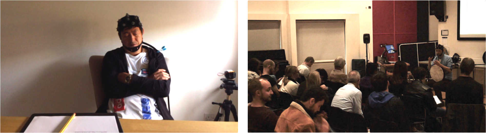
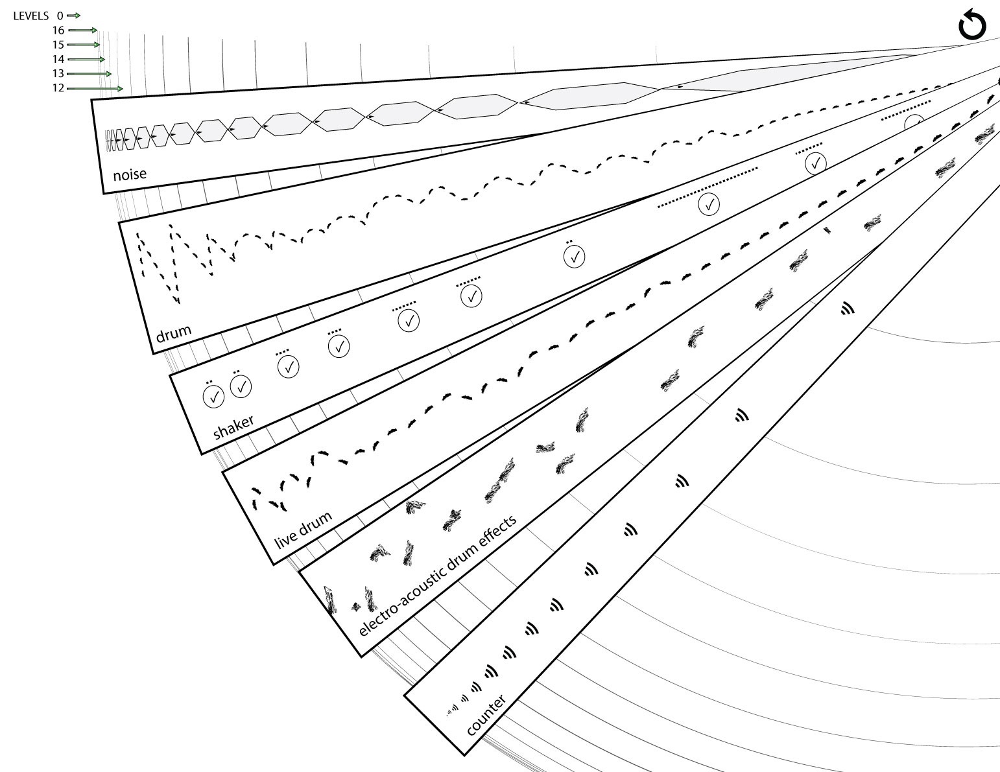
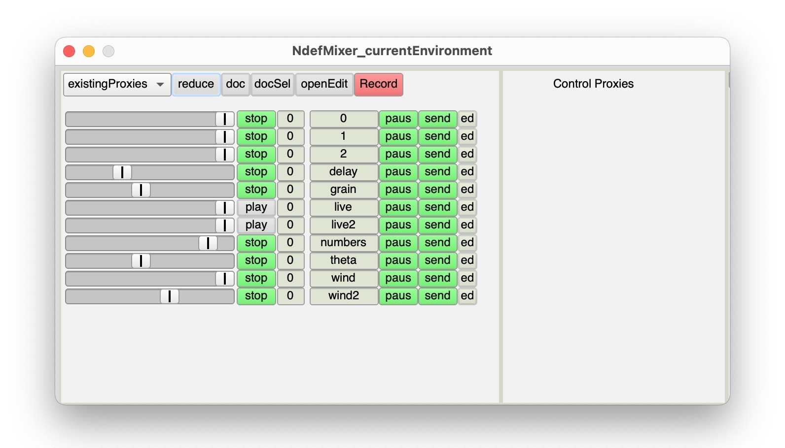
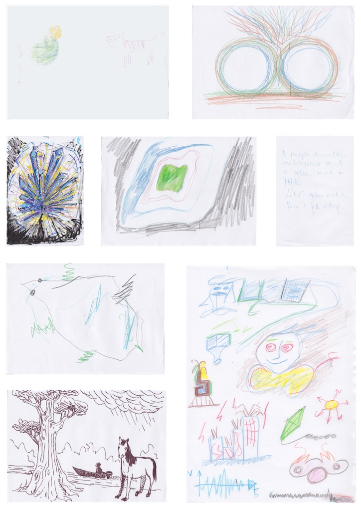
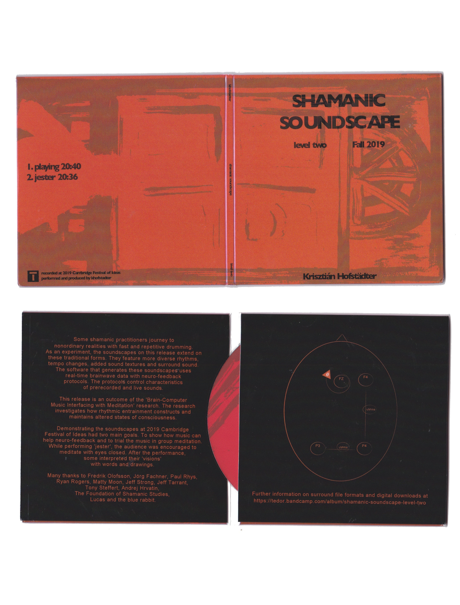

## 5.5 Performance Setting
### 5.5.1 Project overview
This project addressed RO3 — it demonstrated BCMI-2's suitability to support meditation practices in artistic performance settings. After establishing the system's stability in tests with my own and others' brainwaves (Section 5.4), the next step — as a natural progression — was to demonstrate its ability-enhancing potential to an audience. Following the guidance of key BCMI researchers (Williams and Miranda, 2018), I enhanced the system used in the previous NFT setting with additional functions to help provide a musically engaging experience. These functions included acoustic drumming and mapping theta brainwave coherences to surround sound spatialisation of abstract sound textures. Although my own meditation during my 2019 Cambridge Festival of Ideas performance did not produce a breakthrough, the system was stable, and feedback from the audience was insightful. The project helped create works of art (audio and video), highlighted how the system can be improved for artistic performances and raised people’s interest in participating and researchers’ interest in collaborating on upcoming projects.

**Project time span:** October 2019—February 2020

**Supporting materials:**

- [Cambridge Festival of Ideas 2019 Performance Video 1](https://youtu.be/lFVzwZtmecc) | A video collage of a screencast and two additional camera shots archiving my performance at the 2019 Cambridge Festival of Ideas.
- [Cambridge Festival of Ideas 2019 Performance Video 2](https://youtu.be/SdrYMDM7-Mg) | An alternative version of the above video, with additional binaural beats. The start of the video provides annotations clarifying the neurofeedback protocol used on theta at Fz.
- [*Shamanic Soundscape - Level Two*](https://tedor.bandcamp.com/album/shamanic-soundscape-level-two) | A digital audio release with stereo files on Bandcamp for online streaming and in a physical Digipak for CD players, with additional surround formats for downloading. The release contains three soundscapes: one that was generated using BCMI-2 in rehearsal, one that was generated in performance and an alternative version of the latter with binaural beats added in post-production.
- [*Shamanic Soundscape - Jester (Quad Mix)*](https://surroundmusic.one/video-streaming/) | Surround version of a track from the above audio release, published for online streaming.

### 5.5.2 Goals
To address RO3 — to test BCMI-2's suitability to support meditation practices in artistic performance settings — the goal of this project was to prepare and perform with the system at a public event, analyse the archived data and produce some creative outputs. Therefore the objectives of this project included the following:

- find a relevant venue
- organise technical support for setup and soundcheck
- book sufficient time for technical setup and rehearsals in the room
- prepare the BCMI-2 system for performance and for archiving the BCMI data file
- prepare other software and hardware tools to archive audio and video, including different camera shots, a screencast, microphones and surround sound spatialisation
- run the event
- analyse the BCMI data file in SuperCollider with the archived screencast 
- produce creative outputs (e.g. audio releases and videos archiving the performance) to help raise public and academic interest in my research for upcoming projects

These objectives were informed by technical aspects of BCMI-2; literature review in Chapter 3; insights from the previous NFT setting (Section 5.4); technical and aesthetic aspects of computer music; emerging questions and methods and progress with using the system to deepen my meditation.

### 5.5.3 Design and development
Shortly after the NFT sessions with B and M, I applied to present my research and perform with the BCMI-2 system it developed at the 2019 Cambridge Festival of Ideas (Hofstädter, 2019d).

> The Festival of Ideas is a University of Cambridge public engagement initiative that celebrates the arts, humanities and social sciences by showcasing a diverse mix of inspirational talks, performances, films, exhibitions and other creative displays. (University of Cambridge, 2019)

After my application was accepted, I began preparing for the practical, technical and aesthetic aspects of the event. The set and setting (Section 5.4.3.1) for this performance required careful consideration (Fig. 5.21). As it was a highly technical performance, I made sure I could set up the system the night before and rehearse at least once with support for soundchecks. I began the event with a 20-minute presentation outlining the research. Then, I prepared the audience for the performance. I invited them to either meditate with their eyes closed or observe correlations between the soundscape and the visualised EEG during the performance. 

Figure 5.21: Photos contrasting the NFT (left) and the performance (right) settings.

#### 5.5.3.1 New tracks and surround sound
As Williams and Miranda (2018) highlight, BCMI must not only respond to meaningful brainwave information, but the response needs to be musically engaging as well. Therefore, to help increase my and my audience's engagement during the performance, I extended the soundscape with three new tracks — the 'live drum', the 'electro-acoustic drum effects' and the 'counter' track — and utilised quadraphonic sound (4.0 surround sound) for spatialisation (Fig. 5.22).

Figure 5.22: The visual interpretation of the performance’s soundscape (forest) with six tracks.

The live drum track contains my improvisation on an acoustic frame drum. Its primary function was to continuously interpret my meditation progress and secondary to provide a sound source to be transformed using effects and then spatialised with theta coherence measurements in real time. To clarify, in addition to the neurofeedback protocol rewarding increased theta on Fz with shaker sounds (as in the previous NFT setting), in this performance, BCMI-2 also mapped other classified signals — theta brainwave coherences — to other sounds. More specifically, it mapped intra- and cross-hemispheric theta amplitude coherence signals to surround sound spatialisation parameters of the transformed acoustic drum sounds.[^code-coh-soundspat]

[^code-coh-soundspat]: For this coherence sonification, the code of BCMI-2 was updated with additional feature extraction, classification, mapping and control parameter functions. As discussed earlier in Section 5.2, I have updated the code extracting coherence features since this performance, and now, instead of extracting amplitude coherence, the code extracts phase coherence. This function can be found in the OpenBCI-SuperCollider Interface's `openbci_gui_fftplot_with_neurofeedback-8ch+coherence.scd` file. We can find the code for the surround spatialisation in the Shamanic Soundscape Generator's SuperCollider files.

Not only to interpret the progress of my meditation to the audience but also to support all our shifts into an SSC, I often juxtaposed the rhythmic patterns generated by BCMI-2 with patterns made with my fingers on the frame drum. We can hear an example of this juxtaposition when I overlay the computer-generated four-by-four patterns with improvised triplets on the acoustic drum from [10:20 minutes onwards](https://youtu.be/lFVzwZtmecc?t=620) in *Jester*. My aim with this juxtaposition was to experiment with polyrhythms that have been linked to inducing ASC in African drumming (Maas and Strubelt, 2003).

The BCMI-2 system distributed the sound of the noise, the (computer-generated) drum, the live drum and the counter track equally across all four speakers throughout the performance. However, the sounds mapped to brain signals were all in motion. The shaker sounds moved in a steady clockwise circular motion around the audience, but the electro-acoustic drum effects moved in a more unpredictable way (Figs. 5.23, 5.24).

![The performance's speaker setting and BCMI steps: (1) electrical fields picked up with the EEG cap; (2) signal amplification and A/D conversion on the OpenBCI board; (3) noise reduction cleaning user- and system-related artefacts; (4) feature extraction with FFT and coherence tools; (5) classification of meditation-related theta brainwave energy at Fz and classification of intra- and cross-hemispheric theta amplitude coherence measurements between EEG from brain areas F4, P3 and P4; (6-7) mapping of the classified signals to shaker sound and spatialisation (effects) parameters. Note: speaker arrangement is from the performer's perspective: front left (FL), front right (FR), rear right (RR) and rear left (RL). A small triangle on the EEG cap indicates the performer's (my) nose.](../../assets/img/c2-performance-setup-diagram-0.6.1.jpg)
Figure 5.23: The performance’s speaker setting and BCMI steps – (1) electrical felds are picked up with the EEG cap; (2) signal amplifcation and A/D conversion take place on the OpenBCI board; (3) noise reduction cleans user- and system-related artefacts; (4) feature extraction occurs using FFT and coherence tools; (5) meditation-related theta brainwave energy at Fz and intra- and cross-hemispheric theta amplitude coherence measurements are classifed via EEG from brain areas F4, P3 and P4; (6-7) the classifed signals are mapped to the shaker sound and spatialisation (efects) parameters. Note: speaker arrangement is from the performer’s perspective – front left (FL), front right (FR), rear right (RR) and rear left (RL). A small triangle on the EEG cap indicates the performer’s (my) nose.

![EEG cap with the four brain areas (top left) from where I measured signals for the neurofeedback protocol (Fz) and the coherence sonification (F4, P3 and P4). Four groups of FFT plots (bottom left and right) with relevant sound spatialisation. Group [1] illustrates how BCMI-2 spatialised the shaker sounds in a circular motion around the audience, when theta was above the neurofeedback threshold. The other three groups (right) illustrate how the system mapped intra- and cross-hemispheric theta amplitude coherence to the spatialisation of the electro-acoustic drum effects. In group [2], sounds are the loudest close to front-right (FR) due to theta being strongest in F4 and in P4 being stronger than in P3. In group [3], sounds are loudest in the front-middle due to theta being strongest in F4 but in P4 having a similar strength to theta in P3. In group [4], sounds are centered in the middle of the room as all three theta signals have similar amplitudes.](../../assets/img/c2-nf-protocol-and-spatialisation-0.5.jpg)
Figure 5.24: EEG cap labelled with the four brain areas (top left) where I measured signals for the neurofeedback protocol (Fz) and the coherence sonifcation (F4, P3 and P4). Four groups of FFT plots (bottom left and right) with relevant sound spatialisation. Group [1] illustrates how BCMI-2 spatialised the shaker sounds in a circular motion around the audience when theta was above the neurofeedback threshold. The other three groups (right) illustrate how the system mapped intra- and cross-hemispheric theta amplitude coherence to the spatialisation of the electro-acoustic drum effects. In Group [2], sounds
are loudest close to the front right (FR) due to theta being strongest in F4 and stronger in P4 than in P3. In Group [3], sounds are loudest in the front-middle due to theta being strongest in F4 but comparable in P4 to the strength of theta in P3. In Group [4], sounds are centered in the middle of the room, as all three theta signals have similar amplitudes.

The transformation and spatialisation in the electro-acoustic drum effects track continued my attempt to interpret brain activity in a way that could help induce the desired altered state. First, the granular synthesis and delay effects added to the live drumming aimed to help listeners connect the ordinary (dry/acoustic) to the non-ordinary (wet/transformed) world. Second, in addition to the transformed sounds' continuous motion sonifying theta amplitude coherences, these movements also symbolised how visual imagery of seemingly autonomous 'beings' often move in my shamanic journeys — providing I manage to produce a breakthrough. To clarify, I do not consider this coherence to spatialisation mapping to be part of the neurofeedback protocol as it was not set up for operant conditioning. Instead, it was an abstract artistic interpretation aiming to support the immersion into the SSC.

The counter track is more straightforward. In it, inspired by the voice of Robert Monroe in the *Gateway Experience* (Monroe Institute, 1962b), I announced each level with my voice counting backwards from Level 16 to Level 0. I added this track to help recall where in the soundscape my meditation feels becoming deeper.  

#### 5.5.3.2 Ndefs
This enhanced soundscape required some careful considerations regarding several technical and aesthetic aspects, such as the transformation of live acoustic sounds and their surround sound spatialisation. To better understand how this part of the system would function in a live setting, I first tested it in a collaborative performance with live audio from singers, speakers and instrumentalists (Ryan, 2019). Within the Shamanic Soundscape Generator, sounds in all tracks use the `Ndef` object. This object provides simplicity when routing buses (audio and control signals) and allows for the use of the `NdefMixer` GUI to fine-tune the sound mix before the start of a performance (Fig. 5.25).

Figure 5.25: BCMI-2’s NdefMixer GUI in the performance.

#### 5.5.3.3 Shorter duration and no breakthrough
I set the length of the soundscape for the BCMI performance to 20 minutes, 10 minutes shorter than the soundscapes generated in the NFT setting. The main reason for this was to ensure that people in the audience who might lack interest or struggle with music-guided meditation would not become irritated by a too-lengthy, repetitive composition. As shamanic journeys in core shamanic practices often use 15- or 30-minute audio files (Harner, 1993), I could have gone below 20 minutes but decided against it for the following reason. As my brainwaves would be used in the performance, the duration had to be informed by the time I usually need for a mental shift, which on average is at least 15 minutes with BCMI-2 or when doing my own drumming without this system. In the end, while I managed to induce some internal visual imagery around Level 5, I did not have the breakthrough I was hoping for.

### 5.5.4 Deployment
I recorded the following digital files during the performance:

1. a screencast of the computer screen, including SuperCollider's editor, the FFT plot, etc. 
2. four high-resolution mono audio files archiving SuperCollider's output channels
3. a high-resolution audio file archiving my acoustic drumming with a dynamic Zoom H1 microphone
4. a wide camera shot capturing the audience and the performance from a distance
5. a close-up camera shot capturing my drumming
6. a BCMI data file containing raw and classified EEG signals as well as soundscape-related values

In addition to these items, I asked audience members who experienced visions during the performance to interpret them via drawings, for which I provided note clipboards, paper and coloured pencils.

I used Files 1-5 to archive the presentation and the performance in audio-video formats, the audio files (2 and 3) and the drawings to create an audio release in stereo and surround formats and the BCMI data file (6) for an off-line data analysis in SuperCollider.

#### 5.5.4.1 Audience feedback
While I did not have a breakthrough, the system was stable throughout the performance, and the overall feedback from the audience was positive. In addition, some participants managed to induce visual imagery while meditating with me, which they interpreted in drawings after the performance (Fig. 5.26).

Figure 5.26: Drawings by the audience after the performance.

In addition to drawing, some audience members shared their visions in writing as well:

> I was climbing a very big mountain for a long time, then many other people joined to climb the mountain; after a long time, we arrived on a plateau where there were already a lot of animals and other people. We sat together around a fire, then listened [to] the drums and danced for a while. We sat once again around the fire and then it was like a union of all our consciousness, a dissolution of our bodies to become just one consciousness. For all the final part it was only clear consciousness without new visualisation.

In general, the audience’s feedback in the Q&A and later via email was that they felt relaxed and present (mindful) during the performance. However, one comment was different:

> I have listened to the performance music and I am a bit concern about it. Maybe other people present at the performance have experienced dark visions [as well], but they were shy and they didn't say.

As this comment concerned me, I met with this person to explain the methods used in the performance and discuss his vision. As I was in no position to provide any psychological analysis or support regarding his experience, I planned to suggest that he look for relevant help, perhaps through the NHS. However, our discussion highlighted that he had been investigating spiritual practices, and he assured me that he could deal with the situation on his own. Since then, we have been communicating regularly regarding drumming workshops we could organise together, and I have no further concern for his well-being.

Figure 5.27: Digipack release of Shamanic Soundscape - Level Two (2019).

#### 5.5.4.2 Audio-video archives
Another creative output of this project is the audio release titled Shamanic Soundscape - Level Two (Hofstädter, 2019e), containing three mixed and mastered soundscapes. BCMI-2 generated the frst soundscape (Playing) in the rehearsal and the second (Jester) during the performance. I produced the third soundscape (Jester - Binaural Beats Version) a few months later for a listening study investigating how binaural beats could improve ARE.13 The release on the online audio distribution platform Bandcamp provides stereo fles of all three soundscapes for streaming and downloading and additional surround fles of the frst two soundscapes for downloading. The stereo fles are also available on a physical CD in a Digipak case (Fig. 5.27). The surround version of Jester is available for online streaming on the online platform Surround Music One (Hofstädter, 2019c). The release’s cover art features one of my paintings (Hofstädter, 2005) with alterations inspired by the cover art of the SHAMAN journal by ISARS (1993) seen in Fig. 5.28. The eight-page booklet in the Digipak’s inner sleeve contains the audience’s drawings.

[^binbeats]: This study is not yet completed but is briefly introduced in the following Section 5.6. 

Figure 5.28: Cover art for SHAMAN journal. Image courtesy of ISARS.

Other creative outputs include two videos produced using the files archived at the performance, primarily to generate interest for forthcoming research projects. I first made a video collage featuring computer code to make an impression on technically minded people. Later, I made an alternative, more minimal version of this video with annotations clarifying the neurofeedback protocol used, and I added additional binaural beats to the audio (Fig. 5.29).

![Snapshot (top) from the first performance video collage [@Hofstadter2019CambFestIdeas]. Snapshots from the second video, in which, between 0:51 and 2:10 minutes, a clear FFT plot and annotations clarify how the neurofeedback protocol uses theta at Fz to trigger shaker sounds (middle), and then a more minimal arrangement of video elements carries on documenting the event (bottom) [@Hofstadter2022CamFestIVideoBinBeats].](../../assets/img/performance-video-2-screenshotsx2400.jpg)
Figure 5.29: Snapshot (top) from the frst performance video collage (Hofstädter, 2019d). Snapshots from the second video, in which, between 0:51 and 2:10, a clear FFT plot and annotations clarify how the neurofeedback protocol uses theta at Fz to trigger shaker sounds (middle). Last, a more minimal arrangement of video elements that were used to document the event (bottom). (Hofstädter, 2022b)

#### 5.5.4.3 Offline data analysis
I plotted the performance's BCMI data with a customised version of the `nf-plotter-example.scd` file outlined in Section 5.2. As mentioned earlier, my meditation did not produce a breakthrough during this performance, which I believe was primarily due to my inability to stop thinking about the technical complexities around me. In the top two parts of Fig. 5.30, we can see that my neurofeedback success rate was around 50% throughout the performance, indicating no increase in my theta at Fz.

![BCMI data plot of the performance. Part [1] shows theta median at Fz (wiggly grey line); neurofeedback threshold (horizontal red line); soundscape level durations (blue triangles), and (4) averaged neurofeedback success rates for each level (green lines in the blue triangles). The closer the green line gets to the bottom right corner of the blue triangle, the higher the neurofeedback success rate was in that level. Part [2] shows the success rates again, with higher green steps indicate higher success rates. Part [3] visualises amplitude coherence between two theta energies recorded at F4 (wiggly red line) and P3 (wiggly grey line). The wiggly green line shows these two signals' amplitude coherence. The value of the amplitude coherence is between -1.0 and 1.0. The black horizontal line indicates 0. The higher the value, the higher the coherence between the two theta signals, i.e. 1.0 is high coherence, and -1.0 is no coherence. Part [4] visualises amplitude coherence (again), but here between P3 and P4. Part [5] visualises the recorded audio file and allows playback.](../../assets/img/bcmi_2-plotting-example-performance-0.3.jpg)
Figure 5.30: BCMI data plot of the performance. Part [1] shows theta median at Fz (wiggly grey line); neurofeedback threshold (horizontal red line); soundscape level durations (blue triangles), and (4) averaged neurofeedback success rates for each level (green lines in the blue triangles). The closer the green line gets to the bottom right corner of the blue triangle, the higher the neurofeedback success rate at that level. Part [2] shows the success rates again, with higher green steps indicating higher success rates. Part [3] visualises amplitude coherence between two theta energies recorded at F4 (wiggly red line) and P3 (wiggly grey line). The wiggly green line shows these two signals’ amplitude coherence. The value of the amplitude coherence is between -1.0 and 1.0. The black horizontal line indicates 0. The higher the value, the higher the coherence between the two theta signals (1.0 is high coherence, and -1.0 is no coherence). Part [4] visualises amplitude coherence (again), but here between P3 and P4. Part [5] visualises the recorded audio file and allows playback.

### 5.5.5 Conclusion
**Research and project objectives**  
The project addressed RO3 — it demonstrated BCMI-2's suitability to support meditation practices in an artistic performance setting. The project addressed all its objectives. The system was stable throughout the performance, and its use provided insights on how it can be further improved and used for live performance and off-line compositional work (e.g. digital audio releases). The project also encouraged people to participate in the subsequent listening studies and prompted researchers to start discussions with me regarding future collaborations.

**New objectives**  
The project highlighted some weak points of BCMI-2. Apart from the speakers, their stands and XLR cables for sound, the projector for visuals and the two tripods used (one for the OpenBCI board and the other for a DSLR camera), all other equipment for the performance is small and light enough to be carried by one person and includes the following:

- laptop
- soundcard
- SM57 (soundcard input) and Zoom H1 mic (additional recording)
- EEG cap and OpenBCI board
- frame drum
- mobile phone connected to the laptop
- gooseneck mobile phone holder for providing adjustable camera angles 
- external DSLR video camera

Although this mobility allows me to perform with BCMI-2 at distant locations (even if I have to travel on public transport), an extra pair of ears is still needed when calibrating the nuances of the surround sound mix. Fortunately, at the above-described performance, I had an extra day to set up and ask for help with mixing; however, a few days later, at a different location, I had only half an hour to set up and no support for the sound mix. My discomfort with the sound throughout this (fortunately more informal) performance highlighted how crucial it is for this project that I have adequate time to set up and the assistance of another person for a soundcheck.

Another future objective relates to obtaining feedback from the audience. Although I allocated around 15 minutes at the end of the event for Q&A and drawing, I did not ask for any written feedback that I could quantify later. That it would have been useful to have a short survey at the end of the event was only realised when I received comments from only 5% of people in the audience through the festival organiser's online system a few weeks later. The issues with gathering data through the event organiser's system are that the questions are not linked to my work and that I do not have control over when my audience receives these forms. Therefore, in the future, I will consider gathering feedback before the audience leaves the event.

The dark vision experienced by one person in the audience highlighted that altering the state of mind can induce both pleasant and unpleasant experiences. While I warned audiences about the possibility of a ‘bad trip’ and was prepared to debrief and direct people to mental health lines, I will also become trauma-informed by completing the Mental Health First Aider (MHFA) training.[^mhfa] Another comment received after the event also highlights the importance of this objective:

[^mhfa]: I booked this training with [MHFA England](https://mhfaengland.org/) for Fall 2022. 

> As one of the participants of Kris Hofstädter's presentation on drumming and meditation at ARU I thought Kris was competent at presenting and introducing the meditation. As a therapist it did occur to me, that people who are unfamiliar with meditation, might well have strange or even shocking impressions or visions that appear to them, stimulated by the drumming and silence. In these circumstances, deeply rooted images can surface into consciousness. Of course, if a participant is later assisted to process these impressions or visions, it is very positive. ~ Rhea Quien (Art Educator in Creative Expression Art, Therapist in Educational Kinesiology, Cambridge)

Next, Section 5.6 outlines how I used a shamanic soundscape without BCMI-2 to strengthen my understanding of ARE's potential.