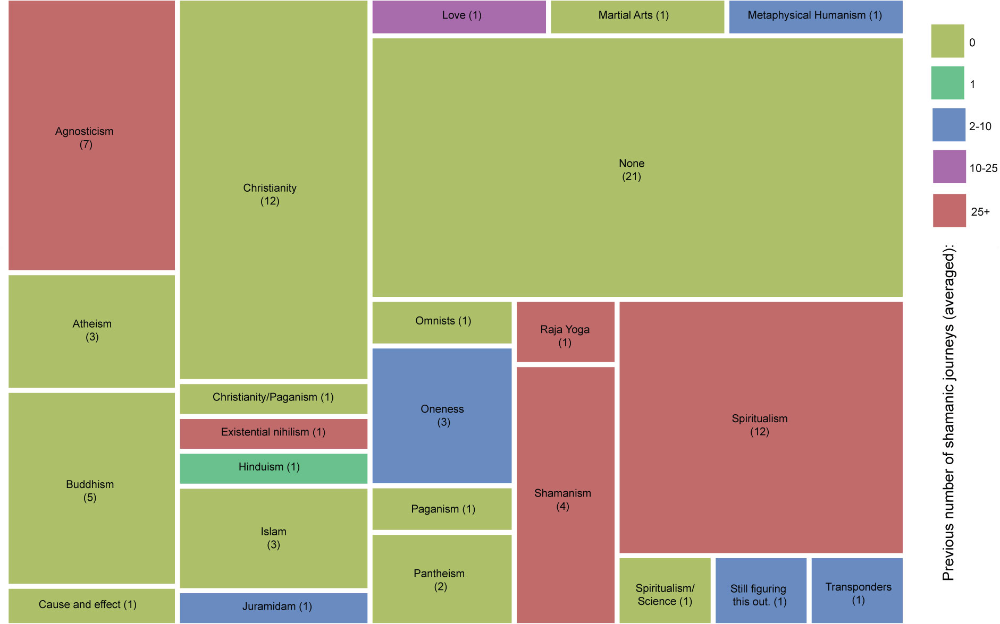
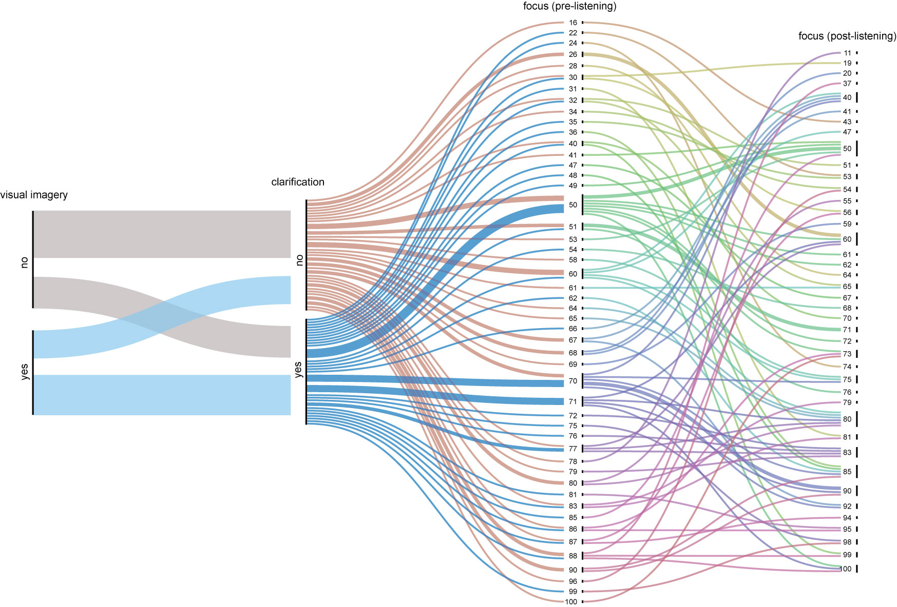
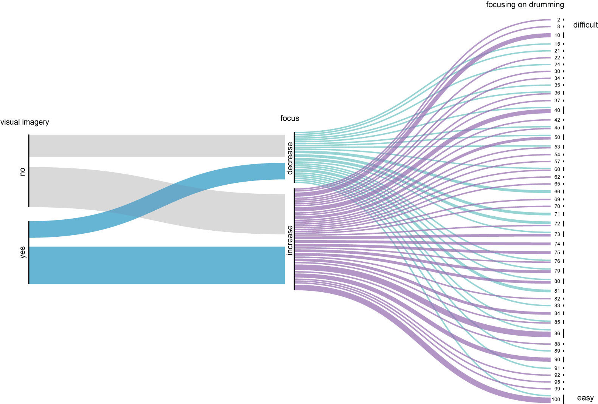
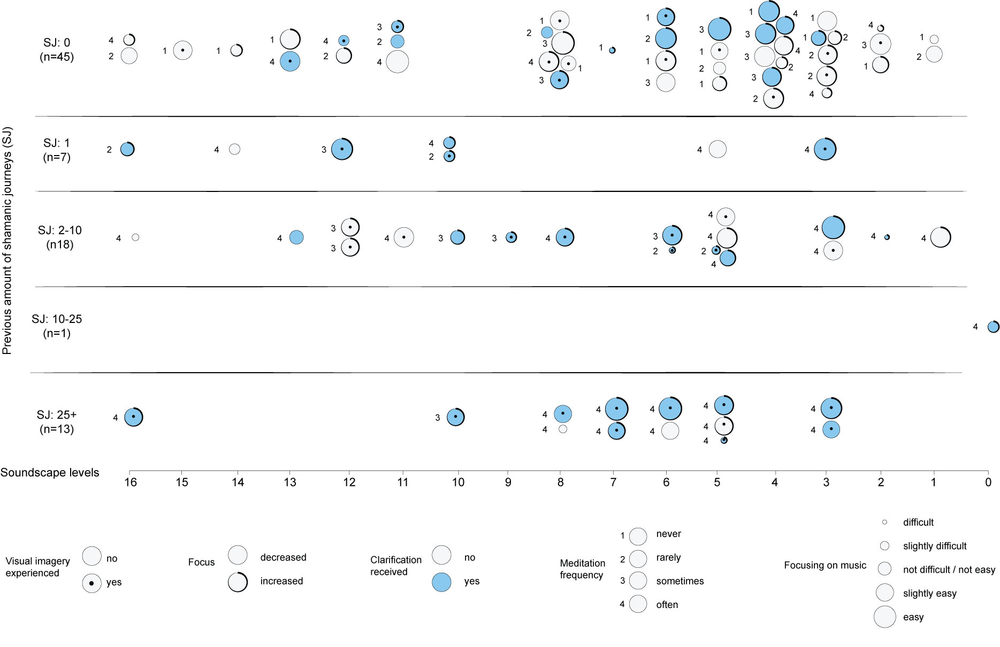
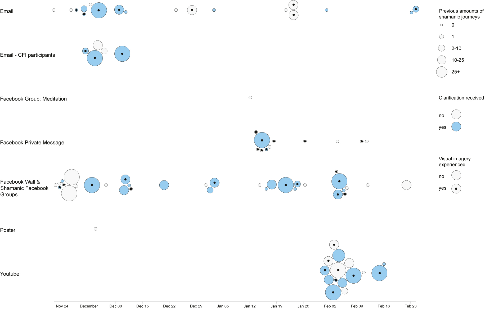

## 5.6 Listening Study Testing ARE

### 5.6.1 Project overview
This project surveyed 84 participants in a listening study to strengthen my understanding of using ARE with decreasing tempo and rhythmic complexity for shamanic journeying. Based on the outcomes of the NFT sessions (Section 5.4), I set up a questionnaire with *Jester* (the soundscape recorded at the performance outlined in Section 5.5), gathered data using SurveyMonkey and analysed the data with OpenOffice and RAWGraphs (DensityDesign and Inmagik, 2013). To clarify, this survey did not use the BCMI-2 system with neurofeedback protocols or other real-time EEG sonification techniques. The rendered file of the soundscape was played with a Web audio tool embedded in the questionnaire. The main outcome of the survey was that most participants experienced an increase in focus (67%) and recalled being most focused towards the end of the soundscape. While this outcome enhanced my confidence in using ARE with gradually decreasing tempo and rhythmic complexity to support shamanic journeying, it does not yet contribute to scientific knowledge, as it is still necessary to test ARE (e.g. with increasing and unchanging parameters). The project also refined my goals and methods for upcoming studies (e.g. regarding calls for participation, questionnaires, data collection points, and creative data analysis). Furthermore, it generated a mailing list of potential participants for upcoming studies. After this first study, I conducted a second listening study (n=23), testing how adding binaural beats to ARE affects participants’ shamanic journeys. In this second study, participants were randomly chosen to listen to *Jester* or *Jester (Binaural Beats Version)* with closed eyes. This section only discusses the first survey. I will use the insights gained in the two studies to design a third study and new NFT sessions that employ scientific rigour. I also plan to write up these insights as a chapter for a handbook on the cross-cultural assessment of how we could use the ancient techniques of shamanic traditions for contemporary healing practices. While the completion of this project is still underway, preliminary results seemed interesting enough to report here, if for no other purpose than to inspire others.

**Project time span:** September 2019—August 2020 

**Supporting material:**

- [*Shamanic Soundscape - Level Two*](https://tedor.bandcamp.com/album/shamanic-soundscape-level-two) | The digital audio release featuring *Jester*, the soundscape used in this study. 

### 5.6.2 Goals
After demonstrating BCMI-2’s suitability to support meditation practices in NFT and artistic performance settings to address RO3 (Sections 5.4 and 5.5), I sought to strengthen my research through a better understanding of ARE and relevant methodologies for questionnaires, data representation and the dissemination of creative research outputs. My objectives in this project were to

- design an internet survey based on the outcomes of the NFT sessions (Section 5.4)
- discuss drafts of this survey with shamanic practitioners and implement feedback
- disseminated the call for participation on relevant channels
- conduct the survey and provide support where needed
- investigate methods for data analysis providing aesthetic visualisation
- analyse the gathered data
- draw conclusions that can help design future projects
- increase others’ interest in my work

These objectives were informed by the outcomes of previous projects; the literature review regarding meditation; my experiences of shamanic journeying; technical aspects of survey design, dissemination and analysis and discussions with relevant researchers and shamanic practitioners.

### 5.6.3 Design and development
I started my study with one SurveyMonkey questionnaire in English, but due to the interest of Hungarian people who do not understand English, I extended it with a questionnaire in Hungarian. Before I sent out the call for participation via social media and emails, the questionnaire was reviewed by The Foundation for Shamanic Studies, an organisation for practicing core shamanism established by Harner (1979) and by senior admins of two shamanic Facebook groups practicing traditional shamanism (Facebook, 2007; 2019).  While these reviewers appreciated my interest in shamanic journeying and helped shape the questionnaire, they also shared concerns about what they believe are essential differences between shamanic journeying and other forms of meditation with visualisation. More specifically, they were concerned that my participants were not required to have previous training in shamanic traditions and, therefore, would be uncertain about who or what was answering their questions and thus be confused by the spirit world. Following their suggestions, I continued relating the study to shamanic journeying in the introduction of the questionnaire but also implied that it is not the same:

> This survey attempts to collect the effects of a soundscape for meditation purposes supported by sonic driving. The sonic driving derives from the shamanic journey tradition but is not specifically a shamanic journey. The estimated completion time is 30 minutes, including a 20-minute meditation.

> **What is shamanic journeying?** Shamanic journeying aims to take participants on a trip to a non-ordinary reality, traditionally through drumming. Participants are encouraged to ask for clarity on a specific question throughout the journey.

> **How is this soundscape different from the traditional form?** You will hear an audio of drumming largely based on the traditional form, but with additional sound textures and more diverse rhythms.

The questionnaire asked participants to commit to two conditions. First, I asked them to carry out the study in an undisturbed environment to make sure they could relax with their eyes closed while listening to the soundscape. Second, I asked them not to eat for at least two hours before the study to ensure their bodies could better focus on the meditation experience instead on digestion.

Similar to the questionnaire used in my previous NFT sessions, the questionnaire in this project also had three parts, with additional and improved questions. The first part (Before Listening) gathered demographic data and data on how participants felt about their focus and emotional states before listening to the soundscape. In the second part (Listening), participants listened to the soundscape with closed eyes. The information in the questionnaire encouraged them to focus on the repetitive aspects of the drumming while also thinking about a question about which they would like to seek clarity. The third part (After Listening) gathered data on participants' focal and emotional states and how they thought the tempo and rhythmic changes supported their focus. Finally, at the end of the survey, I encouraged them to write and interpret their visual imagery – if they experienced any – in drawings.

<!-- #maybe shall I add one of the drawings? -->

I tested the technical aspects of the questionnaire on several computing devices, operating systems and browsers. Although I collected the responses anonymously, participants were asked to provide nicknames they could refer to in an email if needed.[^app6-survey]

[^app6-survey]: For more detail (e.g. the PDF version of the survey and the list of collection points), please see Appendix 4.

### 5.6.4 Testing
I disseminated the call for study participants through several channels, including social media groups related to methods proposing to help induce and maintain ASCs (e.g. Facebook groups and online forums related to shamanism, BCI, NFT, drumming and psychedelic music). I also advertised the study on my Twitter, YouTube and SoundCloud profiles and through personalised private messages on Facebook Messenger and email. For each target group, I used customised information and trackable URL links to help compare the effectiveness of these channels in later analysis. The poster I designed to advertise at suitable venues (e.g. meditation centres and music departments) can be seen in Fig. 5.31.

Figure 5.31: Poster advertising the frst listening study using a well-known photograph of a Mongolian shaman by Sakair Pälsi taken in 1909. Image courtesy by Finnish Heritage Agency. The poster also received a custom domain (https://shamanicmeditation.info) to help people easily remember the URL.
(The custom domain expired in November 2020.)

Initially, I intended the study to last for a month; however, many people requested an extension, so it went on for four months, from the end of November 2019 to the end of February 2020. Due to two people experiencing technical issues, one on an Android mobile device and the other due to a slow internet connection, I exported the survey to a rich text format and sent it to them via email with additional instructions. I then added their answers to the database manually.

#### 5.6.4.1 Analysis tools
As I could not merge the data from the two questionnaires (English and Hungarian) within the SurveyMonkey platform, I could not use this platform's online analysis tools either. Therefore, data from both surveys were exported in .csv format and merged into one spreadsheet using OpenOffice software. In OpenOffice, the data was pre-processed and analysed using simple mathematics (e.g. `COUNTIF` and `SUM` functions). In order to recognise correlations and represent them artistically, I calculated values in OpenOffice and generated visually engaging graphs using RAWGraphs that were then adjusted in Adobe Illustrator. The outcome of the combination of these analysis methods can be seen in the tables and figures below. 

#### 5.6.4.2 Analysis
Most participants were between 25 and 45 years of age, and the group consisted of slightly more males than females (Tables 5.2, 5.3). Age and sex were not found to be correlated with other variables in the study.

| Age Group | Number of Participants | %       |
|-----------|------------------------|---------|
| Under 18  | 0                      | 0.00%   |
| 18-24     | 9                      | 10.71%  |
| 25-34     | 22                     | 26.19%  |
| 35-44     | 28                     | 33.33%  |
| 45-54     | 14                     | 16.67%  |
| 55-64     | 6                      | 7.14%   |
| 65+       | 5                      | 5.95%   |

Table 5.2: Number of participants in each age group.

| Sex     | Number of Participants | %       |
|---------|------------------------|---------|
| Female  | 36                     | 42.86%  |
| Male    | 48                     | 57.14%  |

Table 5.3: Number of participants by sex.

About half of the participants had no previous experience with shamanic journeying, while most considered their meditation practices as frequent ('often') (Tables 5.4, 5.5).

| Number of Previous Shamanic Journeys | Number of Participants | %       |
|--------------------------------------|------------------------|---------|
| 0                                    | 45                     | 53.57%  |
| 1                                    | 7                      | 8.33%   |
| 2-10                                 | 18                     | 21.43%  |
| 10-25                                | 1                      | 1.19%   |
| 25+                                  | 13                     | 15.48%  |

Table 5.4: Number of previous shamanic journeys experienced by participants.

| The Regularity of Meditation | Number of Participants | %       |
|------------------------------|------------------------|---------|
| Never                        | 15                     | 17.86%  |
| Rarely                       | 16                     | 19.05%  |
| Sometimes                    | 16                     | 19.05%  |
| Often                        | 37                     | 44.05%  |

Table 5.5: Regularity of participants’ meditation experiences.

An expected correlation was found between participants’ beliefs and experiences with shamanic journeying; people who labelled their beliefs as ‘Shamanism’ or ‘Spiritualism’ indicated a greater number of experiences with shamanic journeying. In contrast, people who did not associate themselves with any belief system (‘None’) and people with more traditional beliefs (e.g. ‘Christianity’, ‘Buddhism’ and ‘Islam’) indicated no experience with shamanic journeying (Fig. 5.32). 

Figure 5.32: Correlation between belief groups and experience with shamanic journeying. The size of each belief group is indicated by the sizes of the rectangles and the values presented. Experience with shamanic journeying is indicated with colour.

Most participants did not use any mood-altering substances before the study (Table 5.6).

| Substance Used | Number of Participants | %       |
|---------------|------------------------|---------|
| No            | 59                     | 70.24%  |
| Yes           | 25                     | 29.76%  |

Table 5.6: Reported substance use of participants.

Out of the 25 participants who used mood-altering substances, 22 used caffeine, one used cannabis and two used both caffeine and cannabis. Substance use was not correlated with any other variables in the study.

Slightly less than half (46%) of the participants experienced internal visual imagery, which correlates with the number of participants who received clarification regarding a question they asked during their shamanic journey (49%) (Tables 5.7, 5.8).

| Visual Imagery | Number of Participants | %      |
|----------------|------------------------|--------|
| No             | 45                     | 53.57% |
| Yes            | 39                     | 46.43% |

Table 5.7: Participants reporting visual imagery.

| Clarification Received | Number of Participants | %      |
|------------------------|------------------------|--------|
| No                     | 43                     | 51.19% |
| Yes                    | 41                     | 48.81% |

Table 5.8: Participants reporting clarification.

However, the more detailed graphical interpretation in Fig. 5.33 suggests that visual imagery was not required for clarifications: one-third of the participants with no visual imagery received clarification, while one-third of the participants with visual imagery did not. In addition to linking visual imagery with clarification, this figure also relates clarification to pre-listening levels of focus and shows how this focus changed during listening. As seen, there does not seem to be any correlation between these four variables. While Table 5.9 shows that most participants experienced an increase in focus (67%), there is no observable correlation in Fig. 5.34 between this increase and whether participants found it easy or difficult to focus on the drumming, nor is there a relationship between visual imagery and a change in focus.

Figure 5.33: Correlation between visual imagery (experienced or not), clarifcation (received or not) and focus change (increase or decrease when comparing pre- and post-listening).

| Focus After Listening | Number of Participants | %      |
|-----------------------|------------------------|--------|
| Decreased             | 28                     | 33.33% |
| Increased             | 56                     | 66.67% |

Table 5.9: Participants’ focus increase/decrease after listening to the soundscape.

Figure 5.35: Correlation between (1) presence of visual imagery (experienced or not), (2) focus change, (3) clarifcation (received or not), (4) frequency of meditation and (5) participants’ perception of how easy or difficult it was to focus on the rhythms in the music.

However, as seen in Fig. 5.35, most participants recalled being most focused towards the end of the soundscape (Level 6—Level 3), which besides most participants experiencing an increase in focus during the soundscape, was another outcome I had hoped to observe in this study.

| Most Focused (levels) | Number of Participants | %      |
|-----------------------|------------------------|--------|
| Level 16 (first outer layer) | 5     | 5.95%  |
| Level 15 | 1     | 1.19%  |
| Level 14 | 2     | 2.38%  |
| Level 13 | 3     | 3.57%  |
| Level 12 | 5     | 5.95%  |
| Level 11 | 4     | 4.76%  |
| Level 10 | 4     | 4.76%  |
| Level 9  | 1     | 1.19%  |
| Level 8  | 9     | 10.71% |
| Level 7  | 3     | 3.57%  |
| **Level 6** | **8**     | **9.52%**  |
| **Level 5** | **12**    | **14.29%** |
| **Level 4** | **8**     | **9.52%**  |
| **Level 3** | **11**    | **13.10%** |
| Level 2 | 4     | 4.76%  |
| Level 1 (most inner layer) | 3     | 3.57%  |
| Level 0 (outside of forest) | 1     | 1.19%  |

Table 5.10: Levels where participants reported the highest level of focus.

This grouping can also be seen in Fig. 5.35, which depicts the relationships between other variables. The figure shows that, for this study, most people who were highly experienced in shamanic journeying (JS:25+; n=13) not only meditated often but also experienced visual imagery, received clarification, had an increase in focus and found focusing on the rhythmic changes to be easy or slightly easy. Data from participants with no experience in shamanic journeying (JS:0; n=45) is more varied. For example, only 33% of these participants (n=15) experienced visual imagery, but this experience was not correlated with any of their other data (change in focus, clarification, frequency of meditation or the ability to focus on the rhythmic changes). Also, while the majority of participants in this group (76%) recalled being most focused towards the end of the soundscape (Level 9—Level 1) – similar to people highly experienced in shamanic journeying – many (24%) recalled being most focused in earlier levels (Level 16—Level 11). Contrasting the data of these two groups (JS:0 with JS:25+) shows that the participants who were highly experienced in shamanic journeying (with one exception) had similar experiences in this study, while participants with no experience with this meditation technique had more dissimilar experiences. 

Figure 5.35: Correlation between (1) presence of visual imagery (experienced or not), (2) focus change, (3) clarifcation (received or not), (4) frequency of meditation and (5) participants’ perception of how easy or difficult it was to focus on the rhythms in the music.

Figure 5.36: Correlation between (1) collection points, (2) date, (3) the number of previous shamanic journeying experiences, (4) clarifcation (received or not) and (5) visual imagery (experienced or not).

As seen in Fig. 5.36, the most successful collection point (one of the trackable URL links created in SurveyMonkey) was the one used on my personal Facebook wall and in four shamanic Facebook groups. [^collector-points] The most amalgamated responses were linked to the collection point used under my YouTube video archiving the performance. It is my belief that, Jeff Strong (the creator of REI outlined in Section 3.4) shared this URL with his drumming classes at the beginning of February 2019, and therefore, these responses are likely linked to him, his students and associates.

[^collector-points]: Unfortunately, I did not set up separate collection points for these channels at the very beginning of the study. I soon understood this was a mistake, but I felt that editing the calls in my Facebook group posts would confuse admins (as they need to authorise changes) and therefore did not amend my posts. 

My two main observations from the above analysis are as follows. First, most participants experienced an increase in focus (67%) and recalled being most focused towards the end of the soundscape. While both of these outcomes are desired for deepening a shamanic journey, it is not possible to directly link these changes specifically to ARE with gradually decreasing tempo and rhythmic complexity, as the study did not test other ARE parameters (e.g. an increasing or unchanging tempo and rhythmic complexity). I plan to address this through forthcoming projects. Second, of the 45 participants with no experience in shamanic journeying (JS:0), only 8 (18%) meditated often, while of the 13 participants who were highly experienced in shamanic journeying (JS:25+), 12 (92%) meditated often. When comparing the data of these 8 with these 12 participants regarding their visualisation experience, we can see that a high level of experience in shamanic journeying helped induce visual imagery (Table 5.11). This difference might be related to the fact that practitioners of other types of meditation may not exercise visualisation when they meditate with their eyes closed.

| Number of previous shamanic journeying experiences | 0    | 25+ |
|---------------------------------------------------|------|-----|
| visualisation experienced                         | 38%  | 83% |

Table 5.11: Correlation between the number of previous shamanic journeying experiences and whether or not visual imagery were experienced. Of participants with no experience in shamanic journeying, 38% had visuals, while 83% of participants with a high level of experience had visuals.

### 5.6.5 Conclusion
**Research and project objectives**  
This listening study achieved all its objectives and has strengthened my understanding of ARE and survey methodologies, including creative representation of data — all of which I will implement in designing new research with and without BCMI-2.

**New objectives**  
Due to some disadvantages of SurveyMonkey (e.g. limitations of certain survey-building elements and the high monthly cost for custom options such as multi-lingual surveys and surveys with over 10 questions), I plan to explore other online tools (e.g. Qualtrics) or build one myself with HTML programming for my future studies. Also, in order to compare my data with other researchers’ data in similar listening studies, I will explore these researchers’ methods and, if possible, adjust my methods to align with theirs. I will also improve my new survey by asking more specific questions (for instance, about the regularity of participants’ meditation practices). Furthermore, I will add more questions (for instance, to find out whether participants’ meditation sessions were distracted by anything in the study environment or not). While the combination of OpenOffice, RAWGraphs and Adobe Illustrator proved suitable for analysis and aesthetically visualising data, I started exploring other statistical tools (e.g. R and SPSS) for statistical computing and graphics to develop my analytical skills further. As mentioned, this commentary only discusses the first survey. I will analyse the second survey after the completion of this doctoral research. Then, I will use the insights gained in these surveys to design new NFT settings for BCMI-2 that employ scientific rigour.