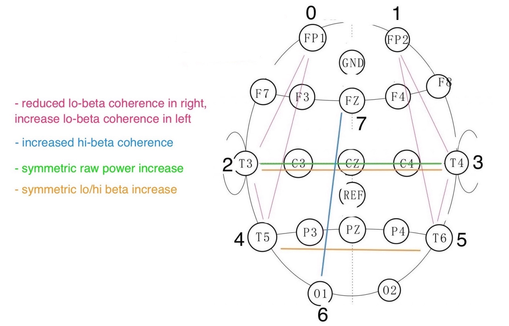

## Appx.5 Ongoing Projects
### Blue Forest
Blue Forest is a project-based learning environment. It is an imaginary forest my (now) 5-year-old son and I have been developing. It all started with me drumming after his bedtime stories to help him fall asleep. After a few days, I noticed that drumming along did not capture all his attention; therefore, I began devising a story in which process he became more and more involved. We created characters and places to visit within this forest. We have colourful foxes who open the forest gates, a blue rabbit whose house moves to a different location within the woods every time we visit and many other remarkable creatures. We also have some visiting characters from parallel stories we encounter in books or video animations (e.g. Blaze and the Monster Machines by Nickelodeon Animation Studio and Totoro by Studio Ghibli). Between January 2019 and today, I have archived dozens of audio files capturing our voices and the drumming, as well as drawings of the characters and maps of the ever-changing forest. Today, the project has not only helped him fall asleep easier but also bond with me while learning about drawing, writing, making music, storytelling and meditation.

### Follow-up listening study with M 
As mentioned in Chapter 5, due to the COVID-19 pandemic, participant M could not travel to the UK; therefore, I am designing a follow-up study with her that does not involve the BCMI-2 system but only listening to non-interactive soundscapes. 

### Book chapter on contemporary entheogenic healing
I am extending my knowledge on how auditory entrainment has been used in shamanic practices without psychedelics. I aim to summarise the outcomes of this process in a chapter of a handbook on the cross-cultural assessment of how we could revitalise the ancient techniques of shamanic traditions for contemporary healing practices.

### Other BCMI projects
Besides the NFT and performance settings (Chapters 4.4 and 4.5), I use the OpenBCI-SuperCollider Interface in other projects, sometimes simply to record EEG while listening to music and sometimes to control sound. The first three projects below do not have interactive sound, while the last three do. 

#### MONOLIT
In this project, I investigate how MONOLIT (Hrvatin, 2019), an hour-long drone composition, can help one enter an ASC. Before listening to the piece, I follow the composer's breathing techniques. I record my EEG before breath-work, during breath-work and the listening part, and for a short time after the listening part. So far, several of my experiments when listening to MONOLIT have evoked visual imagery similar to the imagery I see when using the shamanic soundscapes discussed in Chapter 5.7. As with the shamanic soundscape projects, visions are archived into drawings and voice recordings after listening and later used for analysis. I have been in touch with the composer since his help with fine-tuning my drumming techniques for shamanic journeying.

#### The Gateway Experience
In this project, I investigate how the binaural beats of 'The Gateway Experience' could help induce an ASC (Monroe Institute, 1962a). Designed by Robert Monroe, a pioneer of brainwave entrainment, the Gateway Experience has been referenced in research on binaural beats for decades. Here too, I measure my EEG before, during and after the listening parts and interpret visions in drawings for later analysis.

#### Shamanic journeying and drumming
Out of all methods experienced in this research, simply drumming on my frame drum alone has been the most effective in inducing the flashing visual imagery and then, about 15 minutes later, merging them into one continuous visual narrative — the journey. I experience this merge as the breakthrough in my meditation. Being able to express my inner experience with tempo and rhythmic changes seems to subdue the desire to interpret the experience analytically. Here too, EEG is measured before, during and after the sessions, as well as drawings made to help interpret the experience.

#### Corine protocol
In this project, I have been designing a new neurofeedback protocol for artistic performance purposes. The protocol is based on the paper by Flor-Henry, Shapiro and Sombrun (2017) titled 'Brain changes during a shamanic trance: Altered modes of consciousness, hemispheric laterality, and systemic psychobiology', in which they analysed a shamanic practitioner's EEG with qEEG and LORETA methods while she was entering an SSC. As the number of channels used in their project is much higher (43) than what I currently can measure (8), the classified brain signals for my Corine protocol are simplified. These simplifications were also needed as the BCMI-2 does presently not support LORETA feature analysis, only qEEG (Fig. 8.1).

Figure 8.1: Current draft of Corine protocol with BCMI-2.

#### Here and Now (revisited)
As a member of [David Ryan's Opera Aperta Project](https://operaapertaproject.com/) I have been designing an alternative version of Ryan's recent composition, 'Here and Now'. For my revisit, I developed sound textures to use as control parameters in a BCMI soundscape and a new neurofeedback protocol that controls these textures. The textures use recordings from the original piece (e.g. bass clarinet, percussion, Tibetan bowls, cello, piano, and voices). My compositional method for this piece is similar to the one in the BCMI-2 projects: some aspects of the composition are more controlled (e.g. the overall duration). In contrast, others are more unplanned as they are mapped to classified brain signals in real-time. This project aims to demonstrate the use of BCMI for audiences primarily interested in contemporary classical music.

#### Berlin - Colchester BCMI
This project experiments with sending BCMI data between two countries via the internet using Tunnelblick by OpenVPN Inc. The method, developed by Fredrik Olofsson, is investigated primarily to understand how we could use the OpenBCI-SuperCollider Interface effectively in real-time BCMI performances where the performers do not share a  physical space. While this project felt more relevant in the 2019-20 COVID-19 pandemic, we think it is still worth exploring. 
